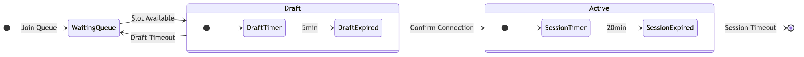
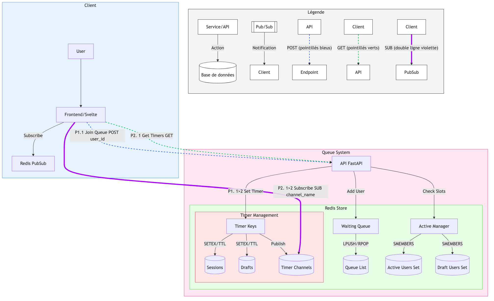

# Introduction
Ce projet implémente un système de gestion de file d'attente intelligent pour contrôler l'accès à Lucie, notre modèle de langage (LLM) entraîné from scratch. Face à l'intérêt croissant pour les modèles de langage open source et la nécessité de gérer efficacement les ressources de calcul, ce système permet d'offrir une expérience utilisateur optimale tout en maintenant la stabilité du service.

### Le Contexte
Lucie est déployée via une interface basée sur open web-ui, permettant au public de tester et d'interagir avec le modèle. Cependant, pour garantir des performances optimales et une expérience utilisateur de qualité, nous devons limiter le nombre d'accès simultanés tout en assurant une distribution équitable du temps d'utilisation.

### Pourquoi un système de file d'attente ?
- **Gestion des ressources** : Optimise l'utilisation des ressources GPU/CPU nécessaires pour faire fonctionner le modèle
- **Équité d'accès** : Assure une distribution équitable du temps d'accès entre les utilisateurs
- **Expérience utilisateur** : Offre une visibilité claire sur le temps d'attente et la disponibilité
- **Stabilité** : Évite la surcharge du système en contrôlant le nombre d'utilisateurs simultanés

### Les Caractéristiques 
- Gestion de 50 sessions utilisateurs simultanées
- Sessions limitées à 20 minutes pour maximiser le nombre d'utilisateurs servis
- Système de "draft" de 5 minutes permettant une transition fluide entre les utilisateurs
- Mécanisme de file d'attente transparent avec notifications en temps réel
- Intégration seamless avec l'interface open web-ui


<details>
<!-- REPORT TITLE -->
<summary>🧪 Rapport de Tests - 2025-01-09 22:10:17 - 25/34 PASSED</summary>

<!-- START_TEST_REPORT -->

### 🧪 Rapport de Tests - 2025-01-09 22:10:17 - 25/34 PASSED

<div style="background-color: #1e1e1e; color: #ffffff; padding: 16px; border-radius: 8px; font-family: 'Courier New', Courier, monospace; white-space: pre-wrap;">

<div style="font-family: monospace;">
<span style="font-weight: bold;">============================= test session starts ==============================</span>
platform linux -- Python 3.13.1, pytest-7.4.4, pluggy-1.5.0 -- /usr/local/bin/python3.13
cachedir: .pytest_cache
rootdir: /app
configfile: pyproject.toml
testpaths: tests
plugins: timeout-2.3.1, asyncio-0.21.2, anyio-3.7.1, cov-4.1.0
asyncio: mode=Mode.AUTO
<span style="font-weight: bold;">collecting ... </span>collected 34 items
tests/test_api_endpoints.py::TestAPI::test_join_queue_flow <span style="color: #4CAF50;"><span style="color: #4CAF50;">PASSED</span></span><span style="color: #4CAF50;">        [  2%]</span>
tests/test_api_endpoints.py::TestAPI::test_join_queue_flow_when_full <span style="color: #f44336;">FAILED</span></span> [  5%]</span>
tests/test_api_endpoints.py::TestAPI::test_leave_queue <span style="color: #4CAF50;"><span style="color: #4CAF50;">PASSED</span></span>            [  8%]</span>
tests/test_api_endpoints.py::TestAPI::test_get_status_nonexistent <span style="color: #4CAF50;"><span style="color: #4CAF50;">PASSED</span></span> [ 11%]</span>
tests/test_api_endpoints.py::TestAPI::test_heartbeat <span style="color: #4CAF50;"><span style="color: #4CAF50;">PASSED</span></span>              [ 14%]</span>
tests/test_api_endpoints.py::TestAPI::test_heartbeat_invalid <span style="color: #4CAF50;"><span style="color: #4CAF50;">PASSED</span></span>      [ 17%]</span>
tests/test_api_endpoints.py::TestAPI::test_timers_async <span style="color: #f44336;">FAILED</span></span>           [ 20%]</span>
tests/test_celery.py::test_celery_eager_mode <span style="color: #4CAF50;"><span style="color: #4CAF50;">PASSED</span></span>                      [ 23%]</span>
tests/test_celery.py::test_celery_task_chaining <span style="color: #4CAF50;"><span style="color: #4CAF50;">PASSED</span></span>                   [ 26%]</span>
tests/test_celery.py::test_celery_error_handling <span style="color: #4CAF50;"><span style="color: #4CAF50;">PASSED</span></span>                  [ 29%]</span>
tests/test_integration.py::TestIntegration::test_concurrent_users <span style="color: #f44336;">FAILED</span></span> [ 32%]</span>
tests/test_integration.py::TestIntegration::test_requeue_mechanism <span style="color: #4CAF50;"><span style="color: #4CAF50;">PASSED</span></span> [ 35%]</span>
tests/test_queue_manager.py::TestQueueManager::test_fill_active_queue <span style="color: #4CAF50;"><span style="color: #4CAF50;">PASSED</span></span> [ 38%]</span>
tests/test_queue_manager.py::TestQueueManager::test_add_to_queue <span style="color: #4CAF50;"><span style="color: #4CAF50;">PASSED</span></span>  [ 41%]</span>
tests/test_queue_manager.py::TestQueueManager::test_draft_flow <span style="color: #4CAF50;"><span style="color: #4CAF50;">PASSED</span></span>    [ 44%]</span>
tests/test_queue_manager.py::TestQueueManager::test_draft_expiration <span style="color: #4CAF50;"><span style="color: #4CAF50;">PASSED</span></span> [ 47%]</span>
tests/test_queue_manager.py::TestQueueManager::test_error_handling <span style="color: #4CAF50;"><span style="color: #4CAF50;">PASSED</span></span> [ 50%]</span>
tests/test_queue_manager.py::TestQueueManager::test_timer_edge_cases <span style="color: #4CAF50;"><span style="color: #4CAF50;">PASSED</span></span> [ 52%]</span>
tests/test_queue_manager.py::TestQueueManager::test_slot_checker_lifecycle <span style="color: #4CAF50;"><span style="color: #4CAF50;">PASSED</span></span> [ 55%]</span>
tests/test_queue_manager.py::TestQueueManager::test_verify_queue_state_errors <span style="color: #4CAF50;"><span style="color: #4CAF50;">PASSED</span></span> [ 58%]</span>
tests/test_queue_manager.py::TestQueueManager::test_session_management <span style="color: #4CAF50;"><span style="color: #4CAF50;">PASSED</span></span> [ 61%]</span>
tests/test_timers.py::TestTimers::test_draft_timer_redis <span style="color: #4CAF50;"><span style="color: #4CAF50;">PASSED</span></span>          [ 64%]</span>
tests/test_timers.py::TestTimers::test_session_timer_redis <span style="color: #4CAF50;"><span style="color: #4CAF50;">PASSED</span></span>        [ 67%]</span>
tests/test_timers.py::TestTimers::test_get_timers_endpoint_draft <span style="color: #f44336;">FAILED</span></span>  [ 70%]</span>
tests/test_timers.py::TestTimers::test_get_timers_endpoint_session <span style="color: #f44336;">FAILED</span></span> [ 73%]</span>
tests/test_timers.py::TestTimers::test_get_timers_endpoint_both <span style="color: #f44336;">FAILED</span></span>   [ 76%]</span>
tests/test_timers.py::TestTimers::test_get_timers_endpoint_no_timers <span style="color: #4CAF50;"><span style="color: #4CAF50;">PASSED</span></span> [ 79%]</span>
tests/test_timers.py::TestTimers::test_pubsub_connection_draft <span style="color: #f44336;">FAILED</span></span>    [ 82%]</span>
tests/test_timers.py::TestTimers::test_pubsub_connection_session <span style="color: #4CAF50;"><span style="color: #4CAF50;">PASSED</span></span>  [ 85%]</span>
tests/test_timers.py::TestTimers::test_pubsub_multiple_updates <span style="color: #f44336;">FAILED</span></span>    [ 88%]</span>
tests/test_timers.py::test_update_timer_channel_expiration <span style="color: #4CAF50;"><span style="color: #4CAF50;">PASSED</span></span>        [ 91%]</span>
tests/test_timers.py::test_update_timer_channel <span style="color: #4CAF50;"><span style="color: #4CAF50;">PASSED</span></span>                   [ 94%]</span>
tests/test_timers_async.py::TestTimersAsync::test_pubsub_multiple_updates_async <span style="color: #f44336;">FAILED</span></span> [ 97%]</span>
tests/test_timers_async.py::TestTimersAsync::test_update_timer_channel_async <span style="color: #4CAF50;"><span style="color: #4CAF50;">PASSED</span></span> [100%]</span>
=================================== FAILURES ===================================
<span style="font-weight: bold;">____________________ TestAPI.test_join_queue_flow_when_full ____________________</span>
self = &lt;test_api_endpoints.TestAPI object at 0xffffb41e60d0&gt;
test_client = &lt;httpx.AsyncClient object at 0xffffb4072fd0&gt;
redis_client = &lt;redis.asyncio.client.Redis(&lt;redis.asyncio.connection.ConnectionPool(&lt;redis.asyncio.connection.Connection(host=redis-test,port=6379,db=1)&gt;)&gt;)&gt;
&gt;   ???
<span style="font-weight: bold;">E   KeyError: &#x27;position&#x27;</span>
<span style="font-weight: bold;">/Users/chrysostomebeltran/Documents/GitHub/redis_queue/tests/test_api_endpoints.py</span>:99: KeyError
---------------------------- Captured stderr setup -----------------------------
2025-01-09 21:10:21 - test_logger - INFO - Connexion Redis établie avec succès
2025-01-09 21:10:21 - test_logger - INFO - QueueManager initialisé avec succès
2025-01-09 21:10:21 - test_logger - INFO - Client de test initialisé avec succès
------------------------------ Captured log setup ------------------------------
<span style="color: #4CAF50;">INFO    </span> test_logger:conftest.py:132 Connexion Redis établie avec succès
<span style="color: #4CAF50;">INFO    </span> test_logger:conftest.py:155 QueueManager initialisé avec succès
<span style="color: #4CAF50;">INFO    </span> test_logger:conftest.py:168 Client de test initialisé avec succès
----------------------------- Captured stderr call -----------------------------
2025-01-09 21:10:21 - test_logger - INFO - Tentative d&#x27;ajout de l&#x27;utilisateur test_user_0
2025-01-09 21:10:21 - test_logger - INFO - Statut actuel: {&#x27;status&#x27;: None}
2025-01-09 21:10:21 - test_logger - INFO - Tentative d&#x27;ajout à la file d&#x27;attente pour test_user_0 avec statut None
2025-01-09 21:10:21 - test_logger - INFO - Résultats de la transaction Redis pour test_user_0: [1, 1, 1]
2025-01-09 21:10:21 - test_logger - INFO - Vérification post-transaction pour test_user_0: queued=1, in_waiting=True
2025-01-09 21:10:21 - test_logger - INFO - Aucun historique de statuts trouvé pour test_user_0
2025-01-09 21:10:21 - test_logger - INFO - Tentative d&#x27;offre de slot à test_user_0
2025-01-09 21:10:21 - test_logger - INFO - Slot offert avec succès à test_user_0
2025-01-09 21:10:21 - test_logger - INFO - Tentative d&#x27;offre de slot à test_user_0
2025-01-09 21:10:21 - test_logger - INFO - État invalide pour test_user_0: déjà en draft ou actif
2025-01-09 21:10:21 - test_logger - INFO - Connexion confirmée pour test_user_0
2025-01-09 21:10:21 - test_logger - INFO - Tentative d&#x27;ajout de l&#x27;utilisateur test_user_1
2025-01-09 21:10:21 - test_logger - INFO - Statut actuel: {&#x27;status&#x27;: None}
2025-01-09 21:10:21 - test_logger - INFO - Tentative d&#x27;ajout à la file d&#x27;attente pour test_user_1 avec statut None
2025-01-09 21:10:21 - test_logger - INFO - Résultats de la transaction Redis pour test_user_1: [1, 1, 1]
2025-01-09 21:10:21 - test_logger - INFO - Vérification post-transaction pour test_user_1: queued=1, in_waiting=True
2025-01-09 21:10:21 - test_logger - INFO - Aucun historique de statuts trouvé pour test_user_1
2025-01-09 21:10:21 - test_logger - INFO - Tentative d&#x27;offre de slot à test_user_1
2025-01-09 21:10:21 - test_logger - INFO - Slot offert avec succès à test_user_1
2025-01-09 21:10:21 - test_logger - INFO - Tentative d&#x27;offre de slot à test_user_1
2025-01-09 21:10:21 - test_logger - INFO - État invalide pour test_user_1: déjà en draft ou actif
2025-01-09 21:10:21 - test_logger - INFO - Connexion confirmée pour test_user_1
2025-01-09 21:10:21 - test_logger - INFO - Tentative d&#x27;ajout de l&#x27;utilisateur test_user_2
2025-01-09 21:10:21 - test_logger - INFO - Statut actuel: {&#x27;status&#x27;: None}
2025-01-09 21:10:21 - test_logger - INFO - Tentative d&#x27;ajout à la file d&#x27;attente pour test_user_2 avec statut None
2025-01-09 21:10:21 - test_logger - INFO - Résultats de la transaction Redis pour test_user_2: [1, 1, 1]
2025-01-09 21:10:21 - test_logger - INFO - Vérification post-transaction pour test_user_2: queued=1, in_waiting=True
2025-01-09 21:10:21 - test_logger - INFO - Aucun historique de statuts trouvé pour test_user_2
2025-01-09 21:10:21 - test_logger - INFO - Tentative d&#x27;offre de slot à test_user_2
2025-01-09 21:10:21 - test_logger - INFO - Slot offert avec succès à test_user_2
2025-01-09 21:10:21 - test_logger - INFO - Tentative d&#x27;offre de slot à test_user_2
2025-01-09 21:10:21 - test_logger - INFO - État invalide pour test_user_2: déjà en draft ou actif
2025-01-09 21:10:21 - test_logger - INFO - Connexion confirmée pour test_user_2
2025-01-09 21:10:21 - test_logger - INFO - Tentative d&#x27;ajout de l&#x27;utilisateur test_user_3
2025-01-09 21:10:21 - test_logger - INFO - Statut actuel: {&#x27;status&#x27;: None}
2025-01-09 21:10:21 - test_logger - INFO - Tentative d&#x27;ajout à la file d&#x27;attente pour test_user_3 avec statut None
2025-01-09 21:10:21 - test_logger - INFO - Résultats de la transaction Redis pour test_user_3: [1, 1, 1]
2025-01-09 21:10:21 - test_logger - INFO - Vérification post-transaction pour test_user_3: queued=1, in_waiting=True
2025-01-09 21:10:21 - test_logger - INFO - Aucun historique de statuts trouvé pour test_user_3
2025-01-09 21:10:21 - test_logger - INFO - Tentative d&#x27;offre de slot à test_user_3
2025-01-09 21:10:21 - test_logger - INFO - Slot offert avec succès à test_user_3
2025-01-09 21:10:21 - test_logger - INFO - Tentative d&#x27;offre de slot à test_user_3
2025-01-09 21:10:21 - test_logger - INFO - État invalide pour test_user_3: déjà en draft ou actif
2025-01-09 21:10:21 - test_logger - INFO - Connexion confirmée pour test_user_3
2025-01-09 21:10:21 - test_logger - INFO - Tentative d&#x27;ajout de l&#x27;utilisateur test_user_4
2025-01-09 21:10:21 - test_logger - INFO - Statut actuel: {&#x27;status&#x27;: None}
2025-01-09 21:10:21 - test_logger - INFO - Tentative d&#x27;ajout à la file d&#x27;attente pour test_user_4 avec statut None
2025-01-09 21:10:21 - test_logger - INFO - Résultats de la transaction Redis pour test_user_4: [1, 1, 1]
2025-01-09 21:10:21 - test_logger - INFO - Vérification post-transaction pour test_user_4: queued=1, in_waiting=True
2025-01-09 21:10:21 - test_logger - INFO - Aucun historique de statuts trouvé pour test_user_4
2025-01-09 21:10:21 - test_logger - INFO - Tentative d&#x27;offre de slot à test_user_4
2025-01-09 21:10:21 - test_logger - INFO - Slot offert avec succès à test_user_4
2025-01-09 21:10:21 - test_logger - INFO - Tentative d&#x27;offre de slot à test_user_4
2025-01-09 21:10:21 - test_logger - INFO - État invalide pour test_user_4: déjà en draft ou actif
2025-01-09 21:10:21 - test_logger - INFO - Connexion confirmée pour test_user_4
2025-01-09 21:10:21 - test_logger - INFO - Tentative d&#x27;ajout de l&#x27;utilisateur test_user_5
2025-01-09 21:10:21 - test_logger - INFO - Statut actuel: {&#x27;status&#x27;: None}
2025-01-09 21:10:21 - test_logger - INFO - Tentative d&#x27;ajout à la file d&#x27;attente pour test_user_5 avec statut None
2025-01-09 21:10:21 - test_logger - INFO - Résultats de la transaction Redis pour test_user_5: [1, 1, 1]
2025-01-09 21:10:21 - test_logger - INFO - Vérification post-transaction pour test_user_5: queued=1, in_waiting=True
2025-01-09 21:10:21 - test_logger - INFO - Aucun historique de statuts trouvé pour test_user_5
2025-01-09 21:10:21 - test_logger - INFO - Tentative d&#x27;offre de slot à test_user_5
2025-01-09 21:10:21 - test_logger - INFO - Slot offert avec succès à test_user_5
2025-01-09 21:10:21 - test_logger - INFO - Tentative d&#x27;offre de slot à test_user_5
2025-01-09 21:10:21 - test_logger - INFO - État invalide pour test_user_5: déjà en draft ou actif
2025-01-09 21:10:21 - test_logger - INFO - Connexion confirmée pour test_user_5
2025-01-09 21:10:21 - test_logger - INFO - Tentative d&#x27;ajout de l&#x27;utilisateur test_user_6
2025-01-09 21:10:21 - test_logger - INFO - Statut actuel: {&#x27;status&#x27;: None}
2025-01-09 21:10:21 - test_logger - INFO - Tentative d&#x27;ajout à la file d&#x27;attente pour test_user_6 avec statut None
2025-01-09 21:10:21 - test_logger - INFO - Résultats de la transaction Redis pour test_user_6: [1, 1, 1]
2025-01-09 21:10:21 - test_logger - INFO - Vérification post-transaction pour test_user_6: queued=1, in_waiting=True
2025-01-09 21:10:21 - test_logger - INFO - Aucun historique de statuts trouvé pour test_user_6
2025-01-09 21:10:21 - test_logger - INFO - Tentative d&#x27;offre de slot à test_user_6
2025-01-09 21:10:21 - test_logger - INFO - Slot offert avec succès à test_user_6
2025-01-09 21:10:21 - test_logger - INFO - Tentative d&#x27;offre de slot à test_user_6
2025-01-09 21:10:21 - test_logger - INFO - État invalide pour test_user_6: déjà en draft ou actif
2025-01-09 21:10:21 - test_logger - INFO - Connexion confirmée pour test_user_6
2025-01-09 21:10:21 - test_logger - INFO - Tentative d&#x27;ajout de l&#x27;utilisateur test_user_7
2025-01-09 21:10:21 - test_logger - INFO - Statut actuel: {&#x27;status&#x27;: None}
2025-01-09 21:10:21 - test_logger - INFO - Tentative d&#x27;ajout à la file d&#x27;attente pour test_user_7 avec statut None
2025-01-09 21:10:21 - test_logger - INFO - Résultats de la transaction Redis pour test_user_7: [1, 1, 1]
2025-01-09 21:10:21 - test_logger - INFO - Vérification post-transaction pour test_user_7: queued=1, in_waiting=True
2025-01-09 21:10:21 - test_logger - INFO - Aucun historique de statuts trouvé pour test_user_7
2025-01-09 21:10:21 - test_logger - INFO - Tentative d&#x27;offre de slot à test_user_7
2025-01-09 21:10:21 - test_logger - INFO - Slot offert avec succès à test_user_7
2025-01-09 21:10:21 - test_logger - INFO - Tentative d&#x27;offre de slot à test_user_7
2025-01-09 21:10:21 - test_logger - INFO - État invalide pour test_user_7: déjà en draft ou actif
2025-01-09 21:10:21 - test_logger - INFO - Connexion confirmée pour test_user_7
2025-01-09 21:10:21 - test_logger - INFO - Tentative d&#x27;ajout de l&#x27;utilisateur test_user_8
2025-01-09 21:10:21 - test_logger - INFO - Statut actuel: {&#x27;status&#x27;: None}
2025-01-09 21:10:21 - test_logger - INFO - Tentative d&#x27;ajout à la file d&#x27;attente pour test_user_8 avec statut None
2025-01-09 21:10:21 - test_logger - INFO - Résultats de la transaction Redis pour test_user_8: [1, 1, 1]
2025-01-09 21:10:21 - test_logger - INFO - Vérification post-transaction pour test_user_8: queued=1, in_waiting=True
2025-01-09 21:10:21 - test_logger - INFO - Aucun historique de statuts trouvé pour test_user_8
2025-01-09 21:10:21 - test_logger - INFO - Tentative d&#x27;offre de slot à test_user_8
2025-01-09 21:10:21 - test_logger - INFO - Slot offert avec succès à test_user_8
2025-01-09 21:10:21 - test_logger - INFO - Tentative d&#x27;offre de slot à test_user_8
2025-01-09 21:10:21 - test_logger - INFO - État invalide pour test_user_8: déjà en draft ou actif
2025-01-09 21:10:21 - test_logger - INFO - Connexion confirmée pour test_user_8
2025-01-09 21:10:21 - test_logger - INFO - Tentative d&#x27;ajout de l&#x27;utilisateur test_user_9
2025-01-09 21:10:21 - test_logger - INFO - Statut actuel: {&#x27;status&#x27;: None}
2025-01-09 21:10:21 - test_logger - INFO - Tentative d&#x27;ajout à la file d&#x27;attente pour test_user_9 avec statut None
2025-01-09 21:10:21 - test_logger - INFO - Résultats de la transaction Redis pour test_user_9: [1, 1, 1]
2025-01-09 21:10:21 - test_logger - INFO - Vérification post-transaction pour test_user_9: queued=1, in_waiting=True
2025-01-09 21:10:21 - test_logger - INFO - Aucun historique de statuts trouvé pour test_user_9
2025-01-09 21:10:21 - test_logger - INFO - Tentative d&#x27;offre de slot à test_user_9
2025-01-09 21:10:21 - test_logger - INFO - Slot offert avec succès à test_user_9
2025-01-09 21:10:21 - test_logger - INFO - Tentative d&#x27;offre de slot à test_user_9
2025-01-09 21:10:21 - test_logger - INFO - État invalide pour test_user_9: déjà en draft ou actif
2025-01-09 21:10:21 - test_logger - INFO - Connexion confirmée pour test_user_9
2025-01-09 21:10:21 - test_logger - INFO - Tentative d&#x27;ajout de l&#x27;utilisateur test_user_10
2025-01-09 21:10:21 - test_logger - INFO - Statut actuel: {&#x27;status&#x27;: None}
2025-01-09 21:10:21 - test_logger - INFO - Tentative d&#x27;ajout à la file d&#x27;attente pour test_user_10 avec statut None
2025-01-09 21:10:21 - test_logger - INFO - Résultats de la transaction Redis pour test_user_10: [1, 1, 1]
2025-01-09 21:10:21 - test_logger - INFO - Vérification post-transaction pour test_user_10: queued=1, in_waiting=True
2025-01-09 21:10:21 - test_logger - INFO - Aucun historique de statuts trouvé pour test_user_10
2025-01-09 21:10:21 - test_logger - INFO - Tentative d&#x27;offre de slot à test_user_10
2025-01-09 21:10:21 - test_logger - INFO - Slot offert avec succès à test_user_10
2025-01-09 21:10:21 - test_logger - INFO - Tentative d&#x27;offre de slot à test_user_10
2025-01-09 21:10:21 - test_logger - INFO - État invalide pour test_user_10: déjà en draft ou actif
2025-01-09 21:10:21 - test_logger - INFO - Connexion confirmée pour test_user_10
2025-01-09 21:10:21 - test_logger - INFO - Tentative d&#x27;ajout de l&#x27;utilisateur test_user_11
2025-01-09 21:10:21 - test_logger - INFO - Statut actuel: {&#x27;status&#x27;: None}
2025-01-09 21:10:21 - test_logger - INFO - Tentative d&#x27;ajout à la file d&#x27;attente pour test_user_11 avec statut None
2025-01-09 21:10:21 - test_logger - INFO - Résultats de la transaction Redis pour test_user_11: [1, 1, 1]
2025-01-09 21:10:21 - test_logger - INFO - Vérification post-transaction pour test_user_11: queued=1, in_waiting=True
2025-01-09 21:10:21 - test_logger - INFO - Aucun historique de statuts trouvé pour test_user_11
2025-01-09 21:10:21 - test_logger - INFO - Tentative d&#x27;offre de slot à test_user_11
2025-01-09 21:10:21 - test_logger - INFO - Slot offert avec succès à test_user_11
2025-01-09 21:10:21 - test_logger - INFO - Tentative d&#x27;offre de slot à test_user_11
2025-01-09 21:10:21 - test_logger - INFO - État invalide pour test_user_11: déjà en draft ou actif
2025-01-09 21:10:21 - test_logger - INFO - Connexion confirmée pour test_user_11
2025-01-09 21:10:21 - test_logger - INFO - Tentative d&#x27;ajout de l&#x27;utilisateur test_user_12
2025-01-09 21:10:21 - test_logger - INFO - Statut actuel: {&#x27;status&#x27;: None}
2025-01-09 21:10:21 - test_logger - INFO - Tentative d&#x27;ajout à la file d&#x27;attente pour test_user_12 avec statut None
2025-01-09 21:10:21 - test_logger - INFO - Résultats de la transaction Redis pour test_user_12: [1, 1, 1]
2025-01-09 21:10:21 - test_logger - INFO - Vérification post-transaction pour test_user_12: queued=1, in_waiting=True
2025-01-09 21:10:21 - test_logger - INFO - Aucun historique de statuts trouvé pour test_user_12
2025-01-09 21:10:21 - test_logger - INFO - Tentative d&#x27;offre de slot à test_user_12
2025-01-09 21:10:21 - test_logger - INFO - Slot offert avec succès à test_user_12
2025-01-09 21:10:21 - test_logger - INFO - Tentative d&#x27;offre de slot à test_user_12
2025-01-09 21:10:21 - test_logger - INFO - État invalide pour test_user_12: déjà en draft ou actif
2025-01-09 21:10:21 - test_logger - INFO - Connexion confirmée pour test_user_12
2025-01-09 21:10:21 - test_logger - INFO - Tentative d&#x27;ajout de l&#x27;utilisateur test_user_13
2025-01-09 21:10:21 - test_logger - INFO - Statut actuel: {&#x27;status&#x27;: None}
2025-01-09 21:10:21 - test_logger - INFO - Tentative d&#x27;ajout à la file d&#x27;attente pour test_user_13 avec statut None
2025-01-09 21:10:21 - test_logger - INFO - Résultats de la transaction Redis pour test_user_13: [1, 1, 1]
2025-01-09 21:10:21 - test_logger - INFO - Vérification post-transaction pour test_user_13: queued=1, in_waiting=True
2025-01-09 21:10:21 - test_logger - INFO - Aucun historique de statuts trouvé pour test_user_13
2025-01-09 21:10:21 - test_logger - INFO - Tentative d&#x27;offre de slot à test_user_13
2025-01-09 21:10:21 - test_logger - INFO - Slot offert avec succès à test_user_13
2025-01-09 21:10:21 - test_logger - INFO - Tentative d&#x27;offre de slot à test_user_13
2025-01-09 21:10:21 - test_logger - INFO - État invalide pour test_user_13: déjà en draft ou actif
2025-01-09 21:10:21 - test_logger - INFO - Connexion confirmée pour test_user_13
2025-01-09 21:10:21 - test_logger - INFO - Tentative d&#x27;ajout de l&#x27;utilisateur test_user_14
2025-01-09 21:10:21 - test_logger - INFO - Statut actuel: {&#x27;status&#x27;: None}
2025-01-09 21:10:21 - test_logger - INFO - Tentative d&#x27;ajout à la file d&#x27;attente pour test_user_14 avec statut None
2025-01-09 21:10:21 - test_logger - INFO - Résultats de la transaction Redis pour test_user_14: [1, 1, 1]
2025-01-09 21:10:21 - test_logger - INFO - Vérification post-transaction pour test_user_14: queued=1, in_waiting=True
2025-01-09 21:10:21 - test_logger - INFO - Aucun historique de statuts trouvé pour test_user_14
2025-01-09 21:10:21 - test_logger - INFO - Tentative d&#x27;offre de slot à test_user_14
2025-01-09 21:10:21 - test_logger - INFO - Slot offert avec succès à test_user_14
2025-01-09 21:10:21 - test_logger - INFO - Tentative d&#x27;offre de slot à test_user_14
2025-01-09 21:10:21 - test_logger - INFO - État invalide pour test_user_14: déjà en draft ou actif
2025-01-09 21:10:21 - test_logger - INFO - Connexion confirmée pour test_user_14
2025-01-09 21:10:21 - test_logger - INFO - Tentative d&#x27;ajout de l&#x27;utilisateur test_user_15
2025-01-09 21:10:21 - test_logger - INFO - Statut actuel: {&#x27;status&#x27;: None}
2025-01-09 21:10:21 - test_logger - INFO - Tentative d&#x27;ajout à la file d&#x27;attente pour test_user_15 avec statut None
2025-01-09 21:10:21 - test_logger - INFO - Résultats de la transaction Redis pour test_user_15: [1, 1, 1]
2025-01-09 21:10:21 - test_logger - INFO - Vérification post-transaction pour test_user_15: queued=1, in_waiting=True
2025-01-09 21:10:21 - test_logger - INFO - Aucun historique de statuts trouvé pour test_user_15
2025-01-09 21:10:21 - test_logger - INFO - Tentative d&#x27;offre de slot à test_user_15
2025-01-09 21:10:21 - test_logger - INFO - Slot offert avec succès à test_user_15
2025-01-09 21:10:21 - test_logger - INFO - Tentative d&#x27;offre de slot à test_user_15
2025-01-09 21:10:21 - test_logger - INFO - État invalide pour test_user_15: déjà en draft ou actif
2025-01-09 21:10:21 - test_logger - INFO - Connexion confirmée pour test_user_15
2025-01-09 21:10:21 - test_logger - INFO - Tentative d&#x27;ajout de l&#x27;utilisateur test_user_16
2025-01-09 21:10:21 - test_logger - INFO - Statut actuel: {&#x27;status&#x27;: None}
2025-01-09 21:10:21 - test_logger - INFO - Tentative d&#x27;ajout à la file d&#x27;attente pour test_user_16 avec statut None
2025-01-09 21:10:21 - test_logger - INFO - Résultats de la transaction Redis pour test_user_16: [1, 1, 1]
2025-01-09 21:10:21 - test_logger - INFO - Vérification post-transaction pour test_user_16: queued=1, in_waiting=True
2025-01-09 21:10:21 - test_logger - INFO - Aucun historique de statuts trouvé pour test_user_16
2025-01-09 21:10:21 - test_logger - INFO - Tentative d&#x27;offre de slot à test_user_16
2025-01-09 21:10:21 - test_logger - INFO - Slot offert avec succès à test_user_16
2025-01-09 21:10:21 - test_logger - INFO - Tentative d&#x27;offre de slot à test_user_16
2025-01-09 21:10:21 - test_logger - INFO - État invalide pour test_user_16: déjà en draft ou actif
2025-01-09 21:10:21 - test_logger - INFO - Connexion confirmée pour test_user_16
2025-01-09 21:10:21 - test_logger - INFO - Tentative d&#x27;ajout de l&#x27;utilisateur test_user_17
2025-01-09 21:10:21 - test_logger - INFO - Statut actuel: {&#x27;status&#x27;: None}
2025-01-09 21:10:21 - test_logger - INFO - Tentative d&#x27;ajout à la file d&#x27;attente pour test_user_17 avec statut None
2025-01-09 21:10:21 - test_logger - INFO - Résultats de la transaction Redis pour test_user_17: [1, 1, 1]
2025-01-09 21:10:21 - test_logger - INFO - Vérification post-transaction pour test_user_17: queued=1, in_waiting=True
2025-01-09 21:10:21 - test_logger - INFO - Aucun historique de statuts trouvé pour test_user_17
2025-01-09 21:10:21 - test_logger - INFO - Tentative d&#x27;offre de slot à test_user_17
2025-01-09 21:10:21 - test_logger - INFO - Slot offert avec succès à test_user_17
2025-01-09 21:10:21 - test_logger - INFO - Tentative d&#x27;offre de slot à test_user_17
2025-01-09 21:10:21 - test_logger - INFO - État invalide pour test_user_17: déjà en draft ou actif
2025-01-09 21:10:21 - test_logger - INFO - Connexion confirmée pour test_user_17
2025-01-09 21:10:21 - test_logger - INFO - Tentative d&#x27;ajout de l&#x27;utilisateur test_user_18
2025-01-09 21:10:21 - test_logger - INFO - Statut actuel: {&#x27;status&#x27;: None}
2025-01-09 21:10:21 - test_logger - INFO - Tentative d&#x27;ajout à la file d&#x27;attente pour test_user_18 avec statut None
2025-01-09 21:10:21 - test_logger - INFO - Résultats de la transaction Redis pour test_user_18: [1, 1, 1]
2025-01-09 21:10:21 - test_logger - INFO - Vérification post-transaction pour test_user_18: queued=1, in_waiting=True
2025-01-09 21:10:21 - test_logger - INFO - Aucun historique de statuts trouvé pour test_user_18
2025-01-09 21:10:21 - test_logger - INFO - Tentative d&#x27;offre de slot à test_user_18
2025-01-09 21:10:21 - test_logger - INFO - Slot offert avec succès à test_user_18
2025-01-09 21:10:21 - test_logger - INFO - Tentative d&#x27;offre de slot à test_user_18
2025-01-09 21:10:21 - test_logger - INFO - État invalide pour test_user_18: déjà en draft ou actif
2025-01-09 21:10:21 - test_logger - INFO - Connexion confirmée pour test_user_18
2025-01-09 21:10:21 - test_logger - INFO - Tentative d&#x27;ajout de l&#x27;utilisateur test_user_19
2025-01-09 21:10:21 - test_logger - INFO - Statut actuel: {&#x27;status&#x27;: None}
2025-01-09 21:10:21 - test_logger - INFO - Tentative d&#x27;ajout à la file d&#x27;attente pour test_user_19 avec statut None
2025-01-09 21:10:21 - test_logger - INFO - Résultats de la transaction Redis pour test_user_19: [1, 1, 1]
2025-01-09 21:10:21 - test_logger - INFO - Vérification post-transaction pour test_user_19: queued=1, in_waiting=True
2025-01-09 21:10:21 - test_logger - INFO - Aucun historique de statuts trouvé pour test_user_19
2025-01-09 21:10:21 - test_logger - INFO - Tentative d&#x27;offre de slot à test_user_19
2025-01-09 21:10:21 - test_logger - INFO - Slot offert avec succès à test_user_19
2025-01-09 21:10:21 - test_logger - INFO - Tentative d&#x27;offre de slot à test_user_19
2025-01-09 21:10:21 - test_logger - INFO - État invalide pour test_user_19: déjà en draft ou actif
2025-01-09 21:10:21 - test_logger - INFO - Connexion confirmée pour test_user_19
2025-01-09 21:10:21 - test_logger - INFO - Tentative d&#x27;ajout de l&#x27;utilisateur test_user_20
2025-01-09 21:10:21 - test_logger - INFO - Statut actuel: {&#x27;status&#x27;: None}
2025-01-09 21:10:21 - test_logger - INFO - Tentative d&#x27;ajout à la file d&#x27;attente pour test_user_20 avec statut None
2025-01-09 21:10:21 - test_logger - INFO - Résultats de la transaction Redis pour test_user_20: [1, 1, 1]
2025-01-09 21:10:21 - test_logger - INFO - Vérification post-transaction pour test_user_20: queued=1, in_waiting=True
2025-01-09 21:10:21 - test_logger - INFO - Aucun historique de statuts trouvé pour test_user_20
2025-01-09 21:10:21 - test_logger - INFO - Tentative d&#x27;offre de slot à test_user_20
2025-01-09 21:10:21 - test_logger - INFO - Slot offert avec succès à test_user_20
2025-01-09 21:10:21 - test_logger - INFO - Tentative d&#x27;offre de slot à test_user_20
2025-01-09 21:10:21 - test_logger - INFO - État invalide pour test_user_20: déjà en draft ou actif
2025-01-09 21:10:21 - test_logger - INFO - Connexion confirmée pour test_user_20
2025-01-09 21:10:21 - test_logger - INFO - Tentative d&#x27;ajout de l&#x27;utilisateur test_user_21
2025-01-09 21:10:21 - test_logger - INFO - Statut actuel: {&#x27;status&#x27;: None}
2025-01-09 21:10:21 - test_logger - INFO - Tentative d&#x27;ajout à la file d&#x27;attente pour test_user_21 avec statut None
2025-01-09 21:10:21 - test_logger - INFO - Résultats de la transaction Redis pour test_user_21: [1, 1, 1]
2025-01-09 21:10:21 - test_logger - INFO - Vérification post-transaction pour test_user_21: queued=1, in_waiting=True
2025-01-09 21:10:21 - test_logger - INFO - Aucun historique de statuts trouvé pour test_user_21
2025-01-09 21:10:21 - test_logger - INFO - Tentative d&#x27;offre de slot à test_user_21
2025-01-09 21:10:21 - test_logger - INFO - Slot offert avec succès à test_user_21
2025-01-09 21:10:21 - test_logger - INFO - Tentative d&#x27;offre de slot à test_user_21
2025-01-09 21:10:21 - test_logger - INFO - État invalide pour test_user_21: déjà en draft ou actif
2025-01-09 21:10:21 - test_logger - INFO - Connexion confirmée pour test_user_21
2025-01-09 21:10:21 - test_logger - INFO - Tentative d&#x27;ajout de l&#x27;utilisateur test_user_22
2025-01-09 21:10:21 - test_logger - INFO - Statut actuel: {&#x27;status&#x27;: None}
2025-01-09 21:10:21 - test_logger - INFO - Tentative d&#x27;ajout à la file d&#x27;attente pour test_user_22 avec statut None
2025-01-09 21:10:21 - test_logger - INFO - Résultats de la transaction Redis pour test_user_22: [1, 1, 1]
2025-01-09 21:10:21 - test_logger - INFO - Vérification post-transaction pour test_user_22: queued=1, in_waiting=True
2025-01-09 21:10:21 - test_logger - INFO - Aucun historique de statuts trouvé pour test_user_22
2025-01-09 21:10:21 - test_logger - INFO - Tentative d&#x27;offre de slot à test_user_22
2025-01-09 21:10:21 - test_logger - INFO - Slot offert avec succès à test_user_22
2025-01-09 21:10:21 - test_logger - INFO - Tentative d&#x27;offre de slot à test_user_22
2025-01-09 21:10:21 - test_logger - INFO - État invalide pour test_user_22: déjà en draft ou actif
2025-01-09 21:10:21 - test_logger - INFO - Connexion confirmée pour test_user_22
2025-01-09 21:10:21 - test_logger - INFO - Tentative d&#x27;ajout de l&#x27;utilisateur test_user_23
2025-01-09 21:10:21 - test_logger - INFO - Statut actuel: {&#x27;status&#x27;: None}
2025-01-09 21:10:21 - test_logger - INFO - Tentative d&#x27;ajout à la file d&#x27;attente pour test_user_23 avec statut None
2025-01-09 21:10:21 - test_logger - INFO - Résultats de la transaction Redis pour test_user_23: [1, 1, 1]
2025-01-09 21:10:21 - test_logger - INFO - Vérification post-transaction pour test_user_23: queued=1, in_waiting=True
2025-01-09 21:10:21 - test_logger - INFO - Aucun historique de statuts trouvé pour test_user_23
2025-01-09 21:10:21 - test_logger - INFO - Tentative d&#x27;offre de slot à test_user_23
2025-01-09 21:10:21 - test_logger - INFO - Slot offert avec succès à test_user_23
2025-01-09 21:10:21 - test_logger - INFO - Tentative d&#x27;offre de slot à test_user_23
2025-01-09 21:10:21 - test_logger - INFO - État invalide pour test_user_23: déjà en draft ou actif
2025-01-09 21:10:21 - test_logger - INFO - Connexion confirmée pour test_user_23
2025-01-09 21:10:21 - test_logger - INFO - Tentative d&#x27;ajout de l&#x27;utilisateur test_user_24
2025-01-09 21:10:21 - test_logger - INFO - Statut actuel: {&#x27;status&#x27;: None}
2025-01-09 21:10:21 - test_logger - INFO - Tentative d&#x27;ajout à la file d&#x27;attente pour test_user_24 avec statut None
2025-01-09 21:10:21 - test_logger - INFO - Résultats de la transaction Redis pour test_user_24: [1, 1, 1]
2025-01-09 21:10:21 - test_logger - INFO - Vérification post-transaction pour test_user_24: queued=1, in_waiting=True
2025-01-09 21:10:21 - test_logger - INFO - Aucun historique de statuts trouvé pour test_user_24
2025-01-09 21:10:21 - test_logger - INFO - Tentative d&#x27;offre de slot à test_user_24
2025-01-09 21:10:21 - test_logger - INFO - Slot offert avec succès à test_user_24
2025-01-09 21:10:21 - test_logger - INFO - Tentative d&#x27;offre de slot à test_user_24
2025-01-09 21:10:21 - test_logger - INFO - État invalide pour test_user_24: déjà en draft ou actif
2025-01-09 21:10:21 - test_logger - INFO - Connexion confirmée pour test_user_24
2025-01-09 21:10:21 - test_logger - INFO - Tentative d&#x27;ajout de l&#x27;utilisateur test_user_25
2025-01-09 21:10:21 - test_logger - INFO - Statut actuel: {&#x27;status&#x27;: None}
2025-01-09 21:10:21 - test_logger - INFO - Tentative d&#x27;ajout à la file d&#x27;attente pour test_user_25 avec statut None
2025-01-09 21:10:21 - test_logger - INFO - Résultats de la transaction Redis pour test_user_25: [1, 1, 1]
2025-01-09 21:10:21 - test_logger - INFO - Vérification post-transaction pour test_user_25: queued=1, in_waiting=True
2025-01-09 21:10:21 - test_logger - INFO - Aucun historique de statuts trouvé pour test_user_25
2025-01-09 21:10:21 - test_logger - INFO - Tentative d&#x27;offre de slot à test_user_25
2025-01-09 21:10:21 - test_logger - INFO - Slot offert avec succès à test_user_25
2025-01-09 21:10:21 - test_logger - INFO - Tentative d&#x27;offre de slot à test_user_25
2025-01-09 21:10:21 - test_logger - INFO - État invalide pour test_user_25: déjà en draft ou actif
2025-01-09 21:10:21 - test_logger - INFO - Connexion confirmée pour test_user_25
2025-01-09 21:10:21 - test_logger - INFO - Tentative d&#x27;ajout de l&#x27;utilisateur test_user_26
2025-01-09 21:10:21 - test_logger - INFO - Statut actuel: {&#x27;status&#x27;: None}
2025-01-09 21:10:21 - test_logger - INFO - Tentative d&#x27;ajout à la file d&#x27;attente pour test_user_26 avec statut None
2025-01-09 21:10:21 - test_logger - INFO - Résultats de la transaction Redis pour test_user_26: [1, 1, 1]
2025-01-09 21:10:21 - test_logger - INFO - Vérification post-transaction pour test_user_26: queued=1, in_waiting=True
2025-01-09 21:10:21 - test_logger - INFO - Aucun historique de statuts trouvé pour test_user_26
2025-01-09 21:10:21 - test_logger - INFO - Tentative d&#x27;offre de slot à test_user_26
2025-01-09 21:10:21 - test_logger - INFO - Slot offert avec succès à test_user_26
2025-01-09 21:10:21 - test_logger - INFO - Tentative d&#x27;offre de slot à test_user_26
2025-01-09 21:10:21 - test_logger - INFO - État invalide pour test_user_26: déjà en draft ou actif
2025-01-09 21:10:21 - test_logger - INFO - Connexion confirmée pour test_user_26
2025-01-09 21:10:21 - test_logger - INFO - Tentative d&#x27;ajout de l&#x27;utilisateur test_user_27
2025-01-09 21:10:21 - test_logger - INFO - Statut actuel: {&#x27;status&#x27;: None}
2025-01-09 21:10:21 - test_logger - INFO - Tentative d&#x27;ajout à la file d&#x27;attente pour test_user_27 avec statut None
2025-01-09 21:10:21 - test_logger - INFO - Résultats de la transaction Redis pour test_user_27: [1, 1, 1]
2025-01-09 21:10:21 - test_logger - INFO - Vérification post-transaction pour test_user_27: queued=1, in_waiting=True
2025-01-09 21:10:21 - test_logger - INFO - Aucun historique de statuts trouvé pour test_user_27
2025-01-09 21:10:21 - test_logger - INFO - Tentative d&#x27;offre de slot à test_user_27
2025-01-09 21:10:21 - test_logger - INFO - Slot offert avec succès à test_user_27
2025-01-09 21:10:21 - test_logger - INFO - Tentative d&#x27;offre de slot à test_user_27
2025-01-09 21:10:21 - test_logger - INFO - État invalide pour test_user_27: déjà en draft ou actif
2025-01-09 21:10:21 - test_logger - INFO - Connexion confirmée pour test_user_27
2025-01-09 21:10:21 - test_logger - INFO - Tentative d&#x27;ajout de l&#x27;utilisateur test_user_28
2025-01-09 21:10:21 - test_logger - INFO - Statut actuel: {&#x27;status&#x27;: None}
2025-01-09 21:10:21 - test_logger - INFO - Tentative d&#x27;ajout à la file d&#x27;attente pour test_user_28 avec statut None
2025-01-09 21:10:21 - test_logger - INFO - Résultats de la transaction Redis pour test_user_28: [1, 1, 1]
2025-01-09 21:10:21 - test_logger - INFO - Vérification post-transaction pour test_user_28: queued=1, in_waiting=True
2025-01-09 21:10:21 - test_logger - INFO - Aucun historique de statuts trouvé pour test_user_28
2025-01-09 21:10:21 - test_logger - INFO - Tentative d&#x27;offre de slot à test_user_28
2025-01-09 21:10:21 - test_logger - INFO - État invalide pour test_user_28: déjà en draft ou actif
2025-01-09 21:10:21 - test_logger - INFO - Connexion confirmée pour test_user_28
2025-01-09 21:10:21 - test_logger - INFO - Tentative d&#x27;ajout de l&#x27;utilisateur test_user_29
2025-01-09 21:10:21 - test_logger - INFO - Statut actuel: {&#x27;status&#x27;: None}
2025-01-09 21:10:21 - test_logger - INFO - Tentative d&#x27;ajout à la file d&#x27;attente pour test_user_29 avec statut None
2025-01-09 21:10:21 - test_logger - INFO - Résultats de la transaction Redis pour test_user_29: [1, 1, 1]
2025-01-09 21:10:21 - test_logger - INFO - Vérification post-transaction pour test_user_29: queued=1, in_waiting=True
2025-01-09 21:10:21 - test_logger - INFO - Aucun historique de statuts trouvé pour test_user_29
2025-01-09 21:10:21 - test_logger - INFO - Tentative d&#x27;offre de slot à test_user_29
2025-01-09 21:10:21 - test_logger - INFO - Slot offert avec succès à test_user_29
2025-01-09 21:10:21 - test_logger - INFO - Tentative d&#x27;offre de slot à test_user_29
2025-01-09 21:10:21 - test_logger - INFO - État invalide pour test_user_29: déjà en draft ou actif
2025-01-09 21:10:21 - test_logger - INFO - Connexion confirmée pour test_user_29
2025-01-09 21:10:21 - test_logger - INFO - Tentative d&#x27;ajout de l&#x27;utilisateur test_user_30
2025-01-09 21:10:21 - test_logger - INFO - Statut actuel: {&#x27;status&#x27;: None}
2025-01-09 21:10:21 - test_logger - INFO - Tentative d&#x27;ajout à la file d&#x27;attente pour test_user_30 avec statut None
2025-01-09 21:10:21 - test_logger - INFO - Résultats de la transaction Redis pour test_user_30: [1, 1, 1]
2025-01-09 21:10:21 - test_logger - INFO - Vérification post-transaction pour test_user_30: queued=1, in_waiting=True
2025-01-09 21:10:21 - test_logger - INFO - Aucun historique de statuts trouvé pour test_user_30
2025-01-09 21:10:21 - test_logger - INFO - Tentative d&#x27;offre de slot à test_user_30
2025-01-09 21:10:21 - test_logger - INFO - Slot offert avec succès à test_user_30
2025-01-09 21:10:21 - test_logger - INFO - Tentative d&#x27;offre de slot à test_user_30
2025-01-09 21:10:21 - test_logger - INFO - État invalide pour test_user_30: déjà en draft ou actif
2025-01-09 21:10:21 - test_logger - INFO - Connexion confirmée pour test_user_30
2025-01-09 21:10:21 - test_logger - INFO - Tentative d&#x27;ajout de l&#x27;utilisateur test_user_31
2025-01-09 21:10:21 - test_logger - INFO - Statut actuel: {&#x27;status&#x27;: None}
2025-01-09 21:10:21 - test_logger - INFO - Tentative d&#x27;ajout à la file d&#x27;attente pour test_user_31 avec statut None
2025-01-09 21:10:21 - test_logger - INFO - Résultats de la transaction Redis pour test_user_31: [1, 1, 1]
2025-01-09 21:10:21 - test_logger - INFO - Vérification post-transaction pour test_user_31: queued=1, in_waiting=True
2025-01-09 21:10:21 - test_logger - INFO - Aucun historique de statuts trouvé pour test_user_31
2025-01-09 21:10:21 - test_logger - INFO - Tentative d&#x27;offre de slot à test_user_31
2025-01-09 21:10:21 - test_logger - INFO - Slot offert avec succès à test_user_31
2025-01-09 21:10:21 - test_logger - INFO - Tentative d&#x27;offre de slot à test_user_31
2025-01-09 21:10:21 - test_logger - INFO - État invalide pour test_user_31: déjà en draft ou actif
2025-01-09 21:10:21 - test_logger - INFO - Connexion confirmée pour test_user_31
2025-01-09 21:10:21 - test_logger - INFO - Tentative d&#x27;ajout de l&#x27;utilisateur test_user_32
2025-01-09 21:10:21 - test_logger - INFO - Statut actuel: {&#x27;status&#x27;: None}
2025-01-09 21:10:21 - test_logger - INFO - Tentative d&#x27;ajout à la file d&#x27;attente pour test_user_32 avec statut None
2025-01-09 21:10:21 - test_logger - INFO - Résultats de la transaction Redis pour test_user_32: [1, 1, 1]
2025-01-09 21:10:21 - test_logger - INFO - Vérification post-transaction pour test_user_32: queued=1, in_waiting=True
2025-01-09 21:10:21 - test_logger - INFO - Aucun historique de statuts trouvé pour test_user_32
2025-01-09 21:10:21 - test_logger - INFO - Tentative d&#x27;offre de slot à test_user_32
2025-01-09 21:10:21 - test_logger - INFO - Slot offert avec succès à test_user_32
2025-01-09 21:10:21 - test_logger - INFO - Tentative d&#x27;offre de slot à test_user_32
2025-01-09 21:10:21 - test_logger - INFO - État invalide pour test_user_32: déjà en draft ou actif
2025-01-09 21:10:21 - test_logger - INFO - Connexion confirmée pour test_user_32
2025-01-09 21:10:21 - test_logger - INFO - Tentative d&#x27;ajout de l&#x27;utilisateur test_user_33
2025-01-09 21:10:21 - test_logger - INFO - Statut actuel: {&#x27;status&#x27;: None}
2025-01-09 21:10:21 - test_logger - INFO - Tentative d&#x27;ajout à la file d&#x27;attente pour test_user_33 avec statut None
2025-01-09 21:10:21 - test_logger - INFO - Résultats de la transaction Redis pour test_user_33: [1, 1, 1]
2025-01-09 21:10:21 - test_logger - INFO - Vérification post-transaction pour test_user_33: queued=1, in_waiting=True
2025-01-09 21:10:21 - test_logger - INFO - Aucun historique de statuts trouvé pour test_user_33
2025-01-09 21:10:21 - test_logger - INFO - Tentative d&#x27;offre de slot à test_user_33
2025-01-09 21:10:21 - test_logger - INFO - Slot offert avec succès à test_user_33
2025-01-09 21:10:21 - test_logger - INFO - Tentative d&#x27;offre de slot à test_user_33
2025-01-09 21:10:21 - test_logger - INFO - État invalide pour test_user_33: déjà en draft ou actif
2025-01-09 21:10:21 - test_logger - INFO - Connexion confirmée pour test_user_33
2025-01-09 21:10:21 - test_logger - INFO - Tentative d&#x27;ajout de l&#x27;utilisateur test_user_34
2025-01-09 21:10:21 - test_logger - INFO - Statut actuel: {&#x27;status&#x27;: None}
2025-01-09 21:10:21 - test_logger - INFO - Tentative d&#x27;ajout à la file d&#x27;attente pour test_user_34 avec statut None
2025-01-09 21:10:21 - test_logger - INFO - Résultats de la transaction Redis pour test_user_34: [1, 1, 1]
2025-01-09 21:10:21 - test_logger - INFO - Vérification post-transaction pour test_user_34: queued=1, in_waiting=True
2025-01-09 21:10:21 - test_logger - INFO - Aucun historique de statuts trouvé pour test_user_34
2025-01-09 21:10:21 - test_logger - INFO - Tentative d&#x27;offre de slot à test_user_34
2025-01-09 21:10:21 - test_logger - INFO - Slot offert avec succès à test_user_34
2025-01-09 21:10:21 - test_logger - INFO - Tentative d&#x27;offre de slot à test_user_34
2025-01-09 21:10:21 - test_logger - INFO - État invalide pour test_user_34: déjà en draft ou actif
2025-01-09 21:10:21 - test_logger - INFO - Connexion confirmée pour test_user_34
2025-01-09 21:10:21 - test_logger - INFO - Tentative d&#x27;ajout de l&#x27;utilisateur test_user_35
2025-01-09 21:10:21 - test_logger - INFO - Statut actuel: {&#x27;status&#x27;: None}
2025-01-09 21:10:21 - test_logger - INFO - Tentative d&#x27;ajout à la file d&#x27;attente pour test_user_35 avec statut None
2025-01-09 21:10:21 - test_logger - INFO - Résultats de la transaction Redis pour test_user_35: [1, 1, 1]
2025-01-09 21:10:21 - test_logger - INFO - Vérification post-transaction pour test_user_35: queued=1, in_waiting=True
2025-01-09 21:10:21 - test_logger - INFO - Aucun historique de statuts trouvé pour test_user_35
2025-01-09 21:10:21 - test_logger - INFO - Tentative d&#x27;offre de slot à test_user_35
2025-01-09 21:10:21 - test_logger - INFO - Slot offert avec succès à test_user_35
2025-01-09 21:10:21 - test_logger - INFO - Tentative d&#x27;offre de slot à test_user_35
2025-01-09 21:10:21 - test_logger - INFO - État invalide pour test_user_35: déjà en draft ou actif
2025-01-09 21:10:21 - test_logger - INFO - Connexion confirmée pour test_user_35
2025-01-09 21:10:21 - test_logger - INFO - Tentative d&#x27;ajout de l&#x27;utilisateur test_user_36
2025-01-09 21:10:21 - test_logger - INFO - Statut actuel: {&#x27;status&#x27;: None}
2025-01-09 21:10:21 - test_logger - INFO - Tentative d&#x27;ajout à la file d&#x27;attente pour test_user_36 avec statut None
2025-01-09 21:10:21 - test_logger - INFO - Résultats de la transaction Redis pour test_user_36: [1, 1, 1]
2025-01-09 21:10:21 - test_logger - INFO - Vérification post-transaction pour test_user_36: queued=1, in_waiting=True
2025-01-09 21:10:21 - test_logger - INFO - Aucun historique de statuts trouvé pour test_user_36
2025-01-09 21:10:21 - test_logger - INFO - Tentative d&#x27;offre de slot à test_user_36
2025-01-09 21:10:21 - test_logger - INFO - Slot offert avec succès à test_user_36
2025-01-09 21:10:21 - test_logger - INFO - Tentative d&#x27;offre de slot à test_user_36
2025-01-09 21:10:21 - test_logger - INFO - État invalide pour test_user_36: déjà en draft ou actif
2025-01-09 21:10:21 - test_logger - INFO - Connexion confirmée pour test_user_36
2025-01-09 21:10:21 - test_logger - INFO - Tentative d&#x27;ajout de l&#x27;utilisateur test_user_37
2025-01-09 21:10:21 - test_logger - INFO - Statut actuel: {&#x27;status&#x27;: None}
2025-01-09 21:10:21 - test_logger - INFO - Tentative d&#x27;ajout à la file d&#x27;attente pour test_user_37 avec statut None
2025-01-09 21:10:21 - test_logger - INFO - Résultats de la transaction Redis pour test_user_37: [1, 1, 1]
2025-01-09 21:10:21 - test_logger - INFO - Vérification post-transaction pour test_user_37: queued=1, in_waiting=True
2025-01-09 21:10:21 - test_logger - INFO - Aucun historique de statuts trouvé pour test_user_37
2025-01-09 21:10:21 - test_logger - INFO - Tentative d&#x27;offre de slot à test_user_37
2025-01-09 21:10:21 - test_logger - INFO - Slot offert avec succès à test_user_37
2025-01-09 21:10:21 - test_logger - INFO - Tentative d&#x27;offre de slot à test_user_37
2025-01-09 21:10:21 - test_logger - INFO - État invalide pour test_user_37: déjà en draft ou actif
2025-01-09 21:10:21 - test_logger - INFO - Connexion confirmée pour test_user_37
2025-01-09 21:10:21 - test_logger - INFO - Tentative d&#x27;ajout de l&#x27;utilisateur test_user_38
2025-01-09 21:10:21 - test_logger - INFO - Statut actuel: {&#x27;status&#x27;: None}
2025-01-09 21:10:21 - test_logger - INFO - Tentative d&#x27;ajout à la file d&#x27;attente pour test_user_38 avec statut None
2025-01-09 21:10:21 - test_logger - INFO - Résultats de la transaction Redis pour test_user_38: [1, 1, 1]
2025-01-09 21:10:21 - test_logger - INFO - Vérification post-transaction pour test_user_38: queued=1, in_waiting=True
2025-01-09 21:10:21 - test_logger - INFO - Aucun historique de statuts trouvé pour test_user_38
2025-01-09 21:10:21 - test_logger - INFO - Tentative d&#x27;offre de slot à test_user_38
2025-01-09 21:10:21 - test_logger - INFO - Slot offert avec succès à test_user_38
2025-01-09 21:10:21 - test_logger - INFO - Tentative d&#x27;offre de slot à test_user_38
2025-01-09 21:10:21 - test_logger - INFO - État invalide pour test_user_38: déjà en draft ou actif
2025-01-09 21:10:21 - test_logger - INFO - Connexion confirmée pour test_user_38
2025-01-09 21:10:21 - test_logger - INFO - Tentative d&#x27;ajout de l&#x27;utilisateur test_user_39
2025-01-09 21:10:21 - test_logger - INFO - Statut actuel: {&#x27;status&#x27;: None}
2025-01-09 21:10:21 - test_logger - INFO - Tentative d&#x27;ajout à la file d&#x27;attente pour test_user_39 avec statut None
2025-01-09 21:10:21 - test_logger - INFO - Résultats de la transaction Redis pour test_user_39: [1, 1, 1]
2025-01-09 21:10:21 - test_logger - INFO - Vérification post-transaction pour test_user_39: queued=1, in_waiting=True
2025-01-09 21:10:21 - test_logger - INFO - Aucun historique de statuts trouvé pour test_user_39
2025-01-09 21:10:21 - test_logger - INFO - Tentative d&#x27;offre de slot à test_user_39
2025-01-09 21:10:21 - test_logger - INFO - Slot offert avec succès à test_user_39
2025-01-09 21:10:21 - test_logger - INFO - Tentative d&#x27;offre de slot à test_user_39
2025-01-09 21:10:21 - test_logger - INFO - État invalide pour test_user_39: déjà en draft ou actif
2025-01-09 21:10:21 - test_logger - INFO - Connexion confirmée pour test_user_39
2025-01-09 21:10:21 - test_logger - INFO - Tentative d&#x27;ajout de l&#x27;utilisateur test_user_40
2025-01-09 21:10:21 - test_logger - INFO - Statut actuel: {&#x27;status&#x27;: None}
2025-01-09 21:10:21 - test_logger - INFO - Tentative d&#x27;ajout à la file d&#x27;attente pour test_user_40 avec statut None
2025-01-09 21:10:21 - test_logger - INFO - Résultats de la transaction Redis pour test_user_40: [1, 1, 1]
2025-01-09 21:10:21 - test_logger - INFO - Vérification post-transaction pour test_user_40: queued=1, in_waiting=True
2025-01-09 21:10:21 - test_logger - INFO - Aucun historique de statuts trouvé pour test_user_40
2025-01-09 21:10:21 - test_logger - INFO - Tentative d&#x27;offre de slot à test_user_40
2025-01-09 21:10:21 - test_logger - INFO - Slot offert avec succès à test_user_40
2025-01-09 21:10:21 - test_logger - INFO - Tentative d&#x27;offre de slot à test_user_40
2025-01-09 21:10:21 - test_logger - INFO - État invalide pour test_user_40: déjà en draft ou actif
2025-01-09 21:10:21 - test_logger - INFO - Connexion confirmée pour test_user_40
2025-01-09 21:10:21 - test_logger - INFO - Tentative d&#x27;ajout de l&#x27;utilisateur test_user_41
2025-01-09 21:10:21 - test_logger - INFO - Statut actuel: {&#x27;status&#x27;: None}
2025-01-09 21:10:21 - test_logger - INFO - Tentative d&#x27;ajout à la file d&#x27;attente pour test_user_41 avec statut None
2025-01-09 21:10:21 - test_logger - INFO - Résultats de la transaction Redis pour test_user_41: [1, 1, 1]
2025-01-09 21:10:21 - test_logger - INFO - Vérification post-transaction pour test_user_41: queued=1, in_waiting=True
2025-01-09 21:10:21 - test_logger - INFO - Aucun historique de statuts trouvé pour test_user_41
2025-01-09 21:10:21 - test_logger - INFO - Tentative d&#x27;offre de slot à test_user_41
2025-01-09 21:10:21 - test_logger - INFO - Slot offert avec succès à test_user_41
2025-01-09 21:10:21 - test_logger - INFO - Tentative d&#x27;offre de slot à test_user_41
2025-01-09 21:10:21 - test_logger - INFO - État invalide pour test_user_41: déjà en draft ou actif
2025-01-09 21:10:21 - test_logger - INFO - Connexion confirmée pour test_user_41
2025-01-09 21:10:21 - test_logger - INFO - Tentative d&#x27;ajout de l&#x27;utilisateur test_user_42
2025-01-09 21:10:21 - test_logger - INFO - Statut actuel: {&#x27;status&#x27;: None}
2025-01-09 21:10:21 - test_logger - INFO - Tentative d&#x27;ajout à la file d&#x27;attente pour test_user_42 avec statut None
2025-01-09 21:10:21 - test_logger - INFO - Résultats de la transaction Redis pour test_user_42: [1, 1, 1]
2025-01-09 21:10:21 - test_logger - INFO - Vérification post-transaction pour test_user_42: queued=1, in_waiting=True
2025-01-09 21:10:21 - test_logger - INFO - Aucun historique de statuts trouvé pour test_user_42
2025-01-09 21:10:21 - test_logger - INFO - Tentative d&#x27;offre de slot à test_user_42
2025-01-09 21:10:21 - test_logger - INFO - Slot offert avec succès à test_user_42
2025-01-09 21:10:21 - test_logger - INFO - Tentative d&#x27;offre de slot à test_user_42
2025-01-09 21:10:21 - test_logger - INFO - État invalide pour test_user_42: déjà en draft ou actif
2025-01-09 21:10:21 - test_logger - INFO - Connexion confirmée pour test_user_42
2025-01-09 21:10:21 - test_logger - INFO - Tentative d&#x27;ajout de l&#x27;utilisateur test_user_43
2025-01-09 21:10:21 - test_logger - INFO - Statut actuel: {&#x27;status&#x27;: None}
2025-01-09 21:10:21 - test_logger - INFO - Tentative d&#x27;ajout à la file d&#x27;attente pour test_user_43 avec statut None
2025-01-09 21:10:21 - test_logger - INFO - Résultats de la transaction Redis pour test_user_43: [1, 1, 1]
2025-01-09 21:10:21 - test_logger - INFO - Vérification post-transaction pour test_user_43: queued=1, in_waiting=True
2025-01-09 21:10:21 - test_logger - INFO - Aucun historique de statuts trouvé pour test_user_43
2025-01-09 21:10:21 - test_logger - INFO - Tentative d&#x27;offre de slot à test_user_43
2025-01-09 21:10:21 - test_logger - INFO - Slot offert avec succès à test_user_43
2025-01-09 21:10:21 - test_logger - INFO - Tentative d&#x27;offre de slot à test_user_43
2025-01-09 21:10:21 - test_logger - INFO - État invalide pour test_user_43: déjà en draft ou actif
2025-01-09 21:10:21 - test_logger - INFO - Connexion confirmée pour test_user_43
2025-01-09 21:10:21 - test_logger - INFO - Tentative d&#x27;ajout de l&#x27;utilisateur test_user_44
2025-01-09 21:10:21 - test_logger - INFO - Statut actuel: {&#x27;status&#x27;: None}
2025-01-09 21:10:21 - test_logger - INFO - Tentative d&#x27;ajout à la file d&#x27;attente pour test_user_44 avec statut None
2025-01-09 21:10:21 - test_logger - INFO - Résultats de la transaction Redis pour test_user_44: [1, 1, 1]
2025-01-09 21:10:21 - test_logger - INFO - Vérification post-transaction pour test_user_44: queued=1, in_waiting=True
2025-01-09 21:10:21 - test_logger - INFO - Aucun historique de statuts trouvé pour test_user_44
2025-01-09 21:10:21 - test_logger - INFO - Tentative d&#x27;offre de slot à test_user_44
2025-01-09 21:10:21 - test_logger - INFO - Slot offert avec succès à test_user_44
2025-01-09 21:10:21 - test_logger - INFO - Tentative d&#x27;offre de slot à test_user_44
2025-01-09 21:10:21 - test_logger - INFO - État invalide pour test_user_44: déjà en draft ou actif
2025-01-09 21:10:21 - test_logger - INFO - Connexion confirmée pour test_user_44
2025-01-09 21:10:21 - test_logger - INFO - Tentative d&#x27;ajout de l&#x27;utilisateur test_user_45
2025-01-09 21:10:21 - test_logger - INFO - Statut actuel: {&#x27;status&#x27;: None}
2025-01-09 21:10:21 - test_logger - INFO - Tentative d&#x27;ajout à la file d&#x27;attente pour test_user_45 avec statut None
2025-01-09 21:10:21 - test_logger - INFO - Résultats de la transaction Redis pour test_user_45: [1, 1, 1]
2025-01-09 21:10:21 - test_logger - INFO - Vérification post-transaction pour test_user_45: queued=1, in_waiting=True
2025-01-09 21:10:21 - test_logger - INFO - Aucun historique de statuts trouvé pour test_user_45
2025-01-09 21:10:21 - test_logger - INFO - Tentative d&#x27;offre de slot à test_user_45
2025-01-09 21:10:21 - test_logger - INFO - Slot offert avec succès à test_user_45
2025-01-09 21:10:21 - test_logger - INFO - Tentative d&#x27;offre de slot à test_user_45
2025-01-09 21:10:21 - test_logger - INFO - État invalide pour test_user_45: déjà en draft ou actif
2025-01-09 21:10:21 - test_logger - INFO - Connexion confirmée pour test_user_45
2025-01-09 21:10:21 - test_logger - INFO - Tentative d&#x27;ajout de l&#x27;utilisateur test_user_46
2025-01-09 21:10:21 - test_logger - INFO - Statut actuel: {&#x27;status&#x27;: None}
2025-01-09 21:10:21 - test_logger - INFO - Tentative d&#x27;ajout à la file d&#x27;attente pour test_user_46 avec statut None
2025-01-09 21:10:21 - test_logger - INFO - Résultats de la transaction Redis pour test_user_46: [1, 1, 1]
2025-01-09 21:10:21 - test_logger - INFO - Vérification post-transaction pour test_user_46: queued=1, in_waiting=True
2025-01-09 21:10:21 - test_logger - INFO - Aucun historique de statuts trouvé pour test_user_46
2025-01-09 21:10:21 - test_logger - INFO - Tentative d&#x27;offre de slot à test_user_46
2025-01-09 21:10:21 - test_logger - INFO - Slot offert avec succès à test_user_46
2025-01-09 21:10:21 - test_logger - INFO - Tentative d&#x27;offre de slot à test_user_46
2025-01-09 21:10:21 - test_logger - INFO - État invalide pour test_user_46: déjà en draft ou actif
2025-01-09 21:10:21 - test_logger - INFO - Connexion confirmée pour test_user_46
2025-01-09 21:10:21 - test_logger - INFO - Tentative d&#x27;ajout de l&#x27;utilisateur test_user_47
2025-01-09 21:10:21 - test_logger - INFO - Statut actuel: {&#x27;status&#x27;: None}
2025-01-09 21:10:21 - test_logger - INFO - Tentative d&#x27;ajout à la file d&#x27;attente pour test_user_47 avec statut None
2025-01-09 21:10:21 - test_logger - INFO - Résultats de la transaction Redis pour test_user_47: [1, 1, 1]
2025-01-09 21:10:21 - test_logger - INFO - Vérification post-transaction pour test_user_47: queued=1, in_waiting=True
2025-01-09 21:10:21 - test_logger - INFO - Aucun historique de statuts trouvé pour test_user_47
2025-01-09 21:10:21 - test_logger - INFO - Tentative d&#x27;offre de slot à test_user_47
2025-01-09 21:10:21 - test_logger - INFO - Slot offert avec succès à test_user_47
2025-01-09 21:10:21 - test_logger - INFO - Tentative d&#x27;offre de slot à test_user_47
2025-01-09 21:10:21 - test_logger - INFO - État invalide pour test_user_47: déjà en draft ou actif
2025-01-09 21:10:21 - test_logger - INFO - Connexion confirmée pour test_user_47
2025-01-09 21:10:21 - test_logger - INFO - Tentative d&#x27;ajout de l&#x27;utilisateur test_user_48
2025-01-09 21:10:21 - test_logger - INFO - Statut actuel: {&#x27;status&#x27;: None}
2025-01-09 21:10:21 - test_logger - INFO - Tentative d&#x27;ajout à la file d&#x27;attente pour test_user_48 avec statut None
2025-01-09 21:10:21 - test_logger - INFO - Résultats de la transaction Redis pour test_user_48: [1, 1, 1]
2025-01-09 21:10:21 - test_logger - INFO - Vérification post-transaction pour test_user_48: queued=1, in_waiting=True
2025-01-09 21:10:21 - test_logger - INFO - Aucun historique de statuts trouvé pour test_user_48
2025-01-09 21:10:21 - test_logger - INFO - Tentative d&#x27;offre de slot à test_user_48
2025-01-09 21:10:21 - test_logger - INFO - Slot offert avec succès à test_user_48
2025-01-09 21:10:21 - test_logger - INFO - Tentative d&#x27;offre de slot à test_user_48
2025-01-09 21:10:21 - test_logger - INFO - État invalide pour test_user_48: déjà en draft ou actif
2025-01-09 21:10:21 - test_logger - INFO - Connexion confirmée pour test_user_48
2025-01-09 21:10:21 - test_logger - INFO - Tentative d&#x27;ajout de l&#x27;utilisateur test_user_49
2025-01-09 21:10:21 - test_logger - INFO - Statut actuel: {&#x27;status&#x27;: None}
2025-01-09 21:10:21 - test_logger - INFO - Tentative d&#x27;ajout à la file d&#x27;attente pour test_user_49 avec statut None
2025-01-09 21:10:21 - test_logger - INFO - Résultats de la transaction Redis pour test_user_49: [1, 1, 1]
2025-01-09 21:10:21 - test_logger - INFO - Vérification post-transaction pour test_user_49: queued=1, in_waiting=True
2025-01-09 21:10:21 - test_logger - INFO - Aucun historique de statuts trouvé pour test_user_49
2025-01-09 21:10:21 - test_logger - INFO - Tentative d&#x27;offre de slot à test_user_49
2025-01-09 21:10:21 - test_logger - INFO - Slot offert avec succès à test_user_49
2025-01-09 21:10:21 - test_logger - INFO - Tentative d&#x27;offre de slot à test_user_49
2025-01-09 21:10:21 - test_logger - INFO - État invalide pour test_user_49: déjà en draft ou actif
2025-01-09 21:10:21 - test_logger - INFO - Connexion confirmée pour test_user_49
2025-01-09 21:10:21 - test_logger - INFO - Tentative d&#x27;ajout de l&#x27;utilisateur test_user_50
2025-01-09 21:10:21 - test_logger - INFO - Statut actuel: {&#x27;status&#x27;: None}
2025-01-09 21:10:21 - test_logger - INFO - Tentative d&#x27;ajout à la file d&#x27;attente pour test_user_50 avec statut None
2025-01-09 21:10:21 - test_logger - INFO - Résultats de la transaction Redis pour test_user_50: [1, 1, 1]
2025-01-09 21:10:21 - test_logger - INFO - Vérification post-transaction pour test_user_50: queued=1, in_waiting=True
2025-01-09 21:10:21 - test_logger - INFO - Aucun historique de statuts trouvé pour test_user_50
------------------------------ Captured log call -------------------------------
<span style="color: #4CAF50;">INFO    </span> test_logger:queue_manager.py:194 Tentative d&#x27;ajout de l&#x27;utilisateur test_user_0
<span style="color: #4CAF50;">INFO    </span> test_logger:queue_manager.py:198 Statut actuel: {&#x27;status&#x27;: None}
<span style="color: #4CAF50;">INFO    </span> test_logger:queue_manager.py:212 Tentative d&#x27;ajout à la file d&#x27;attente pour test_user_0 avec statut None
<span style="color: #4CAF50;">INFO    </span> test_logger:queue_manager.py:220 Résultats de la transaction Redis pour test_user_0: [1, 1, 1]
<span style="color: #4CAF50;">INFO    </span> test_logger:queue_manager.py:227 Vérification post-transaction pour test_user_0: queued=1, in_waiting=True
<span style="color: #4CAF50;">INFO    </span> test_logger:queue_manager.py:547 Aucun historique de statuts trouvé pour test_user_0
<span style="color: #4CAF50;">INFO    </span> test_logger:queue_manager.py:337 Tentative d&#x27;offre de slot à test_user_0
<span style="color: #4CAF50;">INFO    </span> test_logger:queue_manager.py:390 Slot offert avec succès à test_user_0
<span style="color: #4CAF50;">INFO    </span> test_logger:queue_manager.py:337 Tentative d&#x27;offre de slot à test_user_0
<span style="color: #4CAF50;">INFO    </span> test_logger:queue_manager.py:349 État invalide pour test_user_0: déjà en draft ou actif
<span style="color: #4CAF50;">INFO    </span> test_logger:queue_manager.py:444 Connexion confirmée pour test_user_0
<span style="color: #4CAF50;">INFO    </span> test_logger:queue_manager.py:194 Tentative d&#x27;ajout de l&#x27;utilisateur test_user_1
<span style="color: #4CAF50;">INFO    </span> test_logger:queue_manager.py:198 Statut actuel: {&#x27;status&#x27;: None}
<span style="color: #4CAF50;">INFO    </span> test_logger:queue_manager.py:212 Tentative d&#x27;ajout à la file d&#x27;attente pour test_user_1 avec statut None
<span style="color: #4CAF50;">INFO    </span> test_logger:queue_manager.py:220 Résultats de la transaction Redis pour test_user_1: [1, 1, 1]
<span style="color: #4CAF50;">INFO    </span> test_logger:queue_manager.py:227 Vérification post-transaction pour test_user_1: queued=1, in_waiting=True
<span style="color: #4CAF50;">INFO    </span> test_logger:queue_manager.py:547 Aucun historique de statuts trouvé pour test_user_1
<span style="color: #4CAF50;">INFO    </span> test_logger:queue_manager.py:337 Tentative d&#x27;offre de slot à test_user_1
<span style="color: #4CAF50;">INFO    </span> test_logger:queue_manager.py:390 Slot offert avec succès à test_user_1
<span style="color: #4CAF50;">INFO    </span> test_logger:queue_manager.py:337 Tentative d&#x27;offre de slot à test_user_1
<span style="color: #4CAF50;">INFO    </span> test_logger:queue_manager.py:349 État invalide pour test_user_1: déjà en draft ou actif
<span style="color: #4CAF50;">INFO    </span> test_logger:queue_manager.py:444 Connexion confirmée pour test_user_1
<span style="color: #4CAF50;">INFO    </span> test_logger:queue_manager.py:194 Tentative d&#x27;ajout de l&#x27;utilisateur test_user_2
<span style="color: #4CAF50;">INFO    </span> test_logger:queue_manager.py:198 Statut actuel: {&#x27;status&#x27;: None}
<span style="color: #4CAF50;">INFO    </span> test_logger:queue_manager.py:212 Tentative d&#x27;ajout à la file d&#x27;attente pour test_user_2 avec statut None
<span style="color: #4CAF50;">INFO    </span> test_logger:queue_manager.py:220 Résultats de la transaction Redis pour test_user_2: [1, 1, 1]
<span style="color: #4CAF50;">INFO    </span> test_logger:queue_manager.py:227 Vérification post-transaction pour test_user_2: queued=1, in_waiting=True
<span style="color: #4CAF50;">INFO    </span> test_logger:queue_manager.py:547 Aucun historique de statuts trouvé pour test_user_2
<span style="color: #4CAF50;">INFO    </span> test_logger:queue_manager.py:337 Tentative d&#x27;offre de slot à test_user_2
<span style="color: #4CAF50;">INFO    </span> test_logger:queue_manager.py:390 Slot offert avec succès à test_user_2
<span style="color: #4CAF50;">INFO    </span> test_logger:queue_manager.py:337 Tentative d&#x27;offre de slot à test_user_2
<span style="color: #4CAF50;">INFO    </span> test_logger:queue_manager.py:349 État invalide pour test_user_2: déjà en draft ou actif
<span style="color: #4CAF50;">INFO    </span> test_logger:queue_manager.py:444 Connexion confirmée pour test_user_2
<span style="color: #4CAF50;">INFO    </span> test_logger:queue_manager.py:194 Tentative d&#x27;ajout de l&#x27;utilisateur test_user_3
<span style="color: #4CAF50;">INFO    </span> test_logger:queue_manager.py:198 Statut actuel: {&#x27;status&#x27;: None}
<span style="color: #4CAF50;">INFO    </span> test_logger:queue_manager.py:212 Tentative d&#x27;ajout à la file d&#x27;attente pour test_user_3 avec statut None
<span style="color: #4CAF50;">INFO    </span> test_logger:queue_manager.py:220 Résultats de la transaction Redis pour test_user_3: [1, 1, 1]
<span style="color: #4CAF50;">INFO    </span> test_logger:queue_manager.py:227 Vérification post-transaction pour test_user_3: queued=1, in_waiting=True
<span style="color: #4CAF50;">INFO    </span> test_logger:queue_manager.py:547 Aucun historique de statuts trouvé pour test_user_3
<span style="color: #4CAF50;">INFO    </span> test_logger:queue_manager.py:337 Tentative d&#x27;offre de slot à test_user_3
<span style="color: #4CAF50;">INFO    </span> test_logger:queue_manager.py:390 Slot offert avec succès à test_user_3
<span style="color: #4CAF50;">INFO    </span> test_logger:queue_manager.py:337 Tentative d&#x27;offre de slot à test_user_3
<span style="color: #4CAF50;">INFO    </span> test_logger:queue_manager.py:349 État invalide pour test_user_3: déjà en draft ou actif
<span style="color: #4CAF50;">INFO    </span> test_logger:queue_manager.py:444 Connexion confirmée pour test_user_3
<span style="color: #4CAF50;">INFO    </span> test_logger:queue_manager.py:194 Tentative d&#x27;ajout de l&#x27;utilisateur test_user_4
<span style="color: #4CAF50;">INFO    </span> test_logger:queue_manager.py:198 Statut actuel: {&#x27;status&#x27;: None}
<span style="color: #4CAF50;">INFO    </span> test_logger:queue_manager.py:212 Tentative d&#x27;ajout à la file d&#x27;attente pour test_user_4 avec statut None
<span style="color: #4CAF50;">INFO    </span> test_logger:queue_manager.py:220 Résultats de la transaction Redis pour test_user_4: [1, 1, 1]
<span style="color: #4CAF50;">INFO    </span> test_logger:queue_manager.py:227 Vérification post-transaction pour test_user_4: queued=1, in_waiting=True
<span style="color: #4CAF50;">INFO    </span> test_logger:queue_manager.py:547 Aucun historique de statuts trouvé pour test_user_4
<span style="color: #4CAF50;">INFO    </span> test_logger:queue_manager.py:337 Tentative d&#x27;offre de slot à test_user_4
<span style="color: #4CAF50;">INFO    </span> test_logger:queue_manager.py:390 Slot offert avec succès à test_user_4
<span style="color: #4CAF50;">INFO    </span> test_logger:queue_manager.py:337 Tentative d&#x27;offre de slot à test_user_4
<span style="color: #4CAF50;">INFO    </span> test_logger:queue_manager.py:349 État invalide pour test_user_4: déjà en draft ou actif
<span style="color: #4CAF50;">INFO    </span> test_logger:queue_manager.py:444 Connexion confirmée pour test_user_4
<span style="color: #4CAF50;">INFO    </span> test_logger:queue_manager.py:194 Tentative d&#x27;ajout de l&#x27;utilisateur test_user_5
<span style="color: #4CAF50;">INFO    </span> test_logger:queue_manager.py:198 Statut actuel: {&#x27;status&#x27;: None}
<span style="color: #4CAF50;">INFO    </span> test_logger:queue_manager.py:212 Tentative d&#x27;ajout à la file d&#x27;attente pour test_user_5 avec statut None
<span style="color: #4CAF50;">INFO    </span> test_logger:queue_manager.py:220 Résultats de la transaction Redis pour test_user_5: [1, 1, 1]
<span style="color: #4CAF50;">INFO    </span> test_logger:queue_manager.py:227 Vérification post-transaction pour test_user_5: queued=1, in_waiting=True
<span style="color: #4CAF50;">INFO    </span> test_logger:queue_manager.py:547 Aucun historique de statuts trouvé pour test_user_5
<span style="color: #4CAF50;">INFO    </span> test_logger:queue_manager.py:337 Tentative d&#x27;offre de slot à test_user_5
<span style="color: #4CAF50;">INFO    </span> test_logger:queue_manager.py:390 Slot offert avec succès à test_user_5
<span style="color: #4CAF50;">INFO    </span> test_logger:queue_manager.py:337 Tentative d&#x27;offre de slot à test_user_5
<span style="color: #4CAF50;">INFO    </span> test_logger:queue_manager.py:349 État invalide pour test_user_5: déjà en draft ou actif
<span style="color: #4CAF50;">INFO    </span> test_logger:queue_manager.py:444 Connexion confirmée pour test_user_5
<span style="color: #4CAF50;">INFO    </span> test_logger:queue_manager.py:194 Tentative d&#x27;ajout de l&#x27;utilisateur test_user_6
<span style="color: #4CAF50;">INFO    </span> test_logger:queue_manager.py:198 Statut actuel: {&#x27;status&#x27;: None}
<span style="color: #4CAF50;">INFO    </span> test_logger:queue_manager.py:212 Tentative d&#x27;ajout à la file d&#x27;attente pour test_user_6 avec statut None
<span style="color: #4CAF50;">INFO    </span> test_logger:queue_manager.py:220 Résultats de la transaction Redis pour test_user_6: [1, 1, 1]
<span style="color: #4CAF50;">INFO    </span> test_logger:queue_manager.py:227 Vérification post-transaction pour test_user_6: queued=1, in_waiting=True
<span style="color: #4CAF50;">INFO    </span> test_logger:queue_manager.py:547 Aucun historique de statuts trouvé pour test_user_6
<span style="color: #4CAF50;">INFO    </span> test_logger:queue_manager.py:337 Tentative d&#x27;offre de slot à test_user_6
<span style="color: #4CAF50;">INFO    </span> test_logger:queue_manager.py:390 Slot offert avec succès à test_user_6
<span style="color: #4CAF50;">INFO    </span> test_logger:queue_manager.py:337 Tentative d&#x27;offre de slot à test_user_6
<span style="color: #4CAF50;">INFO    </span> test_logger:queue_manager.py:349 État invalide pour test_user_6: déjà en draft ou actif
<span style="color: #4CAF50;">INFO    </span> test_logger:queue_manager.py:444 Connexion confirmée pour test_user_6
<span style="color: #4CAF50;">INFO    </span> test_logger:queue_manager.py:194 Tentative d&#x27;ajout de l&#x27;utilisateur test_user_7
<span style="color: #4CAF50;">INFO    </span> test_logger:queue_manager.py:198 Statut actuel: {&#x27;status&#x27;: None}
<span style="color: #4CAF50;">INFO    </span> test_logger:queue_manager.py:212 Tentative d&#x27;ajout à la file d&#x27;attente pour test_user_7 avec statut None
<span style="color: #4CAF50;">INFO    </span> test_logger:queue_manager.py:220 Résultats de la transaction Redis pour test_user_7: [1, 1, 1]
<span style="color: #4CAF50;">INFO    </span> test_logger:queue_manager.py:227 Vérification post-transaction pour test_user_7: queued=1, in_waiting=True
<span style="color: #4CAF50;">INFO    </span> test_logger:queue_manager.py:547 Aucun historique de statuts trouvé pour test_user_7
<span style="color: #4CAF50;">INFO    </span> test_logger:queue_manager.py:337 Tentative d&#x27;offre de slot à test_user_7
<span style="color: #4CAF50;">INFO    </span> test_logger:queue_manager.py:390 Slot offert avec succès à test_user_7
<span style="color: #4CAF50;">INFO    </span> test_logger:queue_manager.py:337 Tentative d&#x27;offre de slot à test_user_7
<span style="color: #4CAF50;">INFO    </span> test_logger:queue_manager.py:349 État invalide pour test_user_7: déjà en draft ou actif
<span style="color: #4CAF50;">INFO    </span> test_logger:queue_manager.py:444 Connexion confirmée pour test_user_7
<span style="color: #4CAF50;">INFO    </span> test_logger:queue_manager.py:194 Tentative d&#x27;ajout de l&#x27;utilisateur test_user_8
<span style="color: #4CAF50;">INFO    </span> test_logger:queue_manager.py:198 Statut actuel: {&#x27;status&#x27;: None}
<span style="color: #4CAF50;">INFO    </span> test_logger:queue_manager.py:212 Tentative d&#x27;ajout à la file d&#x27;attente pour test_user_8 avec statut None
<span style="color: #4CAF50;">INFO    </span> test_logger:queue_manager.py:220 Résultats de la transaction Redis pour test_user_8: [1, 1, 1]
<span style="color: #4CAF50;">INFO    </span> test_logger:queue_manager.py:227 Vérification post-transaction pour test_user_8: queued=1, in_waiting=True
<span style="color: #4CAF50;">INFO    </span> test_logger:queue_manager.py:547 Aucun historique de statuts trouvé pour test_user_8
<span style="color: #4CAF50;">INFO    </span> test_logger:queue_manager.py:337 Tentative d&#x27;offre de slot à test_user_8
<span style="color: #4CAF50;">INFO    </span> test_logger:queue_manager.py:390 Slot offert avec succès à test_user_8
<span style="color: #4CAF50;">INFO    </span> test_logger:queue_manager.py:337 Tentative d&#x27;offre de slot à test_user_8
<span style="color: #4CAF50;">INFO    </span> test_logger:queue_manager.py:349 État invalide pour test_user_8: déjà en draft ou actif
<span style="color: #4CAF50;">INFO    </span> test_logger:queue_manager.py:444 Connexion confirmée pour test_user_8
<span style="color: #4CAF50;">INFO    </span> test_logger:queue_manager.py:194 Tentative d&#x27;ajout de l&#x27;utilisateur test_user_9
<span style="color: #4CAF50;">INFO    </span> test_logger:queue_manager.py:198 Statut actuel: {&#x27;status&#x27;: None}
<span style="color: #4CAF50;">INFO    </span> test_logger:queue_manager.py:212 Tentative d&#x27;ajout à la file d&#x27;attente pour test_user_9 avec statut None
<span style="color: #4CAF50;">INFO    </span> test_logger:queue_manager.py:220 Résultats de la transaction Redis pour test_user_9: [1, 1, 1]
<span style="color: #4CAF50;">INFO    </span> test_logger:queue_manager.py:227 Vérification post-transaction pour test_user_9: queued=1, in_waiting=True
<span style="color: #4CAF50;">INFO    </span> test_logger:queue_manager.py:547 Aucun historique de statuts trouvé pour test_user_9
<span style="color: #4CAF50;">INFO    </span> test_logger:queue_manager.py:337 Tentative d&#x27;offre de slot à test_user_9
<span style="color: #4CAF50;">INFO    </span> test_logger:queue_manager.py:390 Slot offert avec succès à test_user_9
<span style="color: #4CAF50;">INFO    </span> test_logger:queue_manager.py:337 Tentative d&#x27;offre de slot à test_user_9
<span style="color: #4CAF50;">INFO    </span> test_logger:queue_manager.py:349 État invalide pour test_user_9: déjà en draft ou actif
<span style="color: #4CAF50;">INFO    </span> test_logger:queue_manager.py:444 Connexion confirmée pour test_user_9
<span style="color: #4CAF50;">INFO    </span> test_logger:queue_manager.py:194 Tentative d&#x27;ajout de l&#x27;utilisateur test_user_10
<span style="color: #4CAF50;">INFO    </span> test_logger:queue_manager.py:198 Statut actuel: {&#x27;status&#x27;: None}
<span style="color: #4CAF50;">INFO    </span> test_logger:queue_manager.py:212 Tentative d&#x27;ajout à la file d&#x27;attente pour test_user_10 avec statut None
<span style="color: #4CAF50;">INFO    </span> test_logger:queue_manager.py:220 Résultats de la transaction Redis pour test_user_10: [1, 1, 1]
<span style="color: #4CAF50;">INFO    </span> test_logger:queue_manager.py:227 Vérification post-transaction pour test_user_10: queued=1, in_waiting=True
<span style="color: #4CAF50;">INFO    </span> test_logger:queue_manager.py:547 Aucun historique de statuts trouvé pour test_user_10
<span style="color: #4CAF50;">INFO    </span> test_logger:queue_manager.py:337 Tentative d&#x27;offre de slot à test_user_10
<span style="color: #4CAF50;">INFO    </span> test_logger:queue_manager.py:390 Slot offert avec succès à test_user_10
<span style="color: #4CAF50;">INFO    </span> test_logger:queue_manager.py:337 Tentative d&#x27;offre de slot à test_user_10
<span style="color: #4CAF50;">INFO    </span> test_logger:queue_manager.py:349 État invalide pour test_user_10: déjà en draft ou actif
<span style="color: #4CAF50;">INFO    </span> test_logger:queue_manager.py:444 Connexion confirmée pour test_user_10
<span style="color: #4CAF50;">INFO    </span> test_logger:queue_manager.py:194 Tentative d&#x27;ajout de l&#x27;utilisateur test_user_11
<span style="color: #4CAF50;">INFO    </span> test_logger:queue_manager.py:198 Statut actuel: {&#x27;status&#x27;: None}
<span style="color: #4CAF50;">INFO    </span> test_logger:queue_manager.py:212 Tentative d&#x27;ajout à la file d&#x27;attente pour test_user_11 avec statut None
<span style="color: #4CAF50;">INFO    </span> test_logger:queue_manager.py:220 Résultats de la transaction Redis pour test_user_11: [1, 1, 1]
<span style="color: #4CAF50;">INFO    </span> test_logger:queue_manager.py:227 Vérification post-transaction pour test_user_11: queued=1, in_waiting=True
<span style="color: #4CAF50;">INFO    </span> test_logger:queue_manager.py:547 Aucun historique de statuts trouvé pour test_user_11
<span style="color: #4CAF50;">INFO    </span> test_logger:queue_manager.py:337 Tentative d&#x27;offre de slot à test_user_11
<span style="color: #4CAF50;">INFO    </span> test_logger:queue_manager.py:390 Slot offert avec succès à test_user_11
<span style="color: #4CAF50;">INFO    </span> test_logger:queue_manager.py:337 Tentative d&#x27;offre de slot à test_user_11
<span style="color: #4CAF50;">INFO    </span> test_logger:queue_manager.py:349 État invalide pour test_user_11: déjà en draft ou actif
<span style="color: #4CAF50;">INFO    </span> test_logger:queue_manager.py:444 Connexion confirmée pour test_user_11
<span style="color: #4CAF50;">INFO    </span> test_logger:queue_manager.py:194 Tentative d&#x27;ajout de l&#x27;utilisateur test_user_12
<span style="color: #4CAF50;">INFO    </span> test_logger:queue_manager.py:198 Statut actuel: {&#x27;status&#x27;: None}
<span style="color: #4CAF50;">INFO    </span> test_logger:queue_manager.py:212 Tentative d&#x27;ajout à la file d&#x27;attente pour test_user_12 avec statut None
<span style="color: #4CAF50;">INFO    </span> test_logger:queue_manager.py:220 Résultats de la transaction Redis pour test_user_12: [1, 1, 1]
<span style="color: #4CAF50;">INFO    </span> test_logger:queue_manager.py:227 Vérification post-transaction pour test_user_12: queued=1, in_waiting=True
<span style="color: #4CAF50;">INFO    </span> test_logger:queue_manager.py:547 Aucun historique de statuts trouvé pour test_user_12
<span style="color: #4CAF50;">INFO    </span> test_logger:queue_manager.py:337 Tentative d&#x27;offre de slot à test_user_12
<span style="color: #4CAF50;">INFO    </span> test_logger:queue_manager.py:390 Slot offert avec succès à test_user_12
<span style="color: #4CAF50;">INFO    </span> test_logger:queue_manager.py:337 Tentative d&#x27;offre de slot à test_user_12
<span style="color: #4CAF50;">INFO    </span> test_logger:queue_manager.py:349 État invalide pour test_user_12: déjà en draft ou actif
<span style="color: #4CAF50;">INFO    </span> test_logger:queue_manager.py:444 Connexion confirmée pour test_user_12
<span style="color: #4CAF50;">INFO    </span> test_logger:queue_manager.py:194 Tentative d&#x27;ajout de l&#x27;utilisateur test_user_13
<span style="color: #4CAF50;">INFO    </span> test_logger:queue_manager.py:198 Statut actuel: {&#x27;status&#x27;: None}
<span style="color: #4CAF50;">INFO    </span> test_logger:queue_manager.py:212 Tentative d&#x27;ajout à la file d&#x27;attente pour test_user_13 avec statut None
<span style="color: #4CAF50;">INFO    </span> test_logger:queue_manager.py:220 Résultats de la transaction Redis pour test_user_13: [1, 1, 1]
<span style="color: #4CAF50;">INFO    </span> test_logger:queue_manager.py:227 Vérification post-transaction pour test_user_13: queued=1, in_waiting=True
<span style="color: #4CAF50;">INFO    </span> test_logger:queue_manager.py:547 Aucun historique de statuts trouvé pour test_user_13
<span style="color: #4CAF50;">INFO    </span> test_logger:queue_manager.py:337 Tentative d&#x27;offre de slot à test_user_13
<span style="color: #4CAF50;">INFO    </span> test_logger:queue_manager.py:390 Slot offert avec succès à test_user_13
<span style="color: #4CAF50;">INFO    </span> test_logger:queue_manager.py:337 Tentative d&#x27;offre de slot à test_user_13
<span style="color: #4CAF50;">INFO    </span> test_logger:queue_manager.py:349 État invalide pour test_user_13: déjà en draft ou actif
<span style="color: #4CAF50;">INFO    </span> test_logger:queue_manager.py:444 Connexion confirmée pour test_user_13
<span style="color: #4CAF50;">INFO    </span> test_logger:queue_manager.py:194 Tentative d&#x27;ajout de l&#x27;utilisateur test_user_14
<span style="color: #4CAF50;">INFO    </span> test_logger:queue_manager.py:198 Statut actuel: {&#x27;status&#x27;: None}
<span style="color: #4CAF50;">INFO    </span> test_logger:queue_manager.py:212 Tentative d&#x27;ajout à la file d&#x27;attente pour test_user_14 avec statut None
<span style="color: #4CAF50;">INFO    </span> test_logger:queue_manager.py:220 Résultats de la transaction Redis pour test_user_14: [1, 1, 1]
<span style="color: #4CAF50;">INFO    </span> test_logger:queue_manager.py:227 Vérification post-transaction pour test_user_14: queued=1, in_waiting=True
<span style="color: #4CAF50;">INFO    </span> test_logger:queue_manager.py:547 Aucun historique de statuts trouvé pour test_user_14
<span style="color: #4CAF50;">INFO    </span> test_logger:queue_manager.py:337 Tentative d&#x27;offre de slot à test_user_14
<span style="color: #4CAF50;">INFO    </span> test_logger:queue_manager.py:390 Slot offert avec succès à test_user_14
<span style="color: #4CAF50;">INFO    </span> test_logger:queue_manager.py:337 Tentative d&#x27;offre de slot à test_user_14
<span style="color: #4CAF50;">INFO    </span> test_logger:queue_manager.py:349 État invalide pour test_user_14: déjà en draft ou actif
<span style="color: #4CAF50;">INFO    </span> test_logger:queue_manager.py:444 Connexion confirmée pour test_user_14
<span style="color: #4CAF50;">INFO    </span> test_logger:queue_manager.py:194 Tentative d&#x27;ajout de l&#x27;utilisateur test_user_15
<span style="color: #4CAF50;">INFO    </span> test_logger:queue_manager.py:198 Statut actuel: {&#x27;status&#x27;: None}
<span style="color: #4CAF50;">INFO    </span> test_logger:queue_manager.py:212 Tentative d&#x27;ajout à la file d&#x27;attente pour test_user_15 avec statut None
<span style="color: #4CAF50;">INFO    </span> test_logger:queue_manager.py:220 Résultats de la transaction Redis pour test_user_15: [1, 1, 1]
<span style="color: #4CAF50;">INFO    </span> test_logger:queue_manager.py:227 Vérification post-transaction pour test_user_15: queued=1, in_waiting=True
<span style="color: #4CAF50;">INFO    </span> test_logger:queue_manager.py:547 Aucun historique de statuts trouvé pour test_user_15
<span style="color: #4CAF50;">INFO    </span> test_logger:queue_manager.py:337 Tentative d&#x27;offre de slot à test_user_15
<span style="color: #4CAF50;">INFO    </span> test_logger:queue_manager.py:390 Slot offert avec succès à test_user_15
<span style="color: #4CAF50;">INFO    </span> test_logger:queue_manager.py:337 Tentative d&#x27;offre de slot à test_user_15
<span style="color: #4CAF50;">INFO    </span> test_logger:queue_manager.py:349 État invalide pour test_user_15: déjà en draft ou actif
<span style="color: #4CAF50;">INFO    </span> test_logger:queue_manager.py:444 Connexion confirmée pour test_user_15
<span style="color: #4CAF50;">INFO    </span> test_logger:queue_manager.py:194 Tentative d&#x27;ajout de l&#x27;utilisateur test_user_16
<span style="color: #4CAF50;">INFO    </span> test_logger:queue_manager.py:198 Statut actuel: {&#x27;status&#x27;: None}
<span style="color: #4CAF50;">INFO    </span> test_logger:queue_manager.py:212 Tentative d&#x27;ajout à la file d&#x27;attente pour test_user_16 avec statut None
<span style="color: #4CAF50;">INFO    </span> test_logger:queue_manager.py:220 Résultats de la transaction Redis pour test_user_16: [1, 1, 1]
<span style="color: #4CAF50;">INFO    </span> test_logger:queue_manager.py:227 Vérification post-transaction pour test_user_16: queued=1, in_waiting=True
<span style="color: #4CAF50;">INFO    </span> test_logger:queue_manager.py:547 Aucun historique de statuts trouvé pour test_user_16
<span style="color: #4CAF50;">INFO    </span> test_logger:queue_manager.py:337 Tentative d&#x27;offre de slot à test_user_16
<span style="color: #4CAF50;">INFO    </span> test_logger:queue_manager.py:390 Slot offert avec succès à test_user_16
<span style="color: #4CAF50;">INFO    </span> test_logger:queue_manager.py:337 Tentative d&#x27;offre de slot à test_user_16
<span style="color: #4CAF50;">INFO    </span> test_logger:queue_manager.py:349 État invalide pour test_user_16: déjà en draft ou actif
<span style="color: #4CAF50;">INFO    </span> test_logger:queue_manager.py:444 Connexion confirmée pour test_user_16
<span style="color: #4CAF50;">INFO    </span> test_logger:queue_manager.py:194 Tentative d&#x27;ajout de l&#x27;utilisateur test_user_17
<span style="color: #4CAF50;">INFO    </span> test_logger:queue_manager.py:198 Statut actuel: {&#x27;status&#x27;: None}
<span style="color: #4CAF50;">INFO    </span> test_logger:queue_manager.py:212 Tentative d&#x27;ajout à la file d&#x27;attente pour test_user_17 avec statut None
<span style="color: #4CAF50;">INFO    </span> test_logger:queue_manager.py:220 Résultats de la transaction Redis pour test_user_17: [1, 1, 1]
<span style="color: #4CAF50;">INFO    </span> test_logger:queue_manager.py:227 Vérification post-transaction pour test_user_17: queued=1, in_waiting=True
<span style="color: #4CAF50;">INFO    </span> test_logger:queue_manager.py:547 Aucun historique de statuts trouvé pour test_user_17
<span style="color: #4CAF50;">INFO    </span> test_logger:queue_manager.py:337 Tentative d&#x27;offre de slot à test_user_17
<span style="color: #4CAF50;">INFO    </span> test_logger:queue_manager.py:390 Slot offert avec succès à test_user_17
<span style="color: #4CAF50;">INFO    </span> test_logger:queue_manager.py:337 Tentative d&#x27;offre de slot à test_user_17
<span style="color: #4CAF50;">INFO    </span> test_logger:queue_manager.py:349 État invalide pour test_user_17: déjà en draft ou actif
<span style="color: #4CAF50;">INFO    </span> test_logger:queue_manager.py:444 Connexion confirmée pour test_user_17
<span style="color: #4CAF50;">INFO    </span> test_logger:queue_manager.py:194 Tentative d&#x27;ajout de l&#x27;utilisateur test_user_18
<span style="color: #4CAF50;">INFO    </span> test_logger:queue_manager.py:198 Statut actuel: {&#x27;status&#x27;: None}
<span style="color: #4CAF50;">INFO    </span> test_logger:queue_manager.py:212 Tentative d&#x27;ajout à la file d&#x27;attente pour test_user_18 avec statut None
<span style="color: #4CAF50;">INFO    </span> test_logger:queue_manager.py:220 Résultats de la transaction Redis pour test_user_18: [1, 1, 1]
<span style="color: #4CAF50;">INFO    </span> test_logger:queue_manager.py:227 Vérification post-transaction pour test_user_18: queued=1, in_waiting=True
<span style="color: #4CAF50;">INFO    </span> test_logger:queue_manager.py:547 Aucun historique de statuts trouvé pour test_user_18
<span style="color: #4CAF50;">INFO    </span> test_logger:queue_manager.py:337 Tentative d&#x27;offre de slot à test_user_18
<span style="color: #4CAF50;">INFO    </span> test_logger:queue_manager.py:390 Slot offert avec succès à test_user_18
<span style="color: #4CAF50;">INFO    </span> test_logger:queue_manager.py:337 Tentative d&#x27;offre de slot à test_user_18
<span style="color: #4CAF50;">INFO    </span> test_logger:queue_manager.py:349 État invalide pour test_user_18: déjà en draft ou actif
<span style="color: #4CAF50;">INFO    </span> test_logger:queue_manager.py:444 Connexion confirmée pour test_user_18
<span style="color: #4CAF50;">INFO    </span> test_logger:queue_manager.py:194 Tentative d&#x27;ajout de l&#x27;utilisateur test_user_19
<span style="color: #4CAF50;">INFO    </span> test_logger:queue_manager.py:198 Statut actuel: {&#x27;status&#x27;: None}
<span style="color: #4CAF50;">INFO    </span> test_logger:queue_manager.py:212 Tentative d&#x27;ajout à la file d&#x27;attente pour test_user_19 avec statut None
<span style="color: #4CAF50;">INFO    </span> test_logger:queue_manager.py:220 Résultats de la transaction Redis pour test_user_19: [1, 1, 1]
<span style="color: #4CAF50;">INFO    </span> test_logger:queue_manager.py:227 Vérification post-transaction pour test_user_19: queued=1, in_waiting=True
<span style="color: #4CAF50;">INFO    </span> test_logger:queue_manager.py:547 Aucun historique de statuts trouvé pour test_user_19
<span style="color: #4CAF50;">INFO    </span> test_logger:queue_manager.py:337 Tentative d&#x27;offre de slot à test_user_19
<span style="color: #4CAF50;">INFO    </span> test_logger:queue_manager.py:390 Slot offert avec succès à test_user_19
<span style="color: #4CAF50;">INFO    </span> test_logger:queue_manager.py:337 Tentative d&#x27;offre de slot à test_user_19
<span style="color: #4CAF50;">INFO    </span> test_logger:queue_manager.py:349 État invalide pour test_user_19: déjà en draft ou actif
<span style="color: #4CAF50;">INFO    </span> test_logger:queue_manager.py:444 Connexion confirmée pour test_user_19
<span style="color: #4CAF50;">INFO    </span> test_logger:queue_manager.py:194 Tentative d&#x27;ajout de l&#x27;utilisateur test_user_20
<span style="color: #4CAF50;">INFO    </span> test_logger:queue_manager.py:198 Statut actuel: {&#x27;status&#x27;: None}
<span style="color: #4CAF50;">INFO    </span> test_logger:queue_manager.py:212 Tentative d&#x27;ajout à la file d&#x27;attente pour test_user_20 avec statut None
<span style="color: #4CAF50;">INFO    </span> test_logger:queue_manager.py:220 Résultats de la transaction Redis pour test_user_20: [1, 1, 1]
<span style="color: #4CAF50;">INFO    </span> test_logger:queue_manager.py:227 Vérification post-transaction pour test_user_20: queued=1, in_waiting=True
<span style="color: #4CAF50;">INFO    </span> test_logger:queue_manager.py:547 Aucun historique de statuts trouvé pour test_user_20
<span style="color: #4CAF50;">INFO    </span> test_logger:queue_manager.py:337 Tentative d&#x27;offre de slot à test_user_20
<span style="color: #4CAF50;">INFO    </span> test_logger:queue_manager.py:390 Slot offert avec succès à test_user_20
<span style="color: #4CAF50;">INFO    </span> test_logger:queue_manager.py:337 Tentative d&#x27;offre de slot à test_user_20
<span style="color: #4CAF50;">INFO    </span> test_logger:queue_manager.py:349 État invalide pour test_user_20: déjà en draft ou actif
<span style="color: #4CAF50;">INFO    </span> test_logger:queue_manager.py:444 Connexion confirmée pour test_user_20
<span style="color: #4CAF50;">INFO    </span> test_logger:queue_manager.py:194 Tentative d&#x27;ajout de l&#x27;utilisateur test_user_21
<span style="color: #4CAF50;">INFO    </span> test_logger:queue_manager.py:198 Statut actuel: {&#x27;status&#x27;: None}
<span style="color: #4CAF50;">INFO    </span> test_logger:queue_manager.py:212 Tentative d&#x27;ajout à la file d&#x27;attente pour test_user_21 avec statut None
<span style="color: #4CAF50;">INFO    </span> test_logger:queue_manager.py:220 Résultats de la transaction Redis pour test_user_21: [1, 1, 1]
<span style="color: #4CAF50;">INFO    </span> test_logger:queue_manager.py:227 Vérification post-transaction pour test_user_21: queued=1, in_waiting=True
<span style="color: #4CAF50;">INFO    </span> test_logger:queue_manager.py:547 Aucun historique de statuts trouvé pour test_user_21
<span style="color: #4CAF50;">INFO    </span> test_logger:queue_manager.py:337 Tentative d&#x27;offre de slot à test_user_21
<span style="color: #4CAF50;">INFO    </span> test_logger:queue_manager.py:390 Slot offert avec succès à test_user_21
<span style="color: #4CAF50;">INFO    </span> test_logger:queue_manager.py:337 Tentative d&#x27;offre de slot à test_user_21
<span style="color: #4CAF50;">INFO    </span> test_logger:queue_manager.py:349 État invalide pour test_user_21: déjà en draft ou actif
<span style="color: #4CAF50;">INFO    </span> test_logger:queue_manager.py:444 Connexion confirmée pour test_user_21
<span style="color: #4CAF50;">INFO    </span> test_logger:queue_manager.py:194 Tentative d&#x27;ajout de l&#x27;utilisateur test_user_22
<span style="color: #4CAF50;">INFO    </span> test_logger:queue_manager.py:198 Statut actuel: {&#x27;status&#x27;: None}
<span style="color: #4CAF50;">INFO    </span> test_logger:queue_manager.py:212 Tentative d&#x27;ajout à la file d&#x27;attente pour test_user_22 avec statut None
<span style="color: #4CAF50;">INFO    </span> test_logger:queue_manager.py:220 Résultats de la transaction Redis pour test_user_22: [1, 1, 1]
<span style="color: #4CAF50;">INFO    </span> test_logger:queue_manager.py:227 Vérification post-transaction pour test_user_22: queued=1, in_waiting=True
<span style="color: #4CAF50;">INFO    </span> test_logger:queue_manager.py:547 Aucun historique de statuts trouvé pour test_user_22
<span style="color: #4CAF50;">INFO    </span> test_logger:queue_manager.py:337 Tentative d&#x27;offre de slot à test_user_22
<span style="color: #4CAF50;">INFO    </span> test_logger:queue_manager.py:390 Slot offert avec succès à test_user_22
<span style="color: #4CAF50;">INFO    </span> test_logger:queue_manager.py:337 Tentative d&#x27;offre de slot à test_user_22
<span style="color: #4CAF50;">INFO    </span> test_logger:queue_manager.py:349 État invalide pour test_user_22: déjà en draft ou actif
<span style="color: #4CAF50;">INFO    </span> test_logger:queue_manager.py:444 Connexion confirmée pour test_user_22
<span style="color: #4CAF50;">INFO    </span> test_logger:queue_manager.py:194 Tentative d&#x27;ajout de l&#x27;utilisateur test_user_23
<span style="color: #4CAF50;">INFO    </span> test_logger:queue_manager.py:198 Statut actuel: {&#x27;status&#x27;: None}
<span style="color: #4CAF50;">INFO    </span> test_logger:queue_manager.py:212 Tentative d&#x27;ajout à la file d&#x27;attente pour test_user_23 avec statut None
<span style="color: #4CAF50;">INFO    </span> test_logger:queue_manager.py:220 Résultats de la transaction Redis pour test_user_23: [1, 1, 1]
<span style="color: #4CAF50;">INFO    </span> test_logger:queue_manager.py:227 Vérification post-transaction pour test_user_23: queued=1, in_waiting=True
<span style="color: #4CAF50;">INFO    </span> test_logger:queue_manager.py:547 Aucun historique de statuts trouvé pour test_user_23
<span style="color: #4CAF50;">INFO    </span> test_logger:queue_manager.py:337 Tentative d&#x27;offre de slot à test_user_23
<span style="color: #4CAF50;">INFO    </span> test_logger:queue_manager.py:390 Slot offert avec succès à test_user_23
<span style="color: #4CAF50;">INFO    </span> test_logger:queue_manager.py:337 Tentative d&#x27;offre de slot à test_user_23
<span style="color: #4CAF50;">INFO    </span> test_logger:queue_manager.py:349 État invalide pour test_user_23: déjà en draft ou actif
<span style="color: #4CAF50;">INFO    </span> test_logger:queue_manager.py:444 Connexion confirmée pour test_user_23
<span style="color: #4CAF50;">INFO    </span> test_logger:queue_manager.py:194 Tentative d&#x27;ajout de l&#x27;utilisateur test_user_24
<span style="color: #4CAF50;">INFO    </span> test_logger:queue_manager.py:198 Statut actuel: {&#x27;status&#x27;: None}
<span style="color: #4CAF50;">INFO    </span> test_logger:queue_manager.py:212 Tentative d&#x27;ajout à la file d&#x27;attente pour test_user_24 avec statut None
<span style="color: #4CAF50;">INFO    </span> test_logger:queue_manager.py:220 Résultats de la transaction Redis pour test_user_24: [1, 1, 1]
<span style="color: #4CAF50;">INFO    </span> test_logger:queue_manager.py:227 Vérification post-transaction pour test_user_24: queued=1, in_waiting=True
<span style="color: #4CAF50;">INFO    </span> test_logger:queue_manager.py:547 Aucun historique de statuts trouvé pour test_user_24
<span style="color: #4CAF50;">INFO    </span> test_logger:queue_manager.py:337 Tentative d&#x27;offre de slot à test_user_24
<span style="color: #4CAF50;">INFO    </span> test_logger:queue_manager.py:390 Slot offert avec succès à test_user_24
<span style="color: #4CAF50;">INFO    </span> test_logger:queue_manager.py:337 Tentative d&#x27;offre de slot à test_user_24
<span style="color: #4CAF50;">INFO    </span> test_logger:queue_manager.py:349 État invalide pour test_user_24: déjà en draft ou actif
<span style="color: #4CAF50;">INFO    </span> test_logger:queue_manager.py:444 Connexion confirmée pour test_user_24
<span style="color: #4CAF50;">INFO    </span> test_logger:queue_manager.py:194 Tentative d&#x27;ajout de l&#x27;utilisateur test_user_25
<span style="color: #4CAF50;">INFO    </span> test_logger:queue_manager.py:198 Statut actuel: {&#x27;status&#x27;: None}
<span style="color: #4CAF50;">INFO    </span> test_logger:queue_manager.py:212 Tentative d&#x27;ajout à la file d&#x27;attente pour test_user_25 avec statut None
<span style="color: #4CAF50;">INFO    </span> test_logger:queue_manager.py:220 Résultats de la transaction Redis pour test_user_25: [1, 1, 1]
<span style="color: #4CAF50;">INFO    </span> test_logger:queue_manager.py:227 Vérification post-transaction pour test_user_25: queued=1, in_waiting=True
<span style="color: #4CAF50;">INFO    </span> test_logger:queue_manager.py:547 Aucun historique de statuts trouvé pour test_user_25
<span style="color: #4CAF50;">INFO    </span> test_logger:queue_manager.py:337 Tentative d&#x27;offre de slot à test_user_25
<span style="color: #4CAF50;">INFO    </span> test_logger:queue_manager.py:390 Slot offert avec succès à test_user_25
<span style="color: #4CAF50;">INFO    </span> test_logger:queue_manager.py:337 Tentative d&#x27;offre de slot à test_user_25
<span style="color: #4CAF50;">INFO    </span> test_logger:queue_manager.py:349 État invalide pour test_user_25: déjà en draft ou actif
<span style="color: #4CAF50;">INFO    </span> test_logger:queue_manager.py:444 Connexion confirmée pour test_user_25
<span style="color: #4CAF50;">INFO    </span> test_logger:queue_manager.py:194 Tentative d&#x27;ajout de l&#x27;utilisateur test_user_26
<span style="color: #4CAF50;">INFO    </span> test_logger:queue_manager.py:198 Statut actuel: {&#x27;status&#x27;: None}
<span style="color: #4CAF50;">INFO    </span> test_logger:queue_manager.py:212 Tentative d&#x27;ajout à la file d&#x27;attente pour test_user_26 avec statut None
<span style="color: #4CAF50;">INFO    </span> test_logger:queue_manager.py:220 Résultats de la transaction Redis pour test_user_26: [1, 1, 1]
<span style="color: #4CAF50;">INFO    </span> test_logger:queue_manager.py:227 Vérification post-transaction pour test_user_26: queued=1, in_waiting=True
<span style="color: #4CAF50;">INFO    </span> test_logger:queue_manager.py:547 Aucun historique de statuts trouvé pour test_user_26
<span style="color: #4CAF50;">INFO    </span> test_logger:queue_manager.py:337 Tentative d&#x27;offre de slot à test_user_26
<span style="color: #4CAF50;">INFO    </span> test_logger:queue_manager.py:390 Slot offert avec succès à test_user_26
<span style="color: #4CAF50;">INFO    </span> test_logger:queue_manager.py:337 Tentative d&#x27;offre de slot à test_user_26
<span style="color: #4CAF50;">INFO    </span> test_logger:queue_manager.py:349 État invalide pour test_user_26: déjà en draft ou actif
<span style="color: #4CAF50;">INFO    </span> test_logger:queue_manager.py:444 Connexion confirmée pour test_user_26
<span style="color: #4CAF50;">INFO    </span> test_logger:queue_manager.py:194 Tentative d&#x27;ajout de l&#x27;utilisateur test_user_27
<span style="color: #4CAF50;">INFO    </span> test_logger:queue_manager.py:198 Statut actuel: {&#x27;status&#x27;: None}
<span style="color: #4CAF50;">INFO    </span> test_logger:queue_manager.py:212 Tentative d&#x27;ajout à la file d&#x27;attente pour test_user_27 avec statut None
<span style="color: #4CAF50;">INFO    </span> test_logger:queue_manager.py:220 Résultats de la transaction Redis pour test_user_27: [1, 1, 1]
<span style="color: #4CAF50;">INFO    </span> test_logger:queue_manager.py:227 Vérification post-transaction pour test_user_27: queued=1, in_waiting=True
<span style="color: #4CAF50;">INFO    </span> test_logger:queue_manager.py:547 Aucun historique de statuts trouvé pour test_user_27
<span style="color: #4CAF50;">INFO    </span> test_logger:queue_manager.py:337 Tentative d&#x27;offre de slot à test_user_27
<span style="color: #4CAF50;">INFO    </span> test_logger:queue_manager.py:390 Slot offert avec succès à test_user_27
<span style="color: #4CAF50;">INFO    </span> test_logger:queue_manager.py:337 Tentative d&#x27;offre de slot à test_user_27
<span style="color: #4CAF50;">INFO    </span> test_logger:queue_manager.py:349 État invalide pour test_user_27: déjà en draft ou actif
<span style="color: #4CAF50;">INFO    </span> test_logger:queue_manager.py:444 Connexion confirmée pour test_user_27
<span style="color: #4CAF50;">INFO    </span> test_logger:queue_manager.py:194 Tentative d&#x27;ajout de l&#x27;utilisateur test_user_28
<span style="color: #4CAF50;">INFO    </span> test_logger:queue_manager.py:198 Statut actuel: {&#x27;status&#x27;: None}
<span style="color: #4CAF50;">INFO    </span> test_logger:queue_manager.py:212 Tentative d&#x27;ajout à la file d&#x27;attente pour test_user_28 avec statut None
<span style="color: #4CAF50;">INFO    </span> test_logger:queue_manager.py:220 Résultats de la transaction Redis pour test_user_28: [1, 1, 1]
<span style="color: #4CAF50;">INFO    </span> test_logger:queue_manager.py:227 Vérification post-transaction pour test_user_28: queued=1, in_waiting=True
<span style="color: #4CAF50;">INFO    </span> test_logger:queue_manager.py:547 Aucun historique de statuts trouvé pour test_user_28
<span style="color: #4CAF50;">INFO    </span> test_logger:queue_manager.py:337 Tentative d&#x27;offre de slot à test_user_28
<span style="color: #4CAF50;">INFO    </span> test_logger:queue_manager.py:349 État invalide pour test_user_28: déjà en draft ou actif
<span style="color: #4CAF50;">INFO    </span> test_logger:queue_manager.py:444 Connexion confirmée pour test_user_28
<span style="color: #4CAF50;">INFO    </span> test_logger:queue_manager.py:194 Tentative d&#x27;ajout de l&#x27;utilisateur test_user_29
<span style="color: #4CAF50;">INFO    </span> test_logger:queue_manager.py:198 Statut actuel: {&#x27;status&#x27;: None}
<span style="color: #4CAF50;">INFO    </span> test_logger:queue_manager.py:212 Tentative d&#x27;ajout à la file d&#x27;attente pour test_user_29 avec statut None
<span style="color: #4CAF50;">INFO    </span> test_logger:queue_manager.py:220 Résultats de la transaction Redis pour test_user_29: [1, 1, 1]
<span style="color: #4CAF50;">INFO    </span> test_logger:queue_manager.py:227 Vérification post-transaction pour test_user_29: queued=1, in_waiting=True
<span style="color: #4CAF50;">INFO    </span> test_logger:queue_manager.py:547 Aucun historique de statuts trouvé pour test_user_29
<span style="color: #4CAF50;">INFO    </span> test_logger:queue_manager.py:337 Tentative d&#x27;offre de slot à test_user_29
<span style="color: #4CAF50;">INFO    </span> test_logger:queue_manager.py:390 Slot offert avec succès à test_user_29
<span style="color: #4CAF50;">INFO    </span> test_logger:queue_manager.py:337 Tentative d&#x27;offre de slot à test_user_29
<span style="color: #4CAF50;">INFO    </span> test_logger:queue_manager.py:349 État invalide pour test_user_29: déjà en draft ou actif
<span style="color: #4CAF50;">INFO    </span> test_logger:queue_manager.py:444 Connexion confirmée pour test_user_29
<span style="color: #4CAF50;">INFO    </span> test_logger:queue_manager.py:194 Tentative d&#x27;ajout de l&#x27;utilisateur test_user_30
<span style="color: #4CAF50;">INFO    </span> test_logger:queue_manager.py:198 Statut actuel: {&#x27;status&#x27;: None}
<span style="color: #4CAF50;">INFO    </span> test_logger:queue_manager.py:212 Tentative d&#x27;ajout à la file d&#x27;attente pour test_user_30 avec statut None
<span style="color: #4CAF50;">INFO    </span> test_logger:queue_manager.py:220 Résultats de la transaction Redis pour test_user_30: [1, 1, 1]
<span style="color: #4CAF50;">INFO    </span> test_logger:queue_manager.py:227 Vérification post-transaction pour test_user_30: queued=1, in_waiting=True
<span style="color: #4CAF50;">INFO    </span> test_logger:queue_manager.py:547 Aucun historique de statuts trouvé pour test_user_30
<span style="color: #4CAF50;">INFO    </span> test_logger:queue_manager.py:337 Tentative d&#x27;offre de slot à test_user_30
<span style="color: #4CAF50;">INFO    </span> test_logger:queue_manager.py:390 Slot offert avec succès à test_user_30
<span style="color: #4CAF50;">INFO    </span> test_logger:queue_manager.py:337 Tentative d&#x27;offre de slot à test_user_30
<span style="color: #4CAF50;">INFO    </span> test_logger:queue_manager.py:349 État invalide pour test_user_30: déjà en draft ou actif
<span style="color: #4CAF50;">INFO    </span> test_logger:queue_manager.py:444 Connexion confirmée pour test_user_30
<span style="color: #4CAF50;">INFO    </span> test_logger:queue_manager.py:194 Tentative d&#x27;ajout de l&#x27;utilisateur test_user_31
<span style="color: #4CAF50;">INFO    </span> test_logger:queue_manager.py:198 Statut actuel: {&#x27;status&#x27;: None}
<span style="color: #4CAF50;">INFO    </span> test_logger:queue_manager.py:212 Tentative d&#x27;ajout à la file d&#x27;attente pour test_user_31 avec statut None
<span style="color: #4CAF50;">INFO    </span> test_logger:queue_manager.py:220 Résultats de la transaction Redis pour test_user_31: [1, 1, 1]
<span style="color: #4CAF50;">INFO    </span> test_logger:queue_manager.py:227 Vérification post-transaction pour test_user_31: queued=1, in_waiting=True
<span style="color: #4CAF50;">INFO    </span> test_logger:queue_manager.py:547 Aucun historique de statuts trouvé pour test_user_31
<span style="color: #4CAF50;">INFO    </span> test_logger:queue_manager.py:337 Tentative d&#x27;offre de slot à test_user_31
<span style="color: #4CAF50;">INFO    </span> test_logger:queue_manager.py:390 Slot offert avec succès à test_user_31
<span style="color: #4CAF50;">INFO    </span> test_logger:queue_manager.py:337 Tentative d&#x27;offre de slot à test_user_31
<span style="color: #4CAF50;">INFO    </span> test_logger:queue_manager.py:349 État invalide pour test_user_31: déjà en draft ou actif
<span style="color: #4CAF50;">INFO    </span> test_logger:queue_manager.py:444 Connexion confirmée pour test_user_31
<span style="color: #4CAF50;">INFO    </span> test_logger:queue_manager.py:194 Tentative d&#x27;ajout de l&#x27;utilisateur test_user_32
<span style="color: #4CAF50;">INFO    </span> test_logger:queue_manager.py:198 Statut actuel: {&#x27;status&#x27;: None}
<span style="color: #4CAF50;">INFO    </span> test_logger:queue_manager.py:212 Tentative d&#x27;ajout à la file d&#x27;attente pour test_user_32 avec statut None
<span style="color: #4CAF50;">INFO    </span> test_logger:queue_manager.py:220 Résultats de la transaction Redis pour test_user_32: [1, 1, 1]
<span style="color: #4CAF50;">INFO    </span> test_logger:queue_manager.py:227 Vérification post-transaction pour test_user_32: queued=1, in_waiting=True
<span style="color: #4CAF50;">INFO    </span> test_logger:queue_manager.py:547 Aucun historique de statuts trouvé pour test_user_32
<span style="color: #4CAF50;">INFO    </span> test_logger:queue_manager.py:337 Tentative d&#x27;offre de slot à test_user_32
<span style="color: #4CAF50;">INFO    </span> test_logger:queue_manager.py:390 Slot offert avec succès à test_user_32
<span style="color: #4CAF50;">INFO    </span> test_logger:queue_manager.py:337 Tentative d&#x27;offre de slot à test_user_32
<span style="color: #4CAF50;">INFO    </span> test_logger:queue_manager.py:349 État invalide pour test_user_32: déjà en draft ou actif
<span style="color: #4CAF50;">INFO    </span> test_logger:queue_manager.py:444 Connexion confirmée pour test_user_32
<span style="color: #4CAF50;">INFO    </span> test_logger:queue_manager.py:194 Tentative d&#x27;ajout de l&#x27;utilisateur test_user_33
<span style="color: #4CAF50;">INFO    </span> test_logger:queue_manager.py:198 Statut actuel: {&#x27;status&#x27;: None}
<span style="color: #4CAF50;">INFO    </span> test_logger:queue_manager.py:212 Tentative d&#x27;ajout à la file d&#x27;attente pour test_user_33 avec statut None
<span style="color: #4CAF50;">INFO    </span> test_logger:queue_manager.py:220 Résultats de la transaction Redis pour test_user_33: [1, 1, 1]
<span style="color: #4CAF50;">INFO    </span> test_logger:queue_manager.py:227 Vérification post-transaction pour test_user_33: queued=1, in_waiting=True
<span style="color: #4CAF50;">INFO    </span> test_logger:queue_manager.py:547 Aucun historique de statuts trouvé pour test_user_33
<span style="color: #4CAF50;">INFO    </span> test_logger:queue_manager.py:337 Tentative d&#x27;offre de slot à test_user_33
<span style="color: #4CAF50;">INFO    </span> test_logger:queue_manager.py:390 Slot offert avec succès à test_user_33
<span style="color: #4CAF50;">INFO    </span> test_logger:queue_manager.py:337 Tentative d&#x27;offre de slot à test_user_33
<span style="color: #4CAF50;">INFO    </span> test_logger:queue_manager.py:349 État invalide pour test_user_33: déjà en draft ou actif
<span style="color: #4CAF50;">INFO    </span> test_logger:queue_manager.py:444 Connexion confirmée pour test_user_33
<span style="color: #4CAF50;">INFO    </span> test_logger:queue_manager.py:194 Tentative d&#x27;ajout de l&#x27;utilisateur test_user_34
<span style="color: #4CAF50;">INFO    </span> test_logger:queue_manager.py:198 Statut actuel: {&#x27;status&#x27;: None}
<span style="color: #4CAF50;">INFO    </span> test_logger:queue_manager.py:212 Tentative d&#x27;ajout à la file d&#x27;attente pour test_user_34 avec statut None
<span style="color: #4CAF50;">INFO    </span> test_logger:queue_manager.py:220 Résultats de la transaction Redis pour test_user_34: [1, 1, 1]
<span style="color: #4CAF50;">INFO    </span> test_logger:queue_manager.py:227 Vérification post-transaction pour test_user_34: queued=1, in_waiting=True
<span style="color: #4CAF50;">INFO    </span> test_logger:queue_manager.py:547 Aucun historique de statuts trouvé pour test_user_34
<span style="color: #4CAF50;">INFO    </span> test_logger:queue_manager.py:337 Tentative d&#x27;offre de slot à test_user_34
<span style="color: #4CAF50;">INFO    </span> test_logger:queue_manager.py:390 Slot offert avec succès à test_user_34
<span style="color: #4CAF50;">INFO    </span> test_logger:queue_manager.py:337 Tentative d&#x27;offre de slot à test_user_34
<span style="color: #4CAF50;">INFO    </span> test_logger:queue_manager.py:349 État invalide pour test_user_34: déjà en draft ou actif
<span style="color: #4CAF50;">INFO    </span> test_logger:queue_manager.py:444 Connexion confirmée pour test_user_34
<span style="color: #4CAF50;">INFO    </span> test_logger:queue_manager.py:194 Tentative d&#x27;ajout de l&#x27;utilisateur test_user_35
<span style="color: #4CAF50;">INFO    </span> test_logger:queue_manager.py:198 Statut actuel: {&#x27;status&#x27;: None}
<span style="color: #4CAF50;">INFO    </span> test_logger:queue_manager.py:212 Tentative d&#x27;ajout à la file d&#x27;attente pour test_user_35 avec statut None
<span style="color: #4CAF50;">INFO    </span> test_logger:queue_manager.py:220 Résultats de la transaction Redis pour test_user_35: [1, 1, 1]
<span style="color: #4CAF50;">INFO    </span> test_logger:queue_manager.py:227 Vérification post-transaction pour test_user_35: queued=1, in_waiting=True
<span style="color: #4CAF50;">INFO    </span> test_logger:queue_manager.py:547 Aucun historique de statuts trouvé pour test_user_35
<span style="color: #4CAF50;">INFO    </span> test_logger:queue_manager.py:337 Tentative d&#x27;offre de slot à test_user_35
<span style="color: #4CAF50;">INFO    </span> test_logger:queue_manager.py:390 Slot offert avec succès à test_user_35
<span style="color: #4CAF50;">INFO    </span> test_logger:queue_manager.py:337 Tentative d&#x27;offre de slot à test_user_35
<span style="color: #4CAF50;">INFO    </span> test_logger:queue_manager.py:349 État invalide pour test_user_35: déjà en draft ou actif
<span style="color: #4CAF50;">INFO    </span> test_logger:queue_manager.py:444 Connexion confirmée pour test_user_35
<span style="color: #4CAF50;">INFO    </span> test_logger:queue_manager.py:194 Tentative d&#x27;ajout de l&#x27;utilisateur test_user_36
<span style="color: #4CAF50;">INFO    </span> test_logger:queue_manager.py:198 Statut actuel: {&#x27;status&#x27;: None}
<span style="color: #4CAF50;">INFO    </span> test_logger:queue_manager.py:212 Tentative d&#x27;ajout à la file d&#x27;attente pour test_user_36 avec statut None
<span style="color: #4CAF50;">INFO    </span> test_logger:queue_manager.py:220 Résultats de la transaction Redis pour test_user_36: [1, 1, 1]
<span style="color: #4CAF50;">INFO    </span> test_logger:queue_manager.py:227 Vérification post-transaction pour test_user_36: queued=1, in_waiting=True
<span style="color: #4CAF50;">INFO    </span> test_logger:queue_manager.py:547 Aucun historique de statuts trouvé pour test_user_36
<span style="color: #4CAF50;">INFO    </span> test_logger:queue_manager.py:337 Tentative d&#x27;offre de slot à test_user_36
<span style="color: #4CAF50;">INFO    </span> test_logger:queue_manager.py:390 Slot offert avec succès à test_user_36
<span style="color: #4CAF50;">INFO    </span> test_logger:queue_manager.py:337 Tentative d&#x27;offre de slot à test_user_36
<span style="color: #4CAF50;">INFO    </span> test_logger:queue_manager.py:349 État invalide pour test_user_36: déjà en draft ou actif
<span style="color: #4CAF50;">INFO    </span> test_logger:queue_manager.py:444 Connexion confirmée pour test_user_36
<span style="color: #4CAF50;">INFO    </span> test_logger:queue_manager.py:194 Tentative d&#x27;ajout de l&#x27;utilisateur test_user_37
<span style="color: #4CAF50;">INFO    </span> test_logger:queue_manager.py:198 Statut actuel: {&#x27;status&#x27;: None}
<span style="color: #4CAF50;">INFO    </span> test_logger:queue_manager.py:212 Tentative d&#x27;ajout à la file d&#x27;attente pour test_user_37 avec statut None
<span style="color: #4CAF50;">INFO    </span> test_logger:queue_manager.py:220 Résultats de la transaction Redis pour test_user_37: [1, 1, 1]
<span style="color: #4CAF50;">INFO    </span> test_logger:queue_manager.py:227 Vérification post-transaction pour test_user_37: queued=1, in_waiting=True
<span style="color: #4CAF50;">INFO    </span> test_logger:queue_manager.py:547 Aucun historique de statuts trouvé pour test_user_37
<span style="color: #4CAF50;">INFO    </span> test_logger:queue_manager.py:337 Tentative d&#x27;offre de slot à test_user_37
<span style="color: #4CAF50;">INFO    </span> test_logger:queue_manager.py:390 Slot offert avec succès à test_user_37
<span style="color: #4CAF50;">INFO    </span> test_logger:queue_manager.py:337 Tentative d&#x27;offre de slot à test_user_37
<span style="color: #4CAF50;">INFO    </span> test_logger:queue_manager.py:349 État invalide pour test_user_37: déjà en draft ou actif
<span style="color: #4CAF50;">INFO    </span> test_logger:queue_manager.py:444 Connexion confirmée pour test_user_37
<span style="color: #4CAF50;">INFO    </span> test_logger:queue_manager.py:194 Tentative d&#x27;ajout de l&#x27;utilisateur test_user_38
<span style="color: #4CAF50;">INFO    </span> test_logger:queue_manager.py:198 Statut actuel: {&#x27;status&#x27;: None}
<span style="color: #4CAF50;">INFO    </span> test_logger:queue_manager.py:212 Tentative d&#x27;ajout à la file d&#x27;attente pour test_user_38 avec statut None
<span style="color: #4CAF50;">INFO    </span> test_logger:queue_manager.py:220 Résultats de la transaction Redis pour test_user_38: [1, 1, 1]
<span style="color: #4CAF50;">INFO    </span> test_logger:queue_manager.py:227 Vérification post-transaction pour test_user_38: queued=1, in_waiting=True
<span style="color: #4CAF50;">INFO    </span> test_logger:queue_manager.py:547 Aucun historique de statuts trouvé pour test_user_38
<span style="color: #4CAF50;">INFO    </span> test_logger:queue_manager.py:337 Tentative d&#x27;offre de slot à test_user_38
<span style="color: #4CAF50;">INFO    </span> test_logger:queue_manager.py:390 Slot offert avec succès à test_user_38
<span style="color: #4CAF50;">INFO    </span> test_logger:queue_manager.py:337 Tentative d&#x27;offre de slot à test_user_38
<span style="color: #4CAF50;">INFO    </span> test_logger:queue_manager.py:349 État invalide pour test_user_38: déjà en draft ou actif
<span style="color: #4CAF50;">INFO    </span> test_logger:queue_manager.py:444 Connexion confirmée pour test_user_38
<span style="color: #4CAF50;">INFO    </span> test_logger:queue_manager.py:194 Tentative d&#x27;ajout de l&#x27;utilisateur test_user_39
<span style="color: #4CAF50;">INFO    </span> test_logger:queue_manager.py:198 Statut actuel: {&#x27;status&#x27;: None}
<span style="color: #4CAF50;">INFO    </span> test_logger:queue_manager.py:212 Tentative d&#x27;ajout à la file d&#x27;attente pour test_user_39 avec statut None
<span style="color: #4CAF50;">INFO    </span> test_logger:queue_manager.py:220 Résultats de la transaction Redis pour test_user_39: [1, 1, 1]
<span style="color: #4CAF50;">INFO    </span> test_logger:queue_manager.py:227 Vérification post-transaction pour test_user_39: queued=1, in_waiting=True
<span style="color: #4CAF50;">INFO    </span> test_logger:queue_manager.py:547 Aucun historique de statuts trouvé pour test_user_39
<span style="color: #4CAF50;">INFO    </span> test_logger:queue_manager.py:337 Tentative d&#x27;offre de slot à test_user_39
<span style="color: #4CAF50;">INFO    </span> test_logger:queue_manager.py:390 Slot offert avec succès à test_user_39
<span style="color: #4CAF50;">INFO    </span> test_logger:queue_manager.py:337 Tentative d&#x27;offre de slot à test_user_39
<span style="color: #4CAF50;">INFO    </span> test_logger:queue_manager.py:349 État invalide pour test_user_39: déjà en draft ou actif
<span style="color: #4CAF50;">INFO    </span> test_logger:queue_manager.py:444 Connexion confirmée pour test_user_39
<span style="color: #4CAF50;">INFO    </span> test_logger:queue_manager.py:194 Tentative d&#x27;ajout de l&#x27;utilisateur test_user_40
<span style="color: #4CAF50;">INFO    </span> test_logger:queue_manager.py:198 Statut actuel: {&#x27;status&#x27;: None}
<span style="color: #4CAF50;">INFO    </span> test_logger:queue_manager.py:212 Tentative d&#x27;ajout à la file d&#x27;attente pour test_user_40 avec statut None
<span style="color: #4CAF50;">INFO    </span> test_logger:queue_manager.py:220 Résultats de la transaction Redis pour test_user_40: [1, 1, 1]
<span style="color: #4CAF50;">INFO    </span> test_logger:queue_manager.py:227 Vérification post-transaction pour test_user_40: queued=1, in_waiting=True
<span style="color: #4CAF50;">INFO    </span> test_logger:queue_manager.py:547 Aucun historique de statuts trouvé pour test_user_40
<span style="color: #4CAF50;">INFO    </span> test_logger:queue_manager.py:337 Tentative d&#x27;offre de slot à test_user_40
<span style="color: #4CAF50;">INFO    </span> test_logger:queue_manager.py:390 Slot offert avec succès à test_user_40
<span style="color: #4CAF50;">INFO    </span> test_logger:queue_manager.py:337 Tentative d&#x27;offre de slot à test_user_40
<span style="color: #4CAF50;">INFO    </span> test_logger:queue_manager.py:349 État invalide pour test_user_40: déjà en draft ou actif
<span style="color: #4CAF50;">INFO    </span> test_logger:queue_manager.py:444 Connexion confirmée pour test_user_40
<span style="color: #4CAF50;">INFO    </span> test_logger:queue_manager.py:194 Tentative d&#x27;ajout de l&#x27;utilisateur test_user_41
<span style="color: #4CAF50;">INFO    </span> test_logger:queue_manager.py:198 Statut actuel: {&#x27;status&#x27;: None}
<span style="color: #4CAF50;">INFO    </span> test_logger:queue_manager.py:212 Tentative d&#x27;ajout à la file d&#x27;attente pour test_user_41 avec statut None
<span style="color: #4CAF50;">INFO    </span> test_logger:queue_manager.py:220 Résultats de la transaction Redis pour test_user_41: [1, 1, 1]
<span style="color: #4CAF50;">INFO    </span> test_logger:queue_manager.py:227 Vérification post-transaction pour test_user_41: queued=1, in_waiting=True
<span style="color: #4CAF50;">INFO    </span> test_logger:queue_manager.py:547 Aucun historique de statuts trouvé pour test_user_41
<span style="color: #4CAF50;">INFO    </span> test_logger:queue_manager.py:337 Tentative d&#x27;offre de slot à test_user_41
<span style="color: #4CAF50;">INFO    </span> test_logger:queue_manager.py:390 Slot offert avec succès à test_user_41
<span style="color: #4CAF50;">INFO    </span> test_logger:queue_manager.py:337 Tentative d&#x27;offre de slot à test_user_41
<span style="color: #4CAF50;">INFO    </span> test_logger:queue_manager.py:349 État invalide pour test_user_41: déjà en draft ou actif
<span style="color: #4CAF50;">INFO    </span> test_logger:queue_manager.py:444 Connexion confirmée pour test_user_41
<span style="color: #4CAF50;">INFO    </span> test_logger:queue_manager.py:194 Tentative d&#x27;ajout de l&#x27;utilisateur test_user_42
<span style="color: #4CAF50;">INFO    </span> test_logger:queue_manager.py:198 Statut actuel: {&#x27;status&#x27;: None}
<span style="color: #4CAF50;">INFO    </span> test_logger:queue_manager.py:212 Tentative d&#x27;ajout à la file d&#x27;attente pour test_user_42 avec statut None
<span style="color: #4CAF50;">INFO    </span> test_logger:queue_manager.py:220 Résultats de la transaction Redis pour test_user_42: [1, 1, 1]
<span style="color: #4CAF50;">INFO    </span> test_logger:queue_manager.py:227 Vérification post-transaction pour test_user_42: queued=1, in_waiting=True
<span style="color: #4CAF50;">INFO    </span> test_logger:queue_manager.py:547 Aucun historique de statuts trouvé pour test_user_42
<span style="color: #4CAF50;">INFO    </span> test_logger:queue_manager.py:337 Tentative d&#x27;offre de slot à test_user_42
<span style="color: #4CAF50;">INFO    </span> test_logger:queue_manager.py:390 Slot offert avec succès à test_user_42
<span style="color: #4CAF50;">INFO    </span> test_logger:queue_manager.py:337 Tentative d&#x27;offre de slot à test_user_42
<span style="color: #4CAF50;">INFO    </span> test_logger:queue_manager.py:349 État invalide pour test_user_42: déjà en draft ou actif
<span style="color: #4CAF50;">INFO    </span> test_logger:queue_manager.py:444 Connexion confirmée pour test_user_42
<span style="color: #4CAF50;">INFO    </span> test_logger:queue_manager.py:194 Tentative d&#x27;ajout de l&#x27;utilisateur test_user_43
<span style="color: #4CAF50;">INFO    </span> test_logger:queue_manager.py:198 Statut actuel: {&#x27;status&#x27;: None}
<span style="color: #4CAF50;">INFO    </span> test_logger:queue_manager.py:212 Tentative d&#x27;ajout à la file d&#x27;attente pour test_user_43 avec statut None
<span style="color: #4CAF50;">INFO    </span> test_logger:queue_manager.py:220 Résultats de la transaction Redis pour test_user_43: [1, 1, 1]
<span style="color: #4CAF50;">INFO    </span> test_logger:queue_manager.py:227 Vérification post-transaction pour test_user_43: queued=1, in_waiting=True
<span style="color: #4CAF50;">INFO    </span> test_logger:queue_manager.py:547 Aucun historique de statuts trouvé pour test_user_43
<span style="color: #4CAF50;">INFO    </span> test_logger:queue_manager.py:337 Tentative d&#x27;offre de slot à test_user_43
<span style="color: #4CAF50;">INFO    </span> test_logger:queue_manager.py:390 Slot offert avec succès à test_user_43
<span style="color: #4CAF50;">INFO    </span> test_logger:queue_manager.py:337 Tentative d&#x27;offre de slot à test_user_43
<span style="color: #4CAF50;">INFO    </span> test_logger:queue_manager.py:349 État invalide pour test_user_43: déjà en draft ou actif
<span style="color: #4CAF50;">INFO    </span> test_logger:queue_manager.py:444 Connexion confirmée pour test_user_43
<span style="color: #4CAF50;">INFO    </span> test_logger:queue_manager.py:194 Tentative d&#x27;ajout de l&#x27;utilisateur test_user_44
<span style="color: #4CAF50;">INFO    </span> test_logger:queue_manager.py:198 Statut actuel: {&#x27;status&#x27;: None}
<span style="color: #4CAF50;">INFO    </span> test_logger:queue_manager.py:212 Tentative d&#x27;ajout à la file d&#x27;attente pour test_user_44 avec statut None
<span style="color: #4CAF50;">INFO    </span> test_logger:queue_manager.py:220 Résultats de la transaction Redis pour test_user_44: [1, 1, 1]
<span style="color: #4CAF50;">INFO    </span> test_logger:queue_manager.py:227 Vérification post-transaction pour test_user_44: queued=1, in_waiting=True
<span style="color: #4CAF50;">INFO    </span> test_logger:queue_manager.py:547 Aucun historique de statuts trouvé pour test_user_44
<span style="color: #4CAF50;">INFO    </span> test_logger:queue_manager.py:337 Tentative d&#x27;offre de slot à test_user_44
<span style="color: #4CAF50;">INFO    </span> test_logger:queue_manager.py:390 Slot offert avec succès à test_user_44
<span style="color: #4CAF50;">INFO    </span> test_logger:queue_manager.py:337 Tentative d&#x27;offre de slot à test_user_44
<span style="color: #4CAF50;">INFO    </span> test_logger:queue_manager.py:349 État invalide pour test_user_44: déjà en draft ou actif
<span style="color: #4CAF50;">INFO    </span> test_logger:queue_manager.py:444 Connexion confirmée pour test_user_44
<span style="color: #4CAF50;">INFO    </span> test_logger:queue_manager.py:194 Tentative d&#x27;ajout de l&#x27;utilisateur test_user_45
<span style="color: #4CAF50;">INFO    </span> test_logger:queue_manager.py:198 Statut actuel: {&#x27;status&#x27;: None}
<span style="color: #4CAF50;">INFO    </span> test_logger:queue_manager.py:212 Tentative d&#x27;ajout à la file d&#x27;attente pour test_user_45 avec statut None
<span style="color: #4CAF50;">INFO    </span> test_logger:queue_manager.py:220 Résultats de la transaction Redis pour test_user_45: [1, 1, 1]
<span style="color: #4CAF50;">INFO    </span> test_logger:queue_manager.py:227 Vérification post-transaction pour test_user_45: queued=1, in_waiting=True
<span style="color: #4CAF50;">INFO    </span> test_logger:queue_manager.py:547 Aucun historique de statuts trouvé pour test_user_45
<span style="color: #4CAF50;">INFO    </span> test_logger:queue_manager.py:337 Tentative d&#x27;offre de slot à test_user_45
<span style="color: #4CAF50;">INFO    </span> test_logger:queue_manager.py:390 Slot offert avec succès à test_user_45
<span style="color: #4CAF50;">INFO    </span> test_logger:queue_manager.py:337 Tentative d&#x27;offre de slot à test_user_45
<span style="color: #4CAF50;">INFO    </span> test_logger:queue_manager.py:349 État invalide pour test_user_45: déjà en draft ou actif
<span style="color: #4CAF50;">INFO    </span> test_logger:queue_manager.py:444 Connexion confirmée pour test_user_45
<span style="color: #4CAF50;">INFO    </span> test_logger:queue_manager.py:194 Tentative d&#x27;ajout de l&#x27;utilisateur test_user_46
<span style="color: #4CAF50;">INFO    </span> test_logger:queue_manager.py:198 Statut actuel: {&#x27;status&#x27;: None}
<span style="color: #4CAF50;">INFO    </span> test_logger:queue_manager.py:212 Tentative d&#x27;ajout à la file d&#x27;attente pour test_user_46 avec statut None
<span style="color: #4CAF50;">INFO    </span> test_logger:queue_manager.py:220 Résultats de la transaction Redis pour test_user_46: [1, 1, 1]
<span style="color: #4CAF50;">INFO    </span> test_logger:queue_manager.py:227 Vérification post-transaction pour test_user_46: queued=1, in_waiting=True
<span style="color: #4CAF50;">INFO    </span> test_logger:queue_manager.py:547 Aucun historique de statuts trouvé pour test_user_46
<span style="color: #4CAF50;">INFO    </span> test_logger:queue_manager.py:337 Tentative d&#x27;offre de slot à test_user_46
<span style="color: #4CAF50;">INFO    </span> test_logger:queue_manager.py:390 Slot offert avec succès à test_user_46
<span style="color: #4CAF50;">INFO    </span> test_logger:queue_manager.py:337 Tentative d&#x27;offre de slot à test_user_46
<span style="color: #4CAF50;">INFO    </span> test_logger:queue_manager.py:349 État invalide pour test_user_46: déjà en draft ou actif
<span style="color: #4CAF50;">INFO    </span> test_logger:queue_manager.py:444 Connexion confirmée pour test_user_46
<span style="color: #4CAF50;">INFO    </span> test_logger:queue_manager.py:194 Tentative d&#x27;ajout de l&#x27;utilisateur test_user_47
<span style="color: #4CAF50;">INFO    </span> test_logger:queue_manager.py:198 Statut actuel: {&#x27;status&#x27;: None}
<span style="color: #4CAF50;">INFO    </span> test_logger:queue_manager.py:212 Tentative d&#x27;ajout à la file d&#x27;attente pour test_user_47 avec statut None
<span style="color: #4CAF50;">INFO    </span> test_logger:queue_manager.py:220 Résultats de la transaction Redis pour test_user_47: [1, 1, 1]
<span style="color: #4CAF50;">INFO    </span> test_logger:queue_manager.py:227 Vérification post-transaction pour test_user_47: queued=1, in_waiting=True
<span style="color: #4CAF50;">INFO    </span> test_logger:queue_manager.py:547 Aucun historique de statuts trouvé pour test_user_47
<span style="color: #4CAF50;">INFO    </span> test_logger:queue_manager.py:337 Tentative d&#x27;offre de slot à test_user_47
<span style="color: #4CAF50;">INFO    </span> test_logger:queue_manager.py:390 Slot offert avec succès à test_user_47
<span style="color: #4CAF50;">INFO    </span> test_logger:queue_manager.py:337 Tentative d&#x27;offre de slot à test_user_47
<span style="color: #4CAF50;">INFO    </span> test_logger:queue_manager.py:349 État invalide pour test_user_47: déjà en draft ou actif
<span style="color: #4CAF50;">INFO    </span> test_logger:queue_manager.py:444 Connexion confirmée pour test_user_47
<span style="color: #4CAF50;">INFO    </span> test_logger:queue_manager.py:194 Tentative d&#x27;ajout de l&#x27;utilisateur test_user_48
<span style="color: #4CAF50;">INFO    </span> test_logger:queue_manager.py:198 Statut actuel: {&#x27;status&#x27;: None}
<span style="color: #4CAF50;">INFO    </span> test_logger:queue_manager.py:212 Tentative d&#x27;ajout à la file d&#x27;attente pour test_user_48 avec statut None
<span style="color: #4CAF50;">INFO    </span> test_logger:queue_manager.py:220 Résultats de la transaction Redis pour test_user_48: [1, 1, 1]
<span style="color: #4CAF50;">INFO    </span> test_logger:queue_manager.py:227 Vérification post-transaction pour test_user_48: queued=1, in_waiting=True
<span style="color: #4CAF50;">INFO    </span> test_logger:queue_manager.py:547 Aucun historique de statuts trouvé pour test_user_48
<span style="color: #4CAF50;">INFO    </span> test_logger:queue_manager.py:337 Tentative d&#x27;offre de slot à test_user_48
<span style="color: #4CAF50;">INFO    </span> test_logger:queue_manager.py:390 Slot offert avec succès à test_user_48
<span style="color: #4CAF50;">INFO    </span> test_logger:queue_manager.py:337 Tentative d&#x27;offre de slot à test_user_48
<span style="color: #4CAF50;">INFO    </span> test_logger:queue_manager.py:349 État invalide pour test_user_48: déjà en draft ou actif
<span style="color: #4CAF50;">INFO    </span> test_logger:queue_manager.py:444 Connexion confirmée pour test_user_48
<span style="color: #4CAF50;">INFO    </span> test_logger:queue_manager.py:194 Tentative d&#x27;ajout de l&#x27;utilisateur test_user_49
<span style="color: #4CAF50;">INFO    </span> test_logger:queue_manager.py:198 Statut actuel: {&#x27;status&#x27;: None}
<span style="color: #4CAF50;">INFO    </span> test_logger:queue_manager.py:212 Tentative d&#x27;ajout à la file d&#x27;attente pour test_user_49 avec statut None
<span style="color: #4CAF50;">INFO    </span> test_logger:queue_manager.py:220 Résultats de la transaction Redis pour test_user_49: [1, 1, 1]
<span style="color: #4CAF50;">INFO    </span> test_logger:queue_manager.py:227 Vérification post-transaction pour test_user_49: queued=1, in_waiting=True
<span style="color: #4CAF50;">INFO    </span> test_logger:queue_manager.py:547 Aucun historique de statuts trouvé pour test_user_49
<span style="color: #4CAF50;">INFO    </span> test_logger:queue_manager.py:337 Tentative d&#x27;offre de slot à test_user_49
<span style="color: #4CAF50;">INFO    </span> test_logger:queue_manager.py:390 Slot offert avec succès à test_user_49
<span style="color: #4CAF50;">INFO    </span> test_logger:queue_manager.py:337 Tentative d&#x27;offre de slot à test_user_49
<span style="color: #4CAF50;">INFO    </span> test_logger:queue_manager.py:349 État invalide pour test_user_49: déjà en draft ou actif
<span style="color: #4CAF50;">INFO    </span> test_logger:queue_manager.py:444 Connexion confirmée pour test_user_49
<span style="color: #4CAF50;">INFO    </span> test_logger:queue_manager.py:194 Tentative d&#x27;ajout de l&#x27;utilisateur test_user_50
<span style="color: #4CAF50;">INFO    </span> test_logger:queue_manager.py:198 Statut actuel: {&#x27;status&#x27;: None}
<span style="color: #4CAF50;">INFO    </span> test_logger:queue_manager.py:212 Tentative d&#x27;ajout à la file d&#x27;attente pour test_user_50 avec statut None
<span style="color: #4CAF50;">INFO    </span> test_logger:queue_manager.py:220 Résultats de la transaction Redis pour test_user_50: [1, 1, 1]
<span style="color: #4CAF50;">INFO    </span> test_logger:queue_manager.py:227 Vérification post-transaction pour test_user_50: queued=1, in_waiting=True
<span style="color: #4CAF50;">INFO    </span> test_logger:queue_manager.py:547 Aucun historique de statuts trouvé pour test_user_50
<span style="font-weight: bold;">ERROR   </span> test_api_endpoints:test_api_endpoints.py:110 Test failed with error: &#x27;position&#x27;
<span style="font-weight: bold;">ERROR   </span> test_api_endpoints:test_api_endpoints.py:111 État final:
<span style="font-weight: bold;">ERROR   </span> test_api_endpoints:test_api_endpoints.py:112 Active users: {&#x27;test_user_48&#x27;, &#x27;test_user_34&#x27;, &#x27;test_user_35&#x27;, &#x27;test_user_44&#x27;, &#x27;test_user_4&#x27;, &#x27;test_user_32&#x27;, &#x27;test_user_46&#x27;, &#x27;test_user_25&#x27;, &#x27;test_user_36&#x27;, &#x27;test_user_31&#x27;, &#x27;test_user_7&#x27;, &#x27;test_user_20&#x27;, &#x27;test_user_2&#x27;, &#x27;test_user_5&#x27;, &#x27;test_user_47&#x27;, &#x27;test_user_39&#x27;, &#x27;test_user_49&#x27;, &#x27;test_user_9&#x27;, &#x27;test_user_27&#x27;, &#x27;test_user_17&#x27;, &#x27;test_user_22&#x27;, &#x27;test_user_13&#x27;, &#x27;test_user_18&#x27;, &#x27;test_user_19&#x27;, &#x27;test_user_33&#x27;, &#x27;test_user_8&#x27;, &#x27;test_user_43&#x27;, &#x27;test_user_16&#x27;, &#x27;test_user_45&#x27;, &#x27;test_user_40&#x27;, &#x27;test_user_6&#x27;, &#x27;test_user_42&#x27;, &#x27;test_user_37&#x27;, &#x27;test_user_38&#x27;, &#x27;test_user_41&#x27;, &#x27;test_user_28&#x27;, &#x27;test_user_3&#x27;, &#x27;test_user_11&#x27;, &#x27;test_user_15&#x27;, &#x27;test_user_14&#x27;, &#x27;test_user_10&#x27;, &#x27;test_user_21&#x27;, &#x27;test_user_29&#x27;, &#x27;test_user_26&#x27;, &#x27;test_user_30&#x27;, &#x27;test_user_24&#x27;, &#x27;test_user_12&#x27;, &#x27;test_user_0&#x27;, &#x27;test_user_1&#x27;, &#x27;test_user_23&#x27;}
<span style="font-weight: bold;">ERROR   </span> test_api_endpoints:test_api_endpoints.py:113 Queued users: {&#x27;test_user_50&#x27;}
<span style="font-weight: bold;">ERROR   </span> test_api_endpoints:test_api_endpoints.py:114 Draft users: set()
<span style="font-weight: bold;">__________________________ TestAPI.test_timers_async ___________________________</span>
self = &lt;test_api_endpoints.TestAPI object at 0xffffb424fdf0&gt;
test_client = &lt;httpx.AsyncClient object at 0xffffb405cf30&gt;
redis_client = &lt;redis.asyncio.client.Redis(&lt;redis.asyncio.connection.ConnectionPool(&lt;redis.asyncio.connection.Connection(host=redis-test,port=6379,db=1)&gt;)&gt;)&gt;
test_logger = &lt;Logger test_logger (INFO)&gt;
&gt;   ???
<span style="font-weight: bold;">E   KeyError: &#x27;timer_type&#x27;</span>
<span style="font-weight: bold;">/Users/chrysostomebeltran/Documents/GitHub/redis_queue/tests/test_api_endpoints.py</span>:217: KeyError
---------------------------- Captured stderr setup -----------------------------
2025-01-09 21:10:21 - test_logger - INFO - Connexion Redis établie avec succès
2025-01-09 21:10:21 - test_logger - INFO - QueueManager initialisé avec succès
2025-01-09 21:10:21 - test_logger - INFO - Client de test initialisé avec succès
------------------------------ Captured log setup ------------------------------
<span style="color: #4CAF50;">INFO    </span> test_logger:conftest.py:132 Connexion Redis établie avec succès
<span style="color: #4CAF50;">INFO    </span> test_logger:conftest.py:155 QueueManager initialisé avec succès
<span style="color: #4CAF50;">INFO    </span> test_logger:conftest.py:168 Client de test initialisé avec succès
----------------------------- Captured stderr call -----------------------------
2025-01-09 21:10:21 - test_logger - INFO - Mode Celery configuré: EAGER=True
2025-01-09 21:10:21 - test_logger - INFO - File active remplie
2025-01-09 21:10:21 - test_logger - INFO - Tentative d&#x27;ajout de l&#x27;utilisateur test_user_timers
2025-01-09 21:10:21 - test_logger - INFO - Statut actuel: {&#x27;status&#x27;: None}
2025-01-09 21:10:21 - test_logger - INFO - Tentative d&#x27;ajout à la file d&#x27;attente pour test_user_timers avec statut None
2025-01-09 21:10:21 - test_logger - INFO - Résultats de la transaction Redis pour test_user_timers: [1, 1, 1]
2025-01-09 21:10:21 - test_logger - INFO - Vérification post-transaction pour test_user_timers: queued=1, in_waiting=True
2025-01-09 21:10:21 - test_logger - INFO - Aucun historique de statuts trouvé pour test_user_timers
2025-01-09 21:10:21 - test_logger - INFO - Utilisateur test_user_timers ajouté à la file
2025-01-09 21:10:21 - test_logger - INFO - Récupération des timers pour test_user_timers
2025-01-09 21:10:21 - test_logger - WARNING - Aucun timer actif pour test_user_timers
2025-01-09 21:10:21 - test_logger - WARNING - Nettoyage de l&#x27;état incohérent pour test_user_timers
2025-01-09 21:10:21 - test_logger - INFO - État nettoyé pour test_user_timers
2025-01-09 21:10:21 - test_logger - INFO - Nettoyage terminé
------------------------------ Captured log call -------------------------------
<span style="color: #4CAF50;">INFO    </span> test_logger:test_api_endpoints.py:195 Mode Celery configuré: EAGER=True
<span style="color: #4CAF50;">INFO    </span> test_logger:test_api_endpoints.py:206 File active remplie
<span style="color: #4CAF50;">INFO    </span> test_logger:queue_manager.py:194 Tentative d&#x27;ajout de l&#x27;utilisateur test_user_timers
<span style="color: #4CAF50;">INFO    </span> test_logger:queue_manager.py:198 Statut actuel: {&#x27;status&#x27;: None}
<span style="color: #4CAF50;">INFO    </span> test_logger:queue_manager.py:212 Tentative d&#x27;ajout à la file d&#x27;attente pour test_user_timers avec statut None
<span style="color: #4CAF50;">INFO    </span> test_logger:queue_manager.py:220 Résultats de la transaction Redis pour test_user_timers: [1, 1, 1]
<span style="color: #4CAF50;">INFO    </span> test_logger:queue_manager.py:227 Vérification post-transaction pour test_user_timers: queued=1, in_waiting=True
<span style="color: #4CAF50;">INFO    </span> test_logger:queue_manager.py:547 Aucun historique de statuts trouvé pour test_user_timers
<span style="color: #4CAF50;">INFO    </span> test_logger:test_api_endpoints.py:211 Utilisateur test_user_timers ajouté à la file
<span style="color: #4CAF50;">INFO    </span> test_logger:queue_manager.py:680 Récupération des timers pour test_user_timers
<span style="color: #ffeb3b;">WARNING </span> test_logger:queue_manager.py:696 Aucun timer actif pour test_user_timers
<span style="color: #ffeb3b;">WARNING </span> test_logger:queue_manager.py:734 Nettoyage de l&#x27;état incohérent pour test_user_timers
<span style="color: #4CAF50;">INFO    </span> test_logger:queue_manager.py:745 État nettoyé pour test_user_timers
<span style="color: #4CAF50;">INFO    </span> test_logger:test_api_endpoints.py:269 Nettoyage terminé
<span style="font-weight: bold;">____________________ TestIntegration.test_concurrent_users _____________________</span>
self = &lt;test_integration.TestIntegration object at 0xffffb419ccd0&gt;
redis_client = &lt;redis.asyncio.client.Redis(&lt;redis.asyncio.connection.ConnectionPool(&lt;redis.asyncio.connection.Connection(host=redis-test,port=6379,db=1)&gt;)&gt;)&gt;
test_logger = &lt;Logger test_logger (INFO)&gt;
&gt;   ???
<span style="font-weight: bold;">E   AssertionError: La file d&#x27;attente devrait contenir 5 utilisateurs</span>
<span style="font-weight: bold;">E   assert 1 == 5</span>
<span style="font-weight: bold;">/Users/chrysostomebeltran/Documents/GitHub/redis_queue/tests/test_integration.py</span>:33: AssertionError
---------------------------- Captured stderr setup -----------------------------
2025-01-09 21:10:22 - test_logger - INFO - Connexion Redis établie avec succès
------------------------------ Captured log setup ------------------------------
<span style="color: #4CAF50;">INFO    </span> test_logger:conftest.py:132 Connexion Redis établie avec succès
----------------------------- Captured stderr call -----------------------------
2025-01-09 21:10:22 - test_logger - INFO - Démarrage du test d&#x27;ajout concurrent
2025-01-09 21:10:22 - test_logger - INFO - Ajout concurrent de 5 utilisateurs
2025-01-09 21:10:22 - test_logger - INFO - Tentative d&#x27;ajout de l&#x27;utilisateur user_0
2025-01-09 21:10:22 - test_logger - INFO - Tentative d&#x27;ajout de l&#x27;utilisateur user_1
2025-01-09 21:10:22 - test_logger - INFO - Tentative d&#x27;ajout de l&#x27;utilisateur user_2
2025-01-09 21:10:22 - test_logger - INFO - Tentative d&#x27;ajout de l&#x27;utilisateur user_3
2025-01-09 21:10:22 - test_logger - INFO - Tentative d&#x27;ajout de l&#x27;utilisateur user_4
2025-01-09 21:10:22 - test_logger - INFO - Statut actuel: {&#x27;status&#x27;: None}
2025-01-09 21:10:22 - test_logger - INFO - Tentative d&#x27;ajout à la file d&#x27;attente pour user_0 avec statut None
2025-01-09 21:10:22 - test_logger - INFO - Résultats de la transaction Redis pour user_0: [1, 1, 1]
2025-01-09 21:10:22 - test_logger - INFO - Statut actuel: {&#x27;status&#x27;: None}
2025-01-09 21:10:22 - test_logger - INFO - Vérification post-transaction pour user_0: queued=1, in_waiting=True
2025-01-09 21:10:22 - test_logger - INFO - Statut actuel: {&#x27;status&#x27;: None}
2025-01-09 21:10:22 - test_logger - INFO - Statut actuel: {&#x27;status&#x27;: None}
2025-01-09 21:10:22 - test_logger - INFO - Statut actuel: {&#x27;status&#x27;: None}
2025-01-09 21:10:22 - test_logger - INFO - Tentative d&#x27;ajout à la file d&#x27;attente pour user_1 avec statut None
2025-01-09 21:10:22 - test_logger - INFO - Tentative d&#x27;ajout à la file d&#x27;attente pour user_2 avec statut None
2025-01-09 21:10:22 - test_logger - INFO - Tentative d&#x27;ajout à la file d&#x27;attente pour user_3 avec statut None
2025-01-09 21:10:22 - test_logger - INFO - Tentative d&#x27;ajout à la file d&#x27;attente pour user_4 avec statut None
2025-01-09 21:10:22 - test_logger - INFO - Résultats de la transaction Redis pour user_1: [2, 1, 2]
2025-01-09 21:10:22 - test_logger - INFO - Résultats de la transaction Redis pour user_2: [3, 1, 3]
2025-01-09 21:10:22 - test_logger - INFO - Résultats de la transaction Redis pour user_3: [4, 1, 4]
2025-01-09 21:10:22 - test_logger - INFO - Résultats de la transaction Redis pour user_4: [5, 1, 5]
2025-01-09 21:10:22 - test_logger - INFO - Aucun historique de statuts trouvé pour user_0
2025-01-09 21:10:22 - test_logger - INFO - Vérification post-transaction pour user_1: queued=1, in_waiting=True
2025-01-09 21:10:22 - test_logger - INFO - Vérification post-transaction pour user_3: queued=1, in_waiting=True
2025-01-09 21:10:22 - test_logger - INFO - Vérification post-transaction pour user_2: queued=1, in_waiting=True
2025-01-09 21:10:22 - test_logger - INFO - Vérification post-transaction pour user_4: queued=1, in_waiting=True
2025-01-09 21:10:22 - test_logger - INFO - Aucun historique de statuts trouvé pour user_1
2025-01-09 21:10:22 - test_logger - INFO - Aucun historique de statuts trouvé pour user_3
2025-01-09 21:10:22 - test_logger - INFO - Aucun historique de statuts trouvé pour user_2
2025-01-09 21:10:22 - test_logger - INFO - Aucun historique de statuts trouvé pour user_4
2025-01-09 21:10:22 - test_logger - INFO - État immédiat - File d&#x27;attente: 1, Utilisateurs en file: 0
------------------------------ Captured log call -------------------------------
<span style="color: #4CAF50;">INFO    </span> test_logger:test_integration.py:11 Démarrage du test d&#x27;ajout concurrent
<span style="color: #4CAF50;">INFO    </span> test_logger:test_integration.py:20 Ajout concurrent de 5 utilisateurs
<span style="color: #4CAF50;">INFO    </span> test_logger:queue_manager.py:194 Tentative d&#x27;ajout de l&#x27;utilisateur user_0
<span style="color: #4CAF50;">INFO    </span> test_logger:queue_manager.py:194 Tentative d&#x27;ajout de l&#x27;utilisateur user_1
<span style="color: #4CAF50;">INFO    </span> test_logger:queue_manager.py:194 Tentative d&#x27;ajout de l&#x27;utilisateur user_2
<span style="color: #4CAF50;">INFO    </span> test_logger:queue_manager.py:194 Tentative d&#x27;ajout de l&#x27;utilisateur user_3
<span style="color: #4CAF50;">INFO    </span> test_logger:queue_manager.py:194 Tentative d&#x27;ajout de l&#x27;utilisateur user_4
<span style="color: #4CAF50;">INFO    </span> test_logger:queue_manager.py:198 Statut actuel: {&#x27;status&#x27;: None}
<span style="color: #4CAF50;">INFO    </span> test_logger:queue_manager.py:212 Tentative d&#x27;ajout à la file d&#x27;attente pour user_0 avec statut None
<span style="color: #4CAF50;">INFO    </span> test_logger:queue_manager.py:220 Résultats de la transaction Redis pour user_0: [1, 1, 1]
<span style="color: #4CAF50;">INFO    </span> test_logger:queue_manager.py:198 Statut actuel: {&#x27;status&#x27;: None}
<span style="color: #4CAF50;">INFO    </span> test_logger:queue_manager.py:227 Vérification post-transaction pour user_0: queued=1, in_waiting=True
<span style="color: #4CAF50;">INFO    </span> test_logger:queue_manager.py:198 Statut actuel: {&#x27;status&#x27;: None}
<span style="color: #4CAF50;">INFO    </span> test_logger:queue_manager.py:198 Statut actuel: {&#x27;status&#x27;: None}
<span style="color: #4CAF50;">INFO    </span> test_logger:queue_manager.py:198 Statut actuel: {&#x27;status&#x27;: None}
<span style="color: #4CAF50;">INFO    </span> test_logger:queue_manager.py:212 Tentative d&#x27;ajout à la file d&#x27;attente pour user_1 avec statut None
<span style="color: #4CAF50;">INFO    </span> test_logger:queue_manager.py:212 Tentative d&#x27;ajout à la file d&#x27;attente pour user_2 avec statut None
<span style="color: #4CAF50;">INFO    </span> test_logger:queue_manager.py:212 Tentative d&#x27;ajout à la file d&#x27;attente pour user_3 avec statut None
<span style="color: #4CAF50;">INFO    </span> test_logger:queue_manager.py:212 Tentative d&#x27;ajout à la file d&#x27;attente pour user_4 avec statut None
<span style="color: #4CAF50;">INFO    </span> test_logger:queue_manager.py:220 Résultats de la transaction Redis pour user_1: [2, 1, 2]
<span style="color: #4CAF50;">INFO    </span> test_logger:queue_manager.py:220 Résultats de la transaction Redis pour user_2: [3, 1, 3]
<span style="color: #4CAF50;">INFO    </span> test_logger:queue_manager.py:220 Résultats de la transaction Redis pour user_3: [4, 1, 4]
<span style="color: #4CAF50;">INFO    </span> test_logger:queue_manager.py:220 Résultats de la transaction Redis pour user_4: [5, 1, 5]
<span style="color: #4CAF50;">INFO    </span> test_logger:queue_manager.py:547 Aucun historique de statuts trouvé pour user_0
<span style="color: #4CAF50;">INFO    </span> test_logger:queue_manager.py:227 Vérification post-transaction pour user_1: queued=1, in_waiting=True
<span style="color: #4CAF50;">INFO    </span> test_logger:queue_manager.py:227 Vérification post-transaction pour user_3: queued=1, in_waiting=True
<span style="color: #4CAF50;">INFO    </span> test_logger:queue_manager.py:227 Vérification post-transaction pour user_2: queued=1, in_waiting=True
<span style="color: #4CAF50;">INFO    </span> test_logger:queue_manager.py:227 Vérification post-transaction pour user_4: queued=1, in_waiting=True
<span style="color: #4CAF50;">INFO    </span> test_logger:queue_manager.py:547 Aucun historique de statuts trouvé pour user_1
<span style="color: #4CAF50;">INFO    </span> test_logger:queue_manager.py:547 Aucun historique de statuts trouvé pour user_3
<span style="color: #4CAF50;">INFO    </span> test_logger:queue_manager.py:547 Aucun historique de statuts trouvé pour user_2
<span style="color: #4CAF50;">INFO    </span> test_logger:queue_manager.py:547 Aucun historique de statuts trouvé pour user_4
<span style="color: #4CAF50;">INFO    </span> test_logger:test_integration.py:30 État immédiat - File d&#x27;attente: 1, Utilisateurs en file: 0
<span style="font-weight: bold;">__________________ TestTimers.test_get_timers_endpoint_draft ___________________</span>
self = &lt;test_timers.TestTimers object at 0xffffb40b0050&gt;
test_client = &lt;httpx.AsyncClient object at 0xffffb370f8a0&gt;
redis_client = &lt;redis.asyncio.client.Redis(&lt;redis.asyncio.connection.ConnectionPool(&lt;redis.asyncio.connection.Connection(host=redis-test,port=6379,db=1)&gt;)&gt;)&gt;
&gt;   ???
<span style="font-weight: bold;">E   KeyError: &#x27;timer_type&#x27;</span>
<span style="font-weight: bold;">/Users/chrysostomebeltran/Documents/GitHub/redis_queue/tests/test_timers.py</span>:79: KeyError
---------------------------- Captured stderr setup -----------------------------
2025-01-09 21:10:27 - test_logger - INFO - Connexion Redis établie avec succès
2025-01-09 21:10:27 - test_logger - INFO - Client de test initialisé avec succès
------------------------------ Captured log setup ------------------------------
<span style="color: #4CAF50;">INFO    </span> test_logger:conftest.py:132 Connexion Redis établie avec succès
<span style="color: #4CAF50;">INFO    </span> test_logger:conftest.py:168 Client de test initialisé avec succès
----------------------------- Captured stderr call -----------------------------
2025-01-09 21:10:27 - test_logger - INFO - Récupération des timers pour test_user_api_draft
2025-01-09 21:10:46 - test_logger - ERROR - Erreur lors de la récupération des timers pour test_user_api_draft: Error 111 connecting to localhost:6379. Connection refused.
------------------------------ Captured log call -------------------------------
<span style="color: #4CAF50;">INFO    </span> test_logger:queue_manager.py:680 Récupération des timers pour test_user_api_draft
<span style="color: #ffeb3b;">WARNING </span> kombu.connection:connection.py:669 No hostname was supplied. Reverting to default &#x27;localhost&#x27;
<span style="font-weight: bold;">ERROR   </span> celery.backends.redis:redis.py:391 Connection to Redis lost: Retry (0/20) now.
<span style="font-weight: bold;">ERROR   </span> celery.backends.redis:redis.py:391 Connection to Redis lost: Retry (1/20) in 1.00 second.
<span style="font-weight: bold;">ERROR   </span> celery.backends.redis:redis.py:391 Connection to Redis lost: Retry (2/20) in 1.00 second.
<span style="font-weight: bold;">ERROR   </span> celery.backends.redis:redis.py:391 Connection to Redis lost: Retry (3/20) in 1.00 second.
<span style="font-weight: bold;">ERROR   </span> celery.backends.redis:redis.py:391 Connection to Redis lost: Retry (4/20) in 1.00 second.
<span style="font-weight: bold;">ERROR   </span> celery.backends.redis:redis.py:391 Connection to Redis lost: Retry (5/20) in 1.00 second.
<span style="font-weight: bold;">ERROR   </span> celery.backends.redis:redis.py:391 Connection to Redis lost: Retry (6/20) in 1.00 second.
<span style="font-weight: bold;">ERROR   </span> celery.backends.redis:redis.py:391 Connection to Redis lost: Retry (7/20) in 1.00 second.
<span style="font-weight: bold;">ERROR   </span> celery.backends.redis:redis.py:391 Connection to Redis lost: Retry (8/20) in 1.00 second.
<span style="font-weight: bold;">ERROR   </span> celery.backends.redis:redis.py:391 Connection to Redis lost: Retry (9/20) in 1.00 second.
<span style="font-weight: bold;">ERROR   </span> celery.backends.redis:redis.py:391 Connection to Redis lost: Retry (10/20) in 1.00 second.
<span style="font-weight: bold;">ERROR   </span> celery.backends.redis:redis.py:391 Connection to Redis lost: Retry (11/20) in 1.00 second.
<span style="font-weight: bold;">ERROR   </span> celery.backends.redis:redis.py:391 Connection to Redis lost: Retry (12/20) in 1.00 second.
<span style="font-weight: bold;">ERROR   </span> celery.backends.redis:redis.py:391 Connection to Redis lost: Retry (13/20) in 1.00 second.
<span style="font-weight: bold;">ERROR   </span> celery.backends.redis:redis.py:391 Connection to Redis lost: Retry (14/20) in 1.00 second.
<span style="font-weight: bold;">ERROR   </span> celery.backends.redis:redis.py:391 Connection to Redis lost: Retry (15/20) in 1.00 second.
<span style="font-weight: bold;">ERROR   </span> celery.backends.redis:redis.py:391 Connection to Redis lost: Retry (16/20) in 1.00 second.
<span style="font-weight: bold;">ERROR   </span> celery.backends.redis:redis.py:391 Connection to Redis lost: Retry (17/20) in 1.00 second.
<span style="font-weight: bold;">ERROR   </span> celery.backends.redis:redis.py:391 Connection to Redis lost: Retry (18/20) in 1.00 second.
<span style="font-weight: bold;">ERROR   </span> celery.backends.redis:redis.py:391 Connection to Redis lost: Retry (19/20) in 1.00 second.
CRITICAL</span> celery.backends.redis:redis.py:132 
Retry limit exceeded while trying to reconnect to the Celery redis result store backend. The Celery application must be restarted.
<span style="font-weight: bold;">ERROR   </span> test_logger:queue_manager.py:728 Erreur lors de la récupération des timers pour test_user_api_draft: Error 111 connecting to localhost:6379. Connection refused.
<span style="font-weight: bold;">_________________ TestTimers.test_get_timers_endpoint_session __________________</span>
self = &lt;test_timers.TestTimers object at 0xffffb40b0180&gt;
test_client = &lt;httpx.AsyncClient object at 0xffffb2d31350&gt;
redis_client = &lt;redis.asyncio.client.Redis(&lt;redis.asyncio.connection.ConnectionPool(&lt;redis.asyncio.connection.Connection(host=redis-test,port=6379,db=1)&gt;)&gt;)&gt;
&gt;   ???
<span style="font-weight: bold;">E   KeyError: &#x27;timer_type&#x27;</span>
<span style="font-weight: bold;">/Users/chrysostomebeltran/Documents/GitHub/redis_queue/tests/test_timers.py</span>:97: KeyError
---------------------------- Captured stderr setup -----------------------------
2025-01-09 21:10:46 - test_logger - INFO - Connexion Redis établie avec succès
2025-01-09 21:10:46 - test_logger - INFO - Client de test initialisé avec succès
------------------------------ Captured log setup ------------------------------
<span style="color: #4CAF50;">INFO    </span> test_logger:conftest.py:132 Connexion Redis établie avec succès
<span style="color: #4CAF50;">INFO    </span> test_logger:conftest.py:168 Client de test initialisé avec succès
----------------------------- Captured stderr call -----------------------------
2025-01-09 21:10:46 - test_logger - INFO - Récupération des timers pour test_user_api_session
2025-01-09 21:11:06 - test_logger - ERROR - Erreur lors de la récupération des timers pour test_user_api_session: Error 111 connecting to localhost:6379. Connection refused.
------------------------------ Captured log call -------------------------------
<span style="color: #4CAF50;">INFO    </span> test_logger:queue_manager.py:680 Récupération des timers pour test_user_api_session
<span style="font-weight: bold;">ERROR   </span> celery.backends.redis:redis.py:391 Connection to Redis lost: Retry (0/20) now.
<span style="font-weight: bold;">ERROR   </span> celery.backends.redis:redis.py:391 Connection to Redis lost: Retry (1/20) in 1.00 second.
<span style="font-weight: bold;">ERROR   </span> celery.backends.redis:redis.py:391 Connection to Redis lost: Retry (2/20) in 1.00 second.
<span style="font-weight: bold;">ERROR   </span> celery.backends.redis:redis.py:391 Connection to Redis lost: Retry (3/20) in 1.00 second.
<span style="font-weight: bold;">ERROR   </span> celery.backends.redis:redis.py:391 Connection to Redis lost: Retry (4/20) in 1.00 second.
<span style="font-weight: bold;">ERROR   </span> celery.backends.redis:redis.py:391 Connection to Redis lost: Retry (5/20) in 1.00 second.
<span style="font-weight: bold;">ERROR   </span> celery.backends.redis:redis.py:391 Connection to Redis lost: Retry (6/20) in 1.00 second.
<span style="font-weight: bold;">ERROR   </span> celery.backends.redis:redis.py:391 Connection to Redis lost: Retry (7/20) in 1.00 second.
<span style="font-weight: bold;">ERROR   </span> celery.backends.redis:redis.py:391 Connection to Redis lost: Retry (8/20) in 1.00 second.
<span style="font-weight: bold;">ERROR   </span> celery.backends.redis:redis.py:391 Connection to Redis lost: Retry (9/20) in 1.00 second.
<span style="font-weight: bold;">ERROR   </span> celery.backends.redis:redis.py:391 Connection to Redis lost: Retry (10/20) in 1.00 second.
<span style="font-weight: bold;">ERROR   </span> celery.backends.redis:redis.py:391 Connection to Redis lost: Retry (11/20) in 1.00 second.
<span style="font-weight: bold;">ERROR   </span> celery.backends.redis:redis.py:391 Connection to Redis lost: Retry (12/20) in 1.00 second.
<span style="font-weight: bold;">ERROR   </span> celery.backends.redis:redis.py:391 Connection to Redis lost: Retry (13/20) in 1.00 second.
<span style="font-weight: bold;">ERROR   </span> celery.backends.redis:redis.py:391 Connection to Redis lost: Retry (14/20) in 1.00 second.
<span style="font-weight: bold;">ERROR   </span> celery.backends.redis:redis.py:391 Connection to Redis lost: Retry (15/20) in 1.00 second.
<span style="font-weight: bold;">ERROR   </span> celery.backends.redis:redis.py:391 Connection to Redis lost: Retry (16/20) in 1.00 second.
<span style="font-weight: bold;">ERROR   </span> celery.backends.redis:redis.py:391 Connection to Redis lost: Retry (17/20) in 1.00 second.
<span style="font-weight: bold;">ERROR   </span> celery.backends.redis:redis.py:391 Connection to Redis lost: Retry (18/20) in 1.00 second.
<span style="font-weight: bold;">ERROR   </span> celery.backends.redis:redis.py:391 Connection to Redis lost: Retry (19/20) in 1.00 second.
CRITICAL</span> celery.backends.redis:redis.py:132 
Retry limit exceeded while trying to reconnect to the Celery redis result store backend. The Celery application must be restarted.
<span style="font-weight: bold;">ERROR   </span> test_logger:queue_manager.py:728 Erreur lors de la récupération des timers pour test_user_api_session: Error 111 connecting to localhost:6379. Connection refused.
<span style="font-weight: bold;">___________________ TestTimers.test_get_timers_endpoint_both ___________________</span>
self = &lt;test_timers.TestTimers object at 0xffffb40b4290&gt;
test_client = &lt;httpx.AsyncClient object at 0xffffb2d32d50&gt;
redis_client = &lt;redis.asyncio.client.Redis(&lt;redis.asyncio.connection.ConnectionPool(&lt;redis.asyncio.connection.Connection(host=redis-test,port=6379,db=1)&gt;)&gt;)&gt;
&gt;   ???
<span style="font-weight: bold;">E   KeyError: &#x27;timer_type&#x27;</span>
<span style="font-weight: bold;">/Users/chrysostomebeltran/Documents/GitHub/redis_queue/tests/test_timers.py</span>:124: KeyError
---------------------------- Captured stderr setup -----------------------------
2025-01-09 21:11:06 - test_logger - INFO - Connexion Redis établie avec succès
2025-01-09 21:11:06 - test_logger - INFO - Client de test initialisé avec succès
------------------------------ Captured log setup ------------------------------
<span style="color: #4CAF50;">INFO    </span> test_logger:conftest.py:132 Connexion Redis établie avec succès
<span style="color: #4CAF50;">INFO    </span> test_logger:conftest.py:168 Client de test initialisé avec succès
----------------------------- Captured stderr call -----------------------------
2025-01-09 21:11:06 - test_logger - INFO - Récupération des timers pour test_user_api_session
2025-01-09 21:11:25 - test_logger - ERROR - Erreur lors de la récupération des timers pour test_user_api_session: Error 111 connecting to localhost:6379. Connection refused.
2025-01-09 21:11:25 - test_logger - INFO - Récupération des timers pour test_user_api_draft
2025-01-09 21:11:44 - test_logger - ERROR - Erreur lors de la récupération des timers pour test_user_api_draft: Error 111 connecting to localhost:6379. Connection refused.
------------------------------ Captured log call -------------------------------
<span style="color: #4CAF50;">INFO    </span> test_logger:queue_manager.py:680 Récupération des timers pour test_user_api_session
<span style="font-weight: bold;">ERROR   </span> celery.backends.redis:redis.py:391 Connection to Redis lost: Retry (0/20) now.
<span style="font-weight: bold;">ERROR   </span> celery.backends.redis:redis.py:391 Connection to Redis lost: Retry (1/20) in 1.00 second.
<span style="font-weight: bold;">ERROR   </span> celery.backends.redis:redis.py:391 Connection to Redis lost: Retry (2/20) in 1.00 second.
<span style="font-weight: bold;">ERROR   </span> celery.backends.redis:redis.py:391 Connection to Redis lost: Retry (3/20) in 1.00 second.
<span style="font-weight: bold;">ERROR   </span> celery.backends.redis:redis.py:391 Connection to Redis lost: Retry (4/20) in 1.00 second.
<span style="font-weight: bold;">ERROR   </span> celery.backends.redis:redis.py:391 Connection to Redis lost: Retry (5/20) in 1.00 second.
<span style="font-weight: bold;">ERROR   </span> celery.backends.redis:redis.py:391 Connection to Redis lost: Retry (6/20) in 1.00 second.
<span style="font-weight: bold;">ERROR   </span> celery.backends.redis:redis.py:391 Connection to Redis lost: Retry (7/20) in 1.00 second.
<span style="font-weight: bold;">ERROR   </span> celery.backends.redis:redis.py:391 Connection to Redis lost: Retry (8/20) in 1.00 second.
<span style="font-weight: bold;">ERROR   </span> celery.backends.redis:redis.py:391 Connection to Redis lost: Retry (9/20) in 1.00 second.
<span style="font-weight: bold;">ERROR   </span> celery.backends.redis:redis.py:391 Connection to Redis lost: Retry (10/20) in 1.00 second.
<span style="font-weight: bold;">ERROR   </span> celery.backends.redis:redis.py:391 Connection to Redis lost: Retry (11/20) in 1.00 second.
<span style="font-weight: bold;">ERROR   </span> celery.backends.redis:redis.py:391 Connection to Redis lost: Retry (12/20) in 1.00 second.
<span style="font-weight: bold;">ERROR   </span> celery.backends.redis:redis.py:391 Connection to Redis lost: Retry (13/20) in 1.00 second.
<span style="font-weight: bold;">ERROR   </span> celery.backends.redis:redis.py:391 Connection to Redis lost: Retry (14/20) in 1.00 second.
<span style="font-weight: bold;">ERROR   </span> celery.backends.redis:redis.py:391 Connection to Redis lost: Retry (15/20) in 1.00 second.
<span style="font-weight: bold;">ERROR   </span> celery.backends.redis:redis.py:391 Connection to Redis lost: Retry (16/20) in 1.00 second.
<span style="font-weight: bold;">ERROR   </span> celery.backends.redis:redis.py:391 Connection to Redis lost: Retry (17/20) in 1.00 second.
<span style="font-weight: bold;">ERROR   </span> celery.backends.redis:redis.py:391 Connection to Redis lost: Retry (18/20) in 1.00 second.
<span style="font-weight: bold;">ERROR   </span> celery.backends.redis:redis.py:391 Connection to Redis lost: Retry (19/20) in 1.00 second.
CRITICAL</span> celery.backends.redis:redis.py:132 
Retry limit exceeded while trying to reconnect to the Celery redis result store backend. The Celery application must be restarted.
<span style="font-weight: bold;">ERROR   </span> test_logger:queue_manager.py:728 Erreur lors de la récupération des timers pour test_user_api_session: Error 111 connecting to localhost:6379. Connection refused.
<span style="color: #4CAF50;">INFO    </span> test_logger:queue_manager.py:680 Récupération des timers pour test_user_api_draft
<span style="font-weight: bold;">ERROR   </span> celery.backends.redis:redis.py:391 Connection to Redis lost: Retry (0/20) now.
<span style="font-weight: bold;">ERROR   </span> celery.backends.redis:redis.py:391 Connection to Redis lost: Retry (1/20) in 1.00 second.
<span style="font-weight: bold;">ERROR   </span> celery.backends.redis:redis.py:391 Connection to Redis lost: Retry (2/20) in 1.00 second.
<span style="font-weight: bold;">ERROR   </span> celery.backends.redis:redis.py:391 Connection to Redis lost: Retry (3/20) in 1.00 second.
<span style="font-weight: bold;">ERROR   </span> celery.backends.redis:redis.py:391 Connection to Redis lost: Retry (4/20) in 1.00 second.
<span style="font-weight: bold;">ERROR   </span> celery.backends.redis:redis.py:391 Connection to Redis lost: Retry (5/20) in 1.00 second.
<span style="font-weight: bold;">ERROR   </span> celery.backends.redis:redis.py:391 Connection to Redis lost: Retry (6/20) in 1.00 second.
<span style="font-weight: bold;">ERROR   </span> celery.backends.redis:redis.py:391 Connection to Redis lost: Retry (7/20) in 1.00 second.
<span style="font-weight: bold;">ERROR   </span> celery.backends.redis:redis.py:391 Connection to Redis lost: Retry (8/20) in 1.00 second.
<span style="font-weight: bold;">ERROR   </span> celery.backends.redis:redis.py:391 Connection to Redis lost: Retry (9/20) in 1.00 second.
<span style="font-weight: bold;">ERROR   </span> celery.backends.redis:redis.py:391 Connection to Redis lost: Retry (10/20) in 1.00 second.
<span style="font-weight: bold;">ERROR   </span> celery.backends.redis:redis.py:391 Connection to Redis lost: Retry (11/20) in 1.00 second.
<span style="font-weight: bold;">ERROR   </span> celery.backends.redis:redis.py:391 Connection to Redis lost: Retry (12/20) in 1.00 second.
<span style="font-weight: bold;">ERROR   </span> celery.backends.redis:redis.py:391 Connection to Redis lost: Retry (13/20) in 1.00 second.
<span style="font-weight: bold;">ERROR   </span> celery.backends.redis:redis.py:391 Connection to Redis lost: Retry (14/20) in 1.00 second.
<span style="font-weight: bold;">ERROR   </span> celery.backends.redis:redis.py:391 Connection to Redis lost: Retry (15/20) in 1.00 second.
<span style="font-weight: bold;">ERROR   </span> celery.backends.redis:redis.py:391 Connection to Redis lost: Retry (16/20) in 1.00 second.
<span style="font-weight: bold;">ERROR   </span> celery.backends.redis:redis.py:391 Connection to Redis lost: Retry (17/20) in 1.00 second.
<span style="font-weight: bold;">ERROR   </span> celery.backends.redis:redis.py:391 Connection to Redis lost: Retry (18/20) in 1.00 second.
<span style="font-weight: bold;">ERROR   </span> celery.backends.redis:redis.py:391 Connection to Redis lost: Retry (19/20) in 1.00 second.
CRITICAL</span> celery.backends.redis:redis.py:132 
Retry limit exceeded while trying to reconnect to the Celery redis result store backend. The Celery application must be restarted.
<span style="font-weight: bold;">ERROR   </span> test_logger:queue_manager.py:728 Erreur lors de la récupération des timers pour test_user_api_draft: Error 111 connecting to localhost:6379. Connection refused.
<span style="font-weight: bold;">___________________ TestTimers.test_pubsub_connection_draft ____________________</span>
self = &lt;test_timers.TestTimers object at 0xffffb41497b0&gt;
queue_manager_with_checker = &lt;app.queue_manager.QueueManager object at 0xffffb2d6d850&gt;
test_client = &lt;httpx.AsyncClient object at 0xffffb2d863f0&gt;
test_logger = &lt;Logger test_logger (INFO)&gt;
redis_client = &lt;redis.asyncio.client.Redis(&lt;redis.asyncio.connection.ConnectionPool(&lt;redis.asyncio.connection.Connection(host=redis-test,port=6379,db=1)&gt;)&gt;)&gt;
&gt;   ???
<span style="font-weight: bold;">/Users/chrysostomebeltran/Documents/GitHub/redis_queue/tests/test_timers.py</span>:184: 
_ _ _ _ _ _ _ _ _ _ _ _ _ _ _ _ _ _ _ _ _ _ _ _ _ _ _ _ _ _ _ _ _ _ _ _ _ _ _ _ 
<span style="font-weight: bold;">/usr/local/lib/python3.13/asyncio/tasks.py</span>:507: in wait_for
    return await fut
_ _ _ _ _ _ _ _ _ _ _ _ _ _ _ _ _ _ _ _ _ _ _ _ _ _ _ _ _ _ _ _ _ _ _ _ _ _ _ _ 
&gt;   ???
<span style="font-weight: bold;">E   AssertionError: Timer type incorrect: {}</span>
<span style="font-weight: bold;">E   assert None == &#x27;draft&#x27;</span>
<span style="font-weight: bold;">E    +  where None = &lt;built-in method get of dict object at 0xffffb3762dc0&gt;(&#x27;timer_type&#x27;)</span>
<span style="font-weight: bold;">E    +    where &lt;built-in method get of dict object at 0xffffb3762dc0&gt; = {}.get</span>
<span style="font-weight: bold;">/Users/chrysostomebeltran/Documents/GitHub/redis_queue/tests/test_timers.py</span>:180: AssertionError
---------------------------- Captured stderr setup -----------------------------
2025-01-09 21:11:44 - test_logger - INFO - Connexion Redis établie avec succès
2025-01-09 21:11:44 - test_logger - INFO - Slot checker démarré avec succès
2025-01-09 21:11:44 - test_logger - INFO - Client de test initialisé avec succès
------------------------------ Captured log setup ------------------------------
<span style="color: #4CAF50;">INFO    </span> test_logger:conftest.py:132 Connexion Redis établie avec succès
<span style="color: #4CAF50;">INFO    </span> test_logger:conftest.py:179 Slot checker démarré avec succès
<span style="color: #4CAF50;">INFO    </span> test_logger:conftest.py:168 Client de test initialisé avec succès
----------------------------- Captured stderr call -----------------------------
2025-01-09 21:11:44 - test_logger - INFO - Démarrage du test pubsub draft
2025-01-09 21:11:44 - test_logger - INFO - Tentative d&#x27;ajout de l&#x27;utilisateur test_user_pubsub_draft
2025-01-09 21:11:44 - test_logger - INFO - Statut actuel: {&#x27;status&#x27;: None}
2025-01-09 21:11:44 - test_logger - INFO - Tentative d&#x27;ajout à la file d&#x27;attente pour test_user_pubsub_draft avec statut None
2025-01-09 21:11:44 - test_logger - INFO - Résultats de la transaction Redis pour test_user_pubsub_draft: [1, 1, 1]
2025-01-09 21:11:44 - test_logger - INFO - Vérification post-transaction pour test_user_pubsub_draft: queued=1, in_waiting=True
2025-01-09 21:11:44 - test_logger - INFO - Aucun historique de statuts trouvé pour test_user_pubsub_draft
2025-01-09 21:11:44 - test_logger - INFO - Tentative d&#x27;offre de slot à test_user_pubsub_draft
2025-01-09 21:11:44 - test_logger - INFO - Slot offert avec succès à test_user_pubsub_draft
2025-01-09 21:11:44 - test_logger - INFO - Utilisateur placé en draft avec succès
2025-01-09 21:11:44 - test_logger - INFO - Récupération des timers pour test_user_pubsub_draft
2025-01-09 21:12:03 - test_logger - ERROR - Erreur lors de la récupération des timers pour test_user_pubsub_draft: Error 111 connecting to localhost:6379. Connection refused.
2025-01-09 21:12:03 - test_logger - INFO - Timers reçus: {}
2025-01-09 21:12:03 - test_logger - ERROR - Erreur lors du test pubsub draft: Timer type incorrect: {}
assert None == &#x27;draft&#x27;
 +  where None = &lt;built-in method get of dict object at 0xffffb3762dc0&gt;(&#x27;timer_type&#x27;)
 +    where &lt;built-in method get of dict object at 0xffffb3762dc0&gt; = {}.get
2025-01-09 21:12:03 - test_logger - INFO - Fin du test pubsub draft
------------------------------ Captured log call -------------------------------
<span style="color: #4CAF50;">INFO    </span> test_logger:test_timers.py:148 Démarrage du test pubsub draft
<span style="color: #4CAF50;">INFO    </span> test_logger:queue_manager.py:194 Tentative d&#x27;ajout de l&#x27;utilisateur test_user_pubsub_draft
<span style="color: #4CAF50;">INFO    </span> test_logger:queue_manager.py:198 Statut actuel: {&#x27;status&#x27;: None}
<span style="color: #4CAF50;">INFO    </span> test_logger:queue_manager.py:212 Tentative d&#x27;ajout à la file d&#x27;attente pour test_user_pubsub_draft avec statut None
<span style="color: #4CAF50;">INFO    </span> test_logger:queue_manager.py:220 Résultats de la transaction Redis pour test_user_pubsub_draft: [1, 1, 1]
<span style="color: #4CAF50;">INFO    </span> test_logger:queue_manager.py:227 Vérification post-transaction pour test_user_pubsub_draft: queued=1, in_waiting=True
<span style="color: #4CAF50;">INFO    </span> test_logger:queue_manager.py:547 Aucun historique de statuts trouvé pour test_user_pubsub_draft
<span style="color: #4CAF50;">INFO    </span> test_logger:queue_manager.py:337 Tentative d&#x27;offre de slot à test_user_pubsub_draft
<span style="color: #4CAF50;">INFO    </span> test_logger:queue_manager.py:390 Slot offert avec succès à test_user_pubsub_draft
<span style="color: #4CAF50;">INFO    </span> test_logger:test_timers.py:169 Utilisateur placé en draft avec succès
<span style="color: #4CAF50;">INFO    </span> test_logger:queue_manager.py:680 Récupération des timers pour test_user_pubsub_draft
<span style="font-weight: bold;">ERROR   </span> celery.backends.redis:redis.py:391 Connection to Redis lost: Retry (0/20) now.
<span style="font-weight: bold;">ERROR   </span> celery.backends.redis:redis.py:391 Connection to Redis lost: Retry (1/20) in 1.00 second.
<span style="font-weight: bold;">ERROR   </span> celery.backends.redis:redis.py:391 Connection to Redis lost: Retry (2/20) in 1.00 second.
<span style="font-weight: bold;">ERROR   </span> celery.backends.redis:redis.py:391 Connection to Redis lost: Retry (3/20) in 1.00 second.
<span style="font-weight: bold;">ERROR   </span> celery.backends.redis:redis.py:391 Connection to Redis lost: Retry (4/20) in 1.00 second.
<span style="font-weight: bold;">ERROR   </span> celery.backends.redis:redis.py:391 Connection to Redis lost: Retry (5/20) in 1.00 second.
<span style="font-weight: bold;">ERROR   </span> celery.backends.redis:redis.py:391 Connection to Redis lost: Retry (6/20) in 1.00 second.
<span style="font-weight: bold;">ERROR   </span> celery.backends.redis:redis.py:391 Connection to Redis lost: Retry (7/20) in 1.00 second.
<span style="font-weight: bold;">ERROR   </span> celery.backends.redis:redis.py:391 Connection to Redis lost: Retry (8/20) in 1.00 second.
<span style="font-weight: bold;">ERROR   </span> celery.backends.redis:redis.py:391 Connection to Redis lost: Retry (9/20) in 1.00 second.
<span style="font-weight: bold;">ERROR   </span> celery.backends.redis:redis.py:391 Connection to Redis lost: Retry (10/20) in 1.00 second.
<span style="font-weight: bold;">ERROR   </span> celery.backends.redis:redis.py:391 Connection to Redis lost: Retry (11/20) in 1.00 second.
<span style="font-weight: bold;">ERROR   </span> celery.backends.redis:redis.py:391 Connection to Redis lost: Retry (12/20) in 1.00 second.
<span style="font-weight: bold;">ERROR   </span> celery.backends.redis:redis.py:391 Connection to Redis lost: Retry (13/20) in 1.00 second.
<span style="font-weight: bold;">ERROR   </span> celery.backends.redis:redis.py:391 Connection to Redis lost: Retry (14/20) in 1.00 second.
<span style="font-weight: bold;">ERROR   </span> celery.backends.redis:redis.py:391 Connection to Redis lost: Retry (15/20) in 1.00 second.
<span style="font-weight: bold;">ERROR   </span> celery.backends.redis:redis.py:391 Connection to Redis lost: Retry (16/20) in 1.00 second.
<span style="font-weight: bold;">ERROR   </span> celery.backends.redis:redis.py:391 Connection to Redis lost: Retry (17/20) in 1.00 second.
<span style="font-weight: bold;">ERROR   </span> celery.backends.redis:redis.py:391 Connection to Redis lost: Retry (18/20) in 1.00 second.
<span style="font-weight: bold;">ERROR   </span> celery.backends.redis:redis.py:391 Connection to Redis lost: Retry (19/20) in 1.00 second.
CRITICAL</span> celery.backends.redis:redis.py:132 
Retry limit exceeded while trying to reconnect to the Celery redis result store backend. The Celery application must be restarted.
<span style="font-weight: bold;">ERROR   </span> test_logger:queue_manager.py:728 Erreur lors de la récupération des timers pour test_user_pubsub_draft: Error 111 connecting to localhost:6379. Connection refused.
<span style="color: #4CAF50;">INFO    </span> test_logger:test_timers.py:177 Timers reçus: {}
<span style="font-weight: bold;">ERROR   </span> test_logger:test_timers.py:190 Erreur lors du test pubsub draft: Timer type incorrect: {}
assert None == &#x27;draft&#x27;
 +  where None = &lt;built-in method get of dict object at 0xffffb3762dc0&gt;(&#x27;timer_type&#x27;)
 +    where &lt;built-in method get of dict object at 0xffffb3762dc0&gt; = {}.get
<span style="color: #4CAF50;">INFO    </span> test_logger:test_timers.py:196 Fin du test pubsub draft
<span style="font-weight: bold;">___________________ TestTimers.test_pubsub_multiple_updates ____________________</span>
self = &lt;redis.connection.Connection(host=localhost,port=6379,db=1)&gt;
    def connect(self):
        &quot;Connects to the Redis server if not already connected&quot;
        if self._sock:
            return
        try:
&gt;           sock = self.retry.call_with_retry(
                lambda: self._connect(), lambda error: self.disconnect(error)
            )
<span style="font-weight: bold;">/usr/local/lib/python3.13/site-packages/redis/connection.py</span>:357: 
_ _ _ _ _ _ _ _ _ _ _ _ _ _ _ _ _ _ _ _ _ _ _ _ _ _ _ _ _ _ _ _ _ _ _ _ _ _ _ _ 
<span style="font-weight: bold;">/usr/local/lib/python3.13/site-packages/redis/retry.py</span>:62: in call_with_retry
    return do()
<span style="font-weight: bold;">/usr/local/lib/python3.13/site-packages/redis/connection.py</span>:358: in &lt;lambda&gt;
    lambda: self._connect(), lambda error: self.disconnect(error)
<span style="font-weight: bold;">/usr/local/lib/python3.13/site-packages/redis/connection.py</span>:730: in _connect
    raise err
_ _ _ _ _ _ _ _ _ _ _ _ _ _ _ _ _ _ _ _ _ _ _ _ _ _ _ _ _ _ _ _ _ _ _ _ _ _ _ _ 
self = &lt;redis.connection.Connection(host=localhost,port=6379,db=1)&gt;
    def _connect(self):
        &quot;Create a TCP socket connection&quot;
        # we want to mimic what socket.create_connection does to support
        # ipv4/ipv6, but we want to set options prior to calling
        # socket.connect()
        err = None
        for res in socket.getaddrinfo(
            self.host, self.port, self.socket_type, socket.SOCK_STREAM
        ):
            family, socktype, proto, canonname, socket_address = res
            sock = None
            try:
                sock = socket.socket(family, socktype, proto)
                # TCP_NODELAY
                sock.setsockopt(socket.IPPROTO_TCP, socket.TCP_NODELAY, 1)
                # TCP_KEEPALIVE
                if self.socket_keepalive:
                    sock.setsockopt(socket.SOL_SOCKET, socket.SO_KEEPALIVE, 1)
                    for k, v in self.socket_keepalive_options.items():
                        sock.setsockopt(socket.IPPROTO_TCP, k, v)
                # set the socket_connect_timeout before we connect
                sock.settimeout(self.socket_connect_timeout)
                # connect
&gt;               sock.connect(socket_address)
<span style="font-weight: bold;">E               ConnectionRefusedError: [Errno 111] Connection refused</span>
<span style="font-weight: bold;">/usr/local/lib/python3.13/site-packages/redis/connection.py</span>:718: ConnectionRefusedError
<span style="color: #ffeb3b;">During handling of the above exception, another exception occurred:</span>
self = &lt;celery.backends.redis.ResultConsumer object at 0xffffb2d2ccd0&gt;
    @contextmanager
    def reconnect_on_error(self):
        try:
&gt;           yield
<span style="font-weight: bold;">/usr/local/lib/python3.13/site-packages/celery/backends/redis.py</span>:127: 
_ _ _ _ _ _ _ _ _ _ _ _ _ _ _ _ _ _ _ _ _ _ _ _ _ _ _ _ _ _ _ _ _ _ _ _ _ _ _ _ 
<span style="font-weight: bold;">/usr/local/lib/python3.13/site-packages/celery/backends/redis.py</span>:177: in _consume_from
    self._pubsub.subscribe(key)
<span style="font-weight: bold;">/usr/local/lib/python3.13/site-packages/redis/client.py</span>:957: in subscribe
    ret_val = self.execute_command(&quot;SUBSCRIBE&quot;, *new_channels.keys())
<span style="font-weight: bold;">/usr/local/lib/python3.13/site-packages/redis/client.py</span>:786: in execute_command
    self.connection = self.connection_pool.get_connection(
<span style="font-weight: bold;">/usr/local/lib/python3.13/site-packages/redis/connection.py</span>:1422: in get_connection
    connection.connect()
_ _ _ _ _ _ _ _ _ _ _ _ _ _ _ _ _ _ _ _ _ _ _ _ _ _ _ _ _ _ _ _ _ _ _ _ _ _ _ _ 
self = &lt;redis.connection.Connection(host=localhost,port=6379,db=1)&gt;
    def connect(self):
        &quot;Connects to the Redis server if not already connected&quot;
        if self._sock:
            return
        try:
            sock = self.retry.call_with_retry(
                lambda: self._connect(), lambda error: self.disconnect(error)
            )
        except socket.timeout:
            raise TimeoutError(&quot;Timeout connecting to server&quot;)
        except OSError as e:
&gt;           raise ConnectionError(self._error_message(e))
<span style="font-weight: bold;">E           redis.exceptions.ConnectionError: Error 111 connecting to localhost:6379. Connection refused.</span>
<span style="font-weight: bold;">/usr/local/lib/python3.13/site-packages/redis/connection.py</span>:363: ConnectionError
<span style="color: #ffeb3b;">During handling of the above exception, another exception occurred:</span>
self = &lt;redis.connection.Connection(host=localhost,port=6379,db=1)&gt;
    def connect(self):
        &quot;Connects to the Redis server if not already connected&quot;
        if self._sock:
            return
        try:
&gt;           sock = self.retry.call_with_retry(
                lambda: self._connect(), lambda error: self.disconnect(error)
            )
<span style="font-weight: bold;">/usr/local/lib/python3.13/site-packages/redis/connection.py</span>:357: 
_ _ _ _ _ _ _ _ _ _ _ _ _ _ _ _ _ _ _ _ _ _ _ _ _ _ _ _ _ _ _ _ _ _ _ _ _ _ _ _ 
<span style="font-weight: bold;">/usr/local/lib/python3.13/site-packages/redis/retry.py</span>:62: in call_with_retry
    return do()
<span style="font-weight: bold;">/usr/local/lib/python3.13/site-packages/redis/connection.py</span>:358: in &lt;lambda&gt;
    lambda: self._connect(), lambda error: self.disconnect(error)
<span style="font-weight: bold;">/usr/local/lib/python3.13/site-packages/redis/connection.py</span>:730: in _connect
    raise err
_ _ _ _ _ _ _ _ _ _ _ _ _ _ _ _ _ _ _ _ _ _ _ _ _ _ _ _ _ _ _ _ _ _ _ _ _ _ _ _ 
self = &lt;redis.connection.Connection(host=localhost,port=6379,db=1)&gt;
    def _connect(self):
        &quot;Create a TCP socket connection&quot;
        # we want to mimic what socket.create_connection does to support
        # ipv4/ipv6, but we want to set options prior to calling
        # socket.connect()
        err = None
        for res in socket.getaddrinfo(
            self.host, self.port, self.socket_type, socket.SOCK_STREAM
        ):
            family, socktype, proto, canonname, socket_address = res
            sock = None
            try:
                sock = socket.socket(family, socktype, proto)
                # TCP_NODELAY
                sock.setsockopt(socket.IPPROTO_TCP, socket.TCP_NODELAY, 1)
                # TCP_KEEPALIVE
                if self.socket_keepalive:
                    sock.setsockopt(socket.SOL_SOCKET, socket.SO_KEEPALIVE, 1)
                    for k, v in self.socket_keepalive_options.items():
                        sock.setsockopt(socket.IPPROTO_TCP, k, v)
                # set the socket_connect_timeout before we connect
                sock.settimeout(self.socket_connect_timeout)
                # connect
&gt;               sock.connect(socket_address)
<span style="font-weight: bold;">E               ConnectionRefusedError: [Errno 111] Connection refused</span>
<span style="font-weight: bold;">/usr/local/lib/python3.13/site-packages/redis/connection.py</span>:718: ConnectionRefusedError
<span style="color: #ffeb3b;">During handling of the above exception, another exception occurred:</span>
self = &lt;Connection: redis://localhost:6379 at 0xffffb3733c50&gt;
ConnectionError = &lt;class &#x27;kombu.exceptions.OperationalError&#x27;&gt;
ChannelError = &lt;class &#x27;kombu.exceptions.OperationalError&#x27;&gt;
    @contextmanager
    def _reraise_as_library_errors(
            self,
            ConnectionError=exceptions.OperationalError,
            ChannelError=exceptions.OperationalError):
        try:
&gt;           yield
<span style="font-weight: bold;">/usr/local/lib/python3.13/site-packages/kombu/connection.py</span>:472: 
_ _ _ _ _ _ _ _ _ _ _ _ _ _ _ _ _ _ _ _ _ _ _ _ _ _ _ _ _ _ _ _ _ _ _ _ _ _ _ _ 
<span style="font-weight: bold;">/usr/local/lib/python3.13/site-packages/celery/app/base.py</span>:800: in send_task
    self.backend.on_task_call(P, task_id)
<span style="font-weight: bold;">/usr/local/lib/python3.13/site-packages/celery/backends/redis.py</span>:373: in on_task_call
    self.result_consumer.consume_from(task_id)
<span style="font-weight: bold;">/usr/local/lib/python3.13/site-packages/celery/backends/redis.py</span>:169: in consume_from
    return self.start(task_id)
<span style="font-weight: bold;">/usr/local/lib/python3.13/site-packages/celery/backends/redis.py</span>:147: in start
    self._consume_from(initial_task_id)
<span style="font-weight: bold;">/usr/local/lib/python3.13/site-packages/celery/backends/redis.py</span>:176: in _consume_from
    with self.reconnect_on_error():
<span style="font-weight: bold;">/usr/local/lib/python3.13/contextlib.py</span>:162: in __exit__
    self.gen.throw(value)
<span style="font-weight: bold;">/usr/local/lib/python3.13/site-packages/celery/backends/redis.py</span>:130: in reconnect_on_error
    self._ensure(self._reconnect_pubsub, ())
<span style="font-weight: bold;">/usr/local/lib/python3.13/site-packages/celery/backends/redis.py</span>:384: in ensure
    return retry_over_time(
<span style="font-weight: bold;">/usr/local/lib/python3.13/site-packages/kombu/utils/functional.py</span>:318: in retry_over_time
    return fun(*args, **kwargs)
<span style="font-weight: bold;">/usr/local/lib/python3.13/site-packages/celery/backends/redis.py</span>:106: in _reconnect_pubsub
    metas = self.backend.client.mget(self.subscribed_to)
<span style="font-weight: bold;">/usr/local/lib/python3.13/site-packages/redis/commands/core.py</span>:2009: in mget
    return self.execute_command(&quot;MGET&quot;, *args, **options)
<span style="font-weight: bold;">/usr/local/lib/python3.13/site-packages/redis/client.py</span>:559: in execute_command
    return self._execute_command(*args, **options)
<span style="font-weight: bold;">/usr/local/lib/python3.13/site-packages/redis/client.py</span>:565: in _execute_command
    conn = self.connection or pool.get_connection(command_name, **options)
<span style="font-weight: bold;">/usr/local/lib/python3.13/site-packages/redis/connection.py</span>:1422: in get_connection
    connection.connect()
_ _ _ _ _ _ _ _ _ _ _ _ _ _ _ _ _ _ _ _ _ _ _ _ _ _ _ _ _ _ _ _ _ _ _ _ _ _ _ _ 
self = &lt;redis.connection.Connection(host=localhost,port=6379,db=1)&gt;
    def connect(self):
        &quot;Connects to the Redis server if not already connected&quot;
        if self._sock:
            return
        try:
            sock = self.retry.call_with_retry(
                lambda: self._connect(), lambda error: self.disconnect(error)
            )
        except socket.timeout:
            raise TimeoutError(&quot;Timeout connecting to server&quot;)
        except OSError as e:
&gt;           raise ConnectionError(self._error_message(e))
<span style="font-weight: bold;">E           redis.exceptions.ConnectionError: Error 111 connecting to localhost:6379. Connection refused.</span>
<span style="font-weight: bold;">/usr/local/lib/python3.13/site-packages/redis/connection.py</span>:363: ConnectionError
<span style="color: #ffeb3b;">The above exception was the direct cause of the following exception:</span>
self = &lt;test_timers.TestTimers object at 0xffffb415d850&gt;
test_client = &lt;httpx.AsyncClient object at 0xffffb2d4d9b0&gt;
redis_client = &lt;redis.asyncio.client.Redis(&lt;redis.asyncio.connection.ConnectionPool(&lt;redis.asyncio.connection.Connection(host=redis-test,port=6379,db=1)&gt;)&gt;)&gt;
queue_manager_with_checker = &lt;app.queue_manager.QueueManager object at 0xffffb2d6f4d0&gt;
test_logger = &lt;Logger test_logger (INFO)&gt;
&gt;   ???
<span style="font-weight: bold;">/Users/chrysostomebeltran/Documents/GitHub/redis_queue/tests/test_timers.py</span>:357: 
_ _ _ _ _ _ _ _ _ _ _ _ _ _ _ _ _ _ _ _ _ _ _ _ _ _ _ _ _ _ _ _ _ _ _ _ _ _ _ _ 
<span style="font-weight: bold;">/usr/local/lib/python3.13/site-packages/celery/app/base.py</span>:798: in send_task
    with P.connection._reraise_as_library_errors():
<span style="font-weight: bold;">/usr/local/lib/python3.13/contextlib.py</span>:162: in __exit__
    self.gen.throw(value)
_ _ _ _ _ _ _ _ _ _ _ _ _ _ _ _ _ _ _ _ _ _ _ _ _ _ _ _ _ _ _ _ _ _ _ _ _ _ _ _ 
self = &lt;Connection: redis://localhost:6379 at 0xffffb3733c50&gt;
ConnectionError = &lt;class &#x27;kombu.exceptions.OperationalError&#x27;&gt;
ChannelError = &lt;class &#x27;kombu.exceptions.OperationalError&#x27;&gt;
    @contextmanager
    def _reraise_as_library_errors(
            self,
            ConnectionError=exceptions.OperationalError,
            ChannelError=exceptions.OperationalError):
        try:
            yield
        except (ConnectionError, ChannelError):
            raise
        except self.recoverable_connection_errors as exc:
&gt;           raise ConnectionError(str(exc)) from exc
<span style="font-weight: bold;">E           kombu.exceptions.OperationalError: Error 111 connecting to localhost:6379. Connection refused.</span>
<span style="font-weight: bold;">/usr/local/lib/python3.13/site-packages/kombu/connection.py</span>:476: OperationalError
---------------------------- Captured stderr setup -----------------------------
2025-01-09 21:12:07 - test_logger - INFO - Connexion Redis établie avec succès
2025-01-09 21:12:07 - test_logger - INFO - Client de test initialisé avec succès
2025-01-09 21:12:07 - test_logger - INFO - Slot checker démarré avec succès
------------------------------ Captured log setup ------------------------------
<span style="color: #4CAF50;">INFO    </span> test_logger:conftest.py:132 Connexion Redis établie avec succès
<span style="color: #4CAF50;">INFO    </span> test_logger:conftest.py:168 Client de test initialisé avec succès
<span style="color: #4CAF50;">INFO    </span> test_logger:conftest.py:179 Slot checker démarré avec succès
----------------------------- Captured stderr call -----------------------------
2025-01-09 21:12:07 - test_logger - INFO - Celery configuré en mode asynchrone
2025-01-09 21:12:07 - test_logger - INFO - Tentative d&#x27;ajout de l&#x27;utilisateur test_user_pubsub_multiple
2025-01-09 21:12:07 - test_logger - INFO - Statut actuel: {&#x27;status&#x27;: None}
2025-01-09 21:12:07 - test_logger - INFO - Tentative d&#x27;ajout à la file d&#x27;attente pour test_user_pubsub_multiple avec statut None
2025-01-09 21:12:07 - test_logger - INFO - Résultats de la transaction Redis pour test_user_pubsub_multiple: [1, 1, 1]
2025-01-09 21:12:07 - test_logger - INFO - Vérification post-transaction pour test_user_pubsub_multiple: queued=1, in_waiting=True
2025-01-09 21:12:07 - test_logger - INFO - Aucun historique de statuts trouvé pour test_user_pubsub_multiple
2025-01-09 21:12:07 - test_logger - INFO - Tentative d&#x27;offre de slot à test_user_pubsub_multiple
2025-01-09 21:12:07 - test_logger - INFO - Slot offert avec succès à test_user_pubsub_multiple
2025-01-09 21:12:07 - test_logger - INFO - Utilisateur test_user_pubsub_multiple placé en draft avec succès
2025-01-09 21:12:07 - test_logger - INFO - Abonnement PubSub réussi pour le channel timer:channel:test_user_pubsub_multiple
2025-01-09 21:12:07 - test_logger - INFO - TTL du draft: 300
2025-01-09 21:12:26 - test_logger - INFO - Test terminé, nettoyage effectué
------------------------------ Captured log call -------------------------------
<span style="color: #4CAF50;">INFO    </span> test_logger:test_timers.py:318 Celery configuré en mode asynchrone
<span style="color: #4CAF50;">INFO    </span> test_logger:queue_manager.py:194 Tentative d&#x27;ajout de l&#x27;utilisateur test_user_pubsub_multiple
<span style="color: #4CAF50;">INFO    </span> test_logger:queue_manager.py:198 Statut actuel: {&#x27;status&#x27;: None}
<span style="color: #4CAF50;">INFO    </span> test_logger:queue_manager.py:212 Tentative d&#x27;ajout à la file d&#x27;attente pour test_user_pubsub_multiple avec statut None
<span style="color: #4CAF50;">INFO    </span> test_logger:queue_manager.py:220 Résultats de la transaction Redis pour test_user_pubsub_multiple: [1, 1, 1]
<span style="color: #4CAF50;">INFO    </span> test_logger:queue_manager.py:227 Vérification post-transaction pour test_user_pubsub_multiple: queued=1, in_waiting=True
<span style="color: #4CAF50;">INFO    </span> test_logger:queue_manager.py:547 Aucun historique de statuts trouvé pour test_user_pubsub_multiple
<span style="color: #4CAF50;">INFO    </span> test_logger:queue_manager.py:337 Tentative d&#x27;offre de slot à test_user_pubsub_multiple
<span style="color: #4CAF50;">INFO    </span> test_logger:queue_manager.py:390 Slot offert avec succès à test_user_pubsub_multiple
<span style="color: #4CAF50;">INFO    </span> test_logger:test_timers.py:340 Utilisateur test_user_pubsub_multiple placé en draft avec succès
<span style="color: #4CAF50;">INFO    </span> test_logger:test_timers.py:348 Abonnement PubSub réussi pour le channel timer:channel:test_user_pubsub_multiple
<span style="color: #4CAF50;">INFO    </span> test_logger:test_timers.py:353 TTL du draft: 300
<span style="font-weight: bold;">ERROR   </span> celery.backends.redis:redis.py:391 Connection to Redis lost: Retry (0/20) now.
<span style="font-weight: bold;">ERROR   </span> celery.backends.redis:redis.py:391 Connection to Redis lost: Retry (1/20) in 1.00 second.
<span style="font-weight: bold;">ERROR   </span> celery.backends.redis:redis.py:391 Connection to Redis lost: Retry (2/20) in 1.00 second.
<span style="font-weight: bold;">ERROR   </span> celery.backends.redis:redis.py:391 Connection to Redis lost: Retry (3/20) in 1.00 second.
<span style="font-weight: bold;">ERROR   </span> celery.backends.redis:redis.py:391 Connection to Redis lost: Retry (4/20) in 1.00 second.
<span style="font-weight: bold;">ERROR   </span> celery.backends.redis:redis.py:391 Connection to Redis lost: Retry (5/20) in 1.00 second.
<span style="font-weight: bold;">ERROR   </span> celery.backends.redis:redis.py:391 Connection to Redis lost: Retry (6/20) in 1.00 second.
<span style="font-weight: bold;">ERROR   </span> celery.backends.redis:redis.py:391 Connection to Redis lost: Retry (7/20) in 1.00 second.
<span style="font-weight: bold;">ERROR   </span> celery.backends.redis:redis.py:391 Connection to Redis lost: Retry (8/20) in 1.00 second.
<span style="font-weight: bold;">ERROR   </span> celery.backends.redis:redis.py:391 Connection to Redis lost: Retry (9/20) in 1.00 second.
<span style="font-weight: bold;">ERROR   </span> celery.backends.redis:redis.py:391 Connection to Redis lost: Retry (10/20) in 1.00 second.
<span style="font-weight: bold;">ERROR   </span> celery.backends.redis:redis.py:391 Connection to Redis lost: Retry (11/20) in 1.00 second.
<span style="font-weight: bold;">ERROR   </span> celery.backends.redis:redis.py:391 Connection to Redis lost: Retry (12/20) in 1.00 second.
<span style="font-weight: bold;">ERROR   </span> celery.backends.redis:redis.py:391 Connection to Redis lost: Retry (13/20) in 1.00 second.
<span style="font-weight: bold;">ERROR   </span> celery.backends.redis:redis.py:391 Connection to Redis lost: Retry (14/20) in 1.00 second.
<span style="font-weight: bold;">ERROR   </span> celery.backends.redis:redis.py:391 Connection to Redis lost: Retry (15/20) in 1.00 second.
<span style="font-weight: bold;">ERROR   </span> celery.backends.redis:redis.py:391 Connection to Redis lost: Retry (16/20) in 1.00 second.
<span style="font-weight: bold;">ERROR   </span> celery.backends.redis:redis.py:391 Connection to Redis lost: Retry (17/20) in 1.00 second.
<span style="font-weight: bold;">ERROR   </span> celery.backends.redis:redis.py:391 Connection to Redis lost: Retry (18/20) in 1.00 second.
<span style="font-weight: bold;">ERROR   </span> celery.backends.redis:redis.py:391 Connection to Redis lost: Retry (19/20) in 1.00 second.
CRITICAL</span> celery.backends.redis:redis.py:132 
Retry limit exceeded while trying to reconnect to the Celery redis result store backend. The Celery application must be restarted.
<span style="color: #4CAF50;">INFO    </span> test_logger:test_timers.py:411 Test terminé, nettoyage effectué
<span style="font-weight: bold;">______________ TestTimersAsync.test_pubsub_multiple_updates_async ______________</span>
self = &lt;redis.connection.Connection(host=localhost,port=6379,db=1)&gt;
    def connect(self):
        &quot;Connects to the Redis server if not already connected&quot;
        if self._sock:
            return
        try:
&gt;           sock = self.retry.call_with_retry(
                lambda: self._connect(), lambda error: self.disconnect(error)
            )
<span style="font-weight: bold;">/usr/local/lib/python3.13/site-packages/redis/connection.py</span>:357: 
_ _ _ _ _ _ _ _ _ _ _ _ _ _ _ _ _ _ _ _ _ _ _ _ _ _ _ _ _ _ _ _ _ _ _ _ _ _ _ _ 
<span style="font-weight: bold;">/usr/local/lib/python3.13/site-packages/redis/retry.py</span>:62: in call_with_retry
    return do()
<span style="font-weight: bold;">/usr/local/lib/python3.13/site-packages/redis/connection.py</span>:358: in &lt;lambda&gt;
    lambda: self._connect(), lambda error: self.disconnect(error)
<span style="font-weight: bold;">/usr/local/lib/python3.13/site-packages/redis/connection.py</span>:730: in _connect
    raise err
_ _ _ _ _ _ _ _ _ _ _ _ _ _ _ _ _ _ _ _ _ _ _ _ _ _ _ _ _ _ _ _ _ _ _ _ _ _ _ _ 
self = &lt;redis.connection.Connection(host=localhost,port=6379,db=1)&gt;
    def _connect(self):
        &quot;Create a TCP socket connection&quot;
        # we want to mimic what socket.create_connection does to support
        # ipv4/ipv6, but we want to set options prior to calling
        # socket.connect()
        err = None
        for res in socket.getaddrinfo(
            self.host, self.port, self.socket_type, socket.SOCK_STREAM
        ):
            family, socktype, proto, canonname, socket_address = res
            sock = None
            try:
                sock = socket.socket(family, socktype, proto)
                # TCP_NODELAY
                sock.setsockopt(socket.IPPROTO_TCP, socket.TCP_NODELAY, 1)
                # TCP_KEEPALIVE
                if self.socket_keepalive:
                    sock.setsockopt(socket.SOL_SOCKET, socket.SO_KEEPALIVE, 1)
                    for k, v in self.socket_keepalive_options.items():
                        sock.setsockopt(socket.IPPROTO_TCP, k, v)
                # set the socket_connect_timeout before we connect
                sock.settimeout(self.socket_connect_timeout)
                # connect
&gt;               sock.connect(socket_address)
<span style="font-weight: bold;">E               ConnectionRefusedError: [Errno 111] Connection refused</span>
<span style="font-weight: bold;">/usr/local/lib/python3.13/site-packages/redis/connection.py</span>:718: ConnectionRefusedError
<span style="color: #ffeb3b;">During handling of the above exception, another exception occurred:</span>
self = &lt;celery.backends.redis.ResultConsumer object at 0xffffb4072e90&gt;
    @contextmanager
    def reconnect_on_error(self):
        try:
&gt;           yield
<span style="font-weight: bold;">/usr/local/lib/python3.13/site-packages/celery/backends/redis.py</span>:127: 
_ _ _ _ _ _ _ _ _ _ _ _ _ _ _ _ _ _ _ _ _ _ _ _ _ _ _ _ _ _ _ _ _ _ _ _ _ _ _ _ 
<span style="font-weight: bold;">/usr/local/lib/python3.13/site-packages/celery/backends/redis.py</span>:177: in _consume_from
    self._pubsub.subscribe(key)
<span style="font-weight: bold;">/usr/local/lib/python3.13/site-packages/redis/client.py</span>:957: in subscribe
    ret_val = self.execute_command(&quot;SUBSCRIBE&quot;, *new_channels.keys())
<span style="font-weight: bold;">/usr/local/lib/python3.13/site-packages/redis/client.py</span>:786: in execute_command
    self.connection = self.connection_pool.get_connection(
<span style="font-weight: bold;">/usr/local/lib/python3.13/site-packages/redis/connection.py</span>:1422: in get_connection
    connection.connect()
_ _ _ _ _ _ _ _ _ _ _ _ _ _ _ _ _ _ _ _ _ _ _ _ _ _ _ _ _ _ _ _ _ _ _ _ _ _ _ _ 
self = &lt;redis.connection.Connection(host=localhost,port=6379,db=1)&gt;
    def connect(self):
        &quot;Connects to the Redis server if not already connected&quot;
        if self._sock:
            return
        try:
            sock = self.retry.call_with_retry(
                lambda: self._connect(), lambda error: self.disconnect(error)
            )
        except socket.timeout:
            raise TimeoutError(&quot;Timeout connecting to server&quot;)
        except OSError as e:
&gt;           raise ConnectionError(self._error_message(e))
<span style="font-weight: bold;">E           redis.exceptions.ConnectionError: Error 111 connecting to localhost:6379. Connection refused.</span>
<span style="font-weight: bold;">/usr/local/lib/python3.13/site-packages/redis/connection.py</span>:363: ConnectionError
<span style="color: #ffeb3b;">During handling of the above exception, another exception occurred:</span>
self = &lt;redis.connection.Connection(host=localhost,port=6379,db=1)&gt;
    def connect(self):
        &quot;Connects to the Redis server if not already connected&quot;
        if self._sock:
            return
        try:
&gt;           sock = self.retry.call_with_retry(
                lambda: self._connect(), lambda error: self.disconnect(error)
            )
<span style="font-weight: bold;">/usr/local/lib/python3.13/site-packages/redis/connection.py</span>:357: 
_ _ _ _ _ _ _ _ _ _ _ _ _ _ _ _ _ _ _ _ _ _ _ _ _ _ _ _ _ _ _ _ _ _ _ _ _ _ _ _ 
<span style="font-weight: bold;">/usr/local/lib/python3.13/site-packages/redis/retry.py</span>:62: in call_with_retry
    return do()
<span style="font-weight: bold;">/usr/local/lib/python3.13/site-packages/redis/connection.py</span>:358: in &lt;lambda&gt;
    lambda: self._connect(), lambda error: self.disconnect(error)
<span style="font-weight: bold;">/usr/local/lib/python3.13/site-packages/redis/connection.py</span>:730: in _connect
    raise err
_ _ _ _ _ _ _ _ _ _ _ _ _ _ _ _ _ _ _ _ _ _ _ _ _ _ _ _ _ _ _ _ _ _ _ _ _ _ _ _ 
self = &lt;redis.connection.Connection(host=localhost,port=6379,db=1)&gt;
    def _connect(self):
        &quot;Create a TCP socket connection&quot;
        # we want to mimic what socket.create_connection does to support
        # ipv4/ipv6, but we want to set options prior to calling
        # socket.connect()
        err = None
        for res in socket.getaddrinfo(
            self.host, self.port, self.socket_type, socket.SOCK_STREAM
        ):
            family, socktype, proto, canonname, socket_address = res
            sock = None
            try:
                sock = socket.socket(family, socktype, proto)
                # TCP_NODELAY
                sock.setsockopt(socket.IPPROTO_TCP, socket.TCP_NODELAY, 1)
                # TCP_KEEPALIVE
                if self.socket_keepalive:
                    sock.setsockopt(socket.SOL_SOCKET, socket.SO_KEEPALIVE, 1)
                    for k, v in self.socket_keepalive_options.items():
                        sock.setsockopt(socket.IPPROTO_TCP, k, v)
                # set the socket_connect_timeout before we connect
                sock.settimeout(self.socket_connect_timeout)
                # connect
&gt;               sock.connect(socket_address)
<span style="font-weight: bold;">E               ConnectionRefusedError: [Errno 111] Connection refused</span>
<span style="font-weight: bold;">/usr/local/lib/python3.13/site-packages/redis/connection.py</span>:718: ConnectionRefusedError
<span style="color: #ffeb3b;">During handling of the above exception, another exception occurred:</span>
self = &lt;Connection: redis://localhost:6379 at 0xffffb3733c50&gt;
ConnectionError = &lt;class &#x27;kombu.exceptions.OperationalError&#x27;&gt;
ChannelError = &lt;class &#x27;kombu.exceptions.OperationalError&#x27;&gt;
    @contextmanager
    def _reraise_as_library_errors(
            self,
            ConnectionError=exceptions.OperationalError,
            ChannelError=exceptions.OperationalError):
        try:
&gt;           yield
<span style="font-weight: bold;">/usr/local/lib/python3.13/site-packages/kombu/connection.py</span>:472: 
_ _ _ _ _ _ _ _ _ _ _ _ _ _ _ _ _ _ _ _ _ _ _ _ _ _ _ _ _ _ _ _ _ _ _ _ _ _ _ _ 
<span style="font-weight: bold;">/usr/local/lib/python3.13/site-packages/celery/app/base.py</span>:800: in send_task
    self.backend.on_task_call(P, task_id)
<span style="font-weight: bold;">/usr/local/lib/python3.13/site-packages/celery/backends/redis.py</span>:373: in on_task_call
    self.result_consumer.consume_from(task_id)
<span style="font-weight: bold;">/usr/local/lib/python3.13/site-packages/celery/backends/redis.py</span>:169: in consume_from
    return self.start(task_id)
<span style="font-weight: bold;">/usr/local/lib/python3.13/site-packages/celery/backends/redis.py</span>:147: in start
    self._consume_from(initial_task_id)
<span style="font-weight: bold;">/usr/local/lib/python3.13/site-packages/celery/backends/redis.py</span>:176: in _consume_from
    with self.reconnect_on_error():
<span style="font-weight: bold;">/usr/local/lib/python3.13/contextlib.py</span>:162: in __exit__
    self.gen.throw(value)
<span style="font-weight: bold;">/usr/local/lib/python3.13/site-packages/celery/backends/redis.py</span>:130: in reconnect_on_error
    self._ensure(self._reconnect_pubsub, ())
<span style="font-weight: bold;">/usr/local/lib/python3.13/site-packages/celery/backends/redis.py</span>:384: in ensure
    return retry_over_time(
<span style="font-weight: bold;">/usr/local/lib/python3.13/site-packages/kombu/utils/functional.py</span>:318: in retry_over_time
    return fun(*args, **kwargs)
<span style="font-weight: bold;">/usr/local/lib/python3.13/site-packages/celery/backends/redis.py</span>:106: in _reconnect_pubsub
    metas = self.backend.client.mget(self.subscribed_to)
<span style="font-weight: bold;">/usr/local/lib/python3.13/site-packages/redis/commands/core.py</span>:2009: in mget
    return self.execute_command(&quot;MGET&quot;, *args, **options)
<span style="font-weight: bold;">/usr/local/lib/python3.13/site-packages/redis/client.py</span>:559: in execute_command
    return self._execute_command(*args, **options)
<span style="font-weight: bold;">/usr/local/lib/python3.13/site-packages/redis/client.py</span>:565: in _execute_command
    conn = self.connection or pool.get_connection(command_name, **options)
<span style="font-weight: bold;">/usr/local/lib/python3.13/site-packages/redis/connection.py</span>:1422: in get_connection
    connection.connect()
_ _ _ _ _ _ _ _ _ _ _ _ _ _ _ _ _ _ _ _ _ _ _ _ _ _ _ _ _ _ _ _ _ _ _ _ _ _ _ _ 
self = &lt;redis.connection.Connection(host=localhost,port=6379,db=1)&gt;
    def connect(self):
        &quot;Connects to the Redis server if not already connected&quot;
        if self._sock:
            return
        try:
            sock = self.retry.call_with_retry(
                lambda: self._connect(), lambda error: self.disconnect(error)
            )
        except socket.timeout:
            raise TimeoutError(&quot;Timeout connecting to server&quot;)
        except OSError as e:
&gt;           raise ConnectionError(self._error_message(e))
<span style="font-weight: bold;">E           redis.exceptions.ConnectionError: Error 111 connecting to localhost:6379. Connection refused.</span>
<span style="font-weight: bold;">/usr/local/lib/python3.13/site-packages/redis/connection.py</span>:363: ConnectionError
<span style="color: #ffeb3b;">The above exception was the direct cause of the following exception:</span>
self = &lt;test_timers_async.TestTimersAsync object at 0xffffb419e5d0&gt;
test_client = &lt;httpx.AsyncClient object at 0xffffb2d07860&gt;
redis_client = &lt;redis.asyncio.client.Redis(&lt;redis.asyncio.connection.ConnectionPool(&lt;redis.asyncio.connection.Connection(host=redis-test,port=6379,db=1)&gt;)&gt;)&gt;
queue_manager_with_checker = &lt;app.queue_manager.QueueManager object at 0xffffb22fec50&gt;
test_logger = &lt;Logger test_logger (INFO)&gt;
&gt;   ???
<span style="font-weight: bold;">/Users/chrysostomebeltran/Documents/GitHub/redis_queue/tests/test_timers_async.py</span>:53: 
_ _ _ _ _ _ _ _ _ _ _ _ _ _ _ _ _ _ _ _ _ _ _ _ _ _ _ _ _ _ _ _ _ _ _ _ _ _ _ _ 
<span style="font-weight: bold;">/usr/local/lib/python3.13/site-packages/celery/app/base.py</span>:798: in send_task
    with P.connection._reraise_as_library_errors():
<span style="font-weight: bold;">/usr/local/lib/python3.13/contextlib.py</span>:162: in __exit__
    self.gen.throw(value)
_ _ _ _ _ _ _ _ _ _ _ _ _ _ _ _ _ _ _ _ _ _ _ _ _ _ _ _ _ _ _ _ _ _ _ _ _ _ _ _ 
self = &lt;Connection: redis://localhost:6379 at 0xffffb3733c50&gt;
ConnectionError = &lt;class &#x27;kombu.exceptions.OperationalError&#x27;&gt;
ChannelError = &lt;class &#x27;kombu.exceptions.OperationalError&#x27;&gt;
    @contextmanager
    def _reraise_as_library_errors(
            self,
            ConnectionError=exceptions.OperationalError,
            ChannelError=exceptions.OperationalError):
        try:
            yield
        except (ConnectionError, ChannelError):
            raise
        except self.recoverable_connection_errors as exc:
&gt;           raise ConnectionError(str(exc)) from exc
<span style="font-weight: bold;">E           kombu.exceptions.OperationalError: Error 111 connecting to localhost:6379. Connection refused.</span>
<span style="font-weight: bold;">/usr/local/lib/python3.13/site-packages/kombu/connection.py</span>:476: OperationalError
---------------------------- Captured stderr setup -----------------------------
2025-01-09 21:12:32 - test_logger - INFO - Connexion Redis établie avec succès
2025-01-09 21:12:32 - test_logger - INFO - QueueManager initialisé avec succès
2025-01-09 21:12:32 - test_logger - INFO - Client de test initialisé avec succès
2025-01-09 21:12:32 - test_logger - INFO - Slot checker démarré avec succès
------------------------------ Captured log setup ------------------------------
<span style="color: #4CAF50;">INFO    </span> test_logger:conftest.py:132 Connexion Redis établie avec succès
<span style="color: #4CAF50;">INFO    </span> test_logger:conftest.py:155 QueueManager initialisé avec succès
<span style="color: #4CAF50;">INFO    </span> test_logger:conftest.py:168 Client de test initialisé avec succès
<span style="color: #4CAF50;">INFO    </span> test_logger:conftest.py:179 Slot checker démarré avec succès
----------------------------- Captured stderr call -----------------------------
2025-01-09 21:12:32 - test_logger - INFO - Celery configuré en mode asynchrone
2025-01-09 21:12:32 - test_logger - INFO - Tentative d&#x27;ajout de l&#x27;utilisateur test_user_pubsub_multiple_async
2025-01-09 21:12:32 - test_logger - INFO - Statut actuel: {&#x27;status&#x27;: None}
2025-01-09 21:12:32 - test_logger - INFO - Tentative d&#x27;ajout à la file d&#x27;attente pour test_user_pubsub_multiple_async avec statut None
2025-01-09 21:12:32 - test_logger - INFO - Résultats de la transaction Redis pour test_user_pubsub_multiple_async: [1, 1, 1]
2025-01-09 21:12:32 - test_logger - INFO - Vérification post-transaction pour test_user_pubsub_multiple_async: queued=1, in_waiting=True
2025-01-09 21:12:32 - test_logger - INFO - Aucun historique de statuts trouvé pour test_user_pubsub_multiple_async
2025-01-09 21:12:32 - test_logger - INFO - Tentative d&#x27;offre de slot à test_user_pubsub_multiple_async
2025-01-09 21:12:32 - test_logger - INFO - Slot offert avec succès à test_user_pubsub_multiple_async
2025-01-09 21:12:32 - test_logger - INFO - Utilisateur test_user_pubsub_multiple_async placé en draft avec succès
2025-01-09 21:12:32 - test_logger - INFO - Abonnement PubSub réussi pour le channel timer:channel:test_user_pubsub_multiple_async
2025-01-09 21:12:32 - test_logger - INFO - TTL du draft: 300
2025-01-09 21:12:51 - test_logger - INFO - Test terminé, nettoyage effectué
------------------------------ Captured log call -------------------------------
<span style="color: #4CAF50;">INFO    </span> test_logger:test_timers_async.py:14 Celery configuré en mode asynchrone
<span style="color: #4CAF50;">INFO    </span> test_logger:queue_manager.py:194 Tentative d&#x27;ajout de l&#x27;utilisateur test_user_pubsub_multiple_async
<span style="color: #4CAF50;">INFO    </span> test_logger:queue_manager.py:198 Statut actuel: {&#x27;status&#x27;: None}
<span style="color: #4CAF50;">INFO    </span> test_logger:queue_manager.py:212 Tentative d&#x27;ajout à la file d&#x27;attente pour test_user_pubsub_multiple_async avec statut None
<span style="color: #4CAF50;">INFO    </span> test_logger:queue_manager.py:220 Résultats de la transaction Redis pour test_user_pubsub_multiple_async: [1, 1, 1]
<span style="color: #4CAF50;">INFO    </span> test_logger:queue_manager.py:227 Vérification post-transaction pour test_user_pubsub_multiple_async: queued=1, in_waiting=True
<span style="color: #4CAF50;">INFO    </span> test_logger:queue_manager.py:547 Aucun historique de statuts trouvé pour test_user_pubsub_multiple_async
<span style="color: #4CAF50;">INFO    </span> test_logger:queue_manager.py:337 Tentative d&#x27;offre de slot à test_user_pubsub_multiple_async
<span style="color: #4CAF50;">INFO    </span> test_logger:queue_manager.py:390 Slot offert avec succès à test_user_pubsub_multiple_async
<span style="color: #4CAF50;">INFO    </span> test_logger:test_timers_async.py:36 Utilisateur test_user_pubsub_multiple_async placé en draft avec succès
<span style="color: #4CAF50;">INFO    </span> test_logger:test_timers_async.py:44 Abonnement PubSub réussi pour le channel timer:channel:test_user_pubsub_multiple_async
<span style="color: #4CAF50;">INFO    </span> test_logger:test_timers_async.py:49 TTL du draft: 300
<span style="font-weight: bold;">ERROR   </span> celery.backends.redis:redis.py:391 Connection to Redis lost: Retry (0/20) now.
<span style="font-weight: bold;">ERROR   </span> celery.backends.redis:redis.py:391 Connection to Redis lost: Retry (1/20) in 1.00 second.
<span style="font-weight: bold;">ERROR   </span> celery.backends.redis:redis.py:391 Connection to Redis lost: Retry (2/20) in 1.00 second.
<span style="font-weight: bold;">ERROR   </span> celery.backends.redis:redis.py:391 Connection to Redis lost: Retry (3/20) in 1.00 second.
<span style="font-weight: bold;">ERROR   </span> celery.backends.redis:redis.py:391 Connection to Redis lost: Retry (4/20) in 1.00 second.
<span style="font-weight: bold;">ERROR   </span> celery.backends.redis:redis.py:391 Connection to Redis lost: Retry (5/20) in 1.00 second.
<span style="font-weight: bold;">ERROR   </span> celery.backends.redis:redis.py:391 Connection to Redis lost: Retry (6/20) in 1.00 second.
<span style="font-weight: bold;">ERROR   </span> celery.backends.redis:redis.py:391 Connection to Redis lost: Retry (7/20) in 1.00 second.
<span style="font-weight: bold;">ERROR   </span> celery.backends.redis:redis.py:391 Connection to Redis lost: Retry (8/20) in 1.00 second.
<span style="font-weight: bold;">ERROR   </span> celery.backends.redis:redis.py:391 Connection to Redis lost: Retry (9/20) in 1.00 second.
<span style="font-weight: bold;">ERROR   </span> celery.backends.redis:redis.py:391 Connection to Redis lost: Retry (10/20) in 1.00 second.
<span style="font-weight: bold;">ERROR   </span> celery.backends.redis:redis.py:391 Connection to Redis lost: Retry (11/20) in 1.00 second.
<span style="font-weight: bold;">ERROR   </span> celery.backends.redis:redis.py:391 Connection to Redis lost: Retry (12/20) in 1.00 second.
<span style="font-weight: bold;">ERROR   </span> celery.backends.redis:redis.py:391 Connection to Redis lost: Retry (13/20) in 1.00 second.
<span style="font-weight: bold;">ERROR   </span> celery.backends.redis:redis.py:391 Connection to Redis lost: Retry (14/20) in 1.00 second.
<span style="font-weight: bold;">ERROR   </span> celery.backends.redis:redis.py:391 Connection to Redis lost: Retry (15/20) in 1.00 second.
<span style="font-weight: bold;">ERROR   </span> celery.backends.redis:redis.py:391 Connection to Redis lost: Retry (16/20) in 1.00 second.
<span style="font-weight: bold;">ERROR   </span> celery.backends.redis:redis.py:391 Connection to Redis lost: Retry (17/20) in 1.00 second.
<span style="font-weight: bold;">ERROR   </span> celery.backends.redis:redis.py:391 Connection to Redis lost: Retry (18/20) in 1.00 second.
<span style="font-weight: bold;">ERROR   </span> celery.backends.redis:redis.py:391 Connection to Redis lost: Retry (19/20) in 1.00 second.
CRITICAL</span> celery.backends.redis:redis.py:132 
Retry limit exceeded while trying to reconnect to the Celery redis result store backend. The Celery application must be restarted.
<span style="color: #4CAF50;">INFO    </span> test_logger:test_timers_async.py:112 Test terminé, nettoyage effectué
<span style="color: #ffeb3b;">=============================== <span style="color: #ffeb3b;">warnings summary</span> ===============================</span>
tests/test_timers.py::TestTimers::test_get_timers_endpoint_draft
tests/test_timers.py::TestTimers::test_get_timers_endpoint_both
tests/test_timers.py::TestTimers::test_pubsub_connection_draft
  /app/app/queue_manager.py:714: AlwaysEagerIgnored: task_always_eager has no effect on send_task
    celery.send_task(
tests/test_timers.py::TestTimers::test_get_timers_endpoint_session
tests/test_timers.py::TestTimers::test_get_timers_endpoint_both
  /app/app/queue_manager.py:701: AlwaysEagerIgnored: task_always_eager has no effect on send_task
    celery.send_task(
-- Docs: https://docs.pytest.org/en/stable/how-to/capture-warnings.html
---------- coverage: platform linux, python 3.13.1-final-0 -----------
Name                   Stmts   Miss  Cover   Missing
----------------------------------------------------
app/api_endpoints.py       6      6     0%   1-7
app/celery_app.py          6      6     0%   1-19
app/main.py               96     33    66%   22-23, 26-27, 30-38, 46-66, 86, 102, 110, 130-131, 141-151
app/queue_manager.py     486    145    70%   41-53, 72, 76-77, 128-130, 164-166, 187-189, 230-231, 244-245, 286, 311, 318-320, 353-354, 373, 393-400, 435, 447-454, 484-486, 533, 559-562, 585-586, 601, 611-619, 632-675, 706, 719, 746-747, 752-757, 766-809, 814-856, 908-910, 918-920
----------------------------------------------------
TOTAL                    594    190    68%
<span style="font-weight: bold;">=========================== short test summary info ============================</span>
<span style="color: #f44336;">FAILED</span></span> tests/test_api_endpoints.py::<span style="font-weight: bold;">TestAPI::test_join_queue_flow_when_full</span> - KeyError: &#x27;position&#x27;
<span style="color: #f44336;">FAILED</span></span> tests/test_api_endpoints.py::<span style="font-weight: bold;">TestAPI::test_timers_async</span> - KeyError: &#x27;timer_type&#x27;
<span style="color: #f44336;">FAILED</span></span> tests/test_integration.py::<span style="font-weight: bold;">TestIntegration::test_concurrent_users</span> - AssertionError: La file d&#x27;attente devrait contenir 5 utilisateurs
<span style="color: #f44336;">FAILED</span></span> tests/test_timers.py::<span style="font-weight: bold;">TestTimers::test_get_timers_endpoint_draft</span> - KeyError: &#x27;timer_type&#x27;
<span style="color: #f44336;">FAILED</span></span> tests/test_timers.py::<span style="font-weight: bold;">TestTimers::test_get_timers_endpoint_session</span> - KeyError: &#x27;timer_type&#x27;
<span style="color: #f44336;">FAILED</span></span> tests/test_timers.py::<span style="font-weight: bold;">TestTimers::test_get_timers_endpoint_both</span> - KeyError: &#x27;timer_type&#x27;
<span style="color: #f44336;">FAILED</span></span> tests/test_timers.py::<span style="font-weight: bold;">TestTimers::test_pubsub_connection_draft</span> - AssertionError: Timer type incorrect: {}
<span style="color: #f44336;">FAILED</span></span> tests/test_timers.py::<span style="font-weight: bold;">TestTimers::test_pubsub_multiple_updates</span> - kombu.exceptions.OperationalError: Error 111 connecting to localhost:6379. ...
<span style="color: #f44336;">FAILED</span></span> tests/test_timers_async.py::<span style="font-weight: bold;">TestTimersAsync::test_pubsub_multiple_updates_async</span> - kombu.exceptions.OperationalError: Error 111 connecting to localhost:6379. ...
============= <span style="font-weight: bold;">9 failed</span>, <span style="color: #4CAF50;">25 passed</span>, <span style="color: #ffeb3b;">5 warnings</span> in 153.72s (0:02:33)</span> =============</span>

</div>

</div>

<!-- END_TEST_REPORT -->


</details>


## Table des matières
- 1. [Introduction](#introduction)
-   - [1.1. Le Contexte](#le-contexte)  
-   - [1.2. Pourquoi un système de file d'attente ?](#pourquoi-un-système-de-file-dattente)
-   - [1.3. Les Caractéristiques](#les-caractéristiques)
- 2. [Fonctionnalités](#fonctionnalités)
- 3. [Architecture](#architecture)
-   - [3.1. Prérequis](#prérequis)
-   - [3.2. Installation](#installation)
-   - [3.3. Configuration](#configuration)
- 4. [Installation](#installation)
- 5. [Configuration](#configuration)
- 6. [Utilisation](#utilisation)
- 7. [Scripts CLI](#scripts-cli)
- 8. [Tests](#tests)
- 9. [Structure du Projet](#structure-du-projet)
- 10. [API Reference](#api-reference)
- 11. [Glossaire](#glossaire)

## Fonctionnalités
- 🔄 File d'attente en temps réel
- 👥 Gestion de 50 utilisateurs simultanés
- ⏲️ Sessions de 20 minutes
- 🎟️ Système de réservation temporaire (draft)
- 📊 Métriques en temps réel
- 🔔 Notifications via Redis Pub/Sub

# Architecture
- **FastAPI** : APIrest et Websocket
- **Redis** : Cache et pub/sub
- **Celery** : Gestion des tâches asynchrones
- **Docker** : Service management

### Prérequis
- Python 3.12+
- Docker et Docker Compose
- Poetry


<details>
<summary><h3>📊 Schémas de la file d'attente</h3></summary>

<div align="left" style="margin-left: 20px; border-left: 2px solid #3eaf7c; padding: 10px;">


</div>
</details>

<details>
<summary><h3>🏗️ Schémas de l'Architecture</h3></summary>

<div align="left" style="margin-left: 20px; border-left: 2px solid #3eaf7c; padding: 10px;">


</div>
</details>
<details>
<summary> <h2 id="installation"> Installation</h2></summary>

<div style="margin-left: 20px; padding: 10px; border-left: 2px solid #3eaf7c;">


### Installation avec Poetry

#### Installation des dépendances
```bash
poetry install
```
#### Activation de l'environnement virtuel
```bash
poetry shell
```

###  Docker compose
#### Lancement de tous les services
```bash
docker-compose up -d
```
#### Arrêt des services
```bash
docker-compose down
```
</div>
</details>

<details>
<summary> <h2 id="configuration"> Configuration</h2></summary>

<div style="margin-left: 20px; padding: 10px; border-left: 2px solid #3eaf7c;">

### Variables d'environnement

#### Redis Configuration
```Yaml
REDIS_HOST=redis
REDIS_PORT=6379
REDIS_DB=0
```

### Application Configuration
```yaml
MAX_ACTIVE_USERS=50
SESSION_DURATION=1200 # 20 minutes
DRAFT_DURATION=300 # 5 minutes
```

</div>
</details>

# Utilisation

<details>
<summary> <h2 id="modedev"> Démarrage en mode dev</h2></summary>

<div style="margin-left: 20px; padding: 10px; border-left: 2px solid #3eaf7c;">


### Lancement auto reload pour traquer les changements
```bash
poetry run dev run --reload
```

### Lancement sur un port spécifique
```bash
poetry run dev run --port 8080
```

### Démarrage en production

## Avec Docker Compose
```bash
docker-compose up -d
```
## Vérification des logs
```bash
docker-compose logs -f
```

</div>
</details>

<details>
<summary> <h2 id="scriptscli">Scripts CLI</h2></summary>

<div style="margin-left: 20px; padding: 10px; border-left: 2px solid #3eaf7c;">

### Script de développement (`poetry run dev`)

#### Lancer l'application
```bash
dev run [--host] [--port] [--reload]
```
#### Gérer Docker
```bash
dev docker-up # Démarre les services
```
```bash
dev docker-down # Stop services
```
```bash
dev docker-logs # Affiche les logs
```

### Script de test (`poetry run test`)
#### Lancer les tests
```bash
test run [--cov] [--html] [test_path]
```
#### Tests dans Docker
```bash
test docker [--logs] [--test-only]
```

#### Mise à jour de la documentation des tests
```bash
# Exécuter les tests et mettre à jour le README
test update-doc [test_path]

# Mettre à jour le README avec le dernier rapport sans relancer les tests
test update-doc --insert
```

#### Options de test
| Option | Description |
|--------|-------------|
| `--logs` | Affiche les logs détaillés des tests |
| `--test-only` | Affiche uniquement les résultats des tests (sans logs Docker) |
| `--cov` | Active la couverture de code |
| `--html` | Génère un rapport HTML de couverture |
| `--insert` | Met à jour le README avec le dernier rapport sans relancer les tests |

### Script de formatage (`poetry run format`)
#### option de formatage
| option | description |
|--------|-------------|
| format black [--check] | Formatage avec black |
| format isort | Tri des imports |
| format lint | Vérification avec flake8 |
| format all | Exécute tous les formatages |


</div>
</details>


### Script de test de charge (`poetry run load-test`)
#### Test utilisateur unique
```bash
load-test single USER_ID
```
#### Test de groupe
```bash
load-test group --size 50
```
#### Test de charge progressif
```bash
load-test load --users 200 --batch-size 20 --delay 5
```


## Tests

### Types de tests
- **Tests unitaires** : Teste les composants individuellement
- **Tests d'intégration** : Vérifie l'interaction entre les composants
- **Tests API** : Valide les endpoints HTTP
- **Tests de charge** : Évalue les performances sous charge

### Exécution des tests
#### Tous les tests
```bash
poetry run test run
```
#### Avec couverture
```bash
poetry run test run --cov --html
```
#### Tests dans Docker
```bash
poetry run test docker
```


## API Reference

### Endpoints REST FastAPI
| Endpoint | Méthode | Description |
|----------|---------|-------------|
| `/queue/join/{user_id}` | POST | Rejoindre la file d'attente |
| `/queue/confirm/{user_id}` | POST | Confirmer la connexion |
| `/queue/leave/{user_id}` | POST | Quitter la file |
| `/queue/status/{user_id}` | GET | Obtenir le statut |
| `/queue/metrics` | GET | Obtenir les métriques |


### États utilisateur
- **Waiting** : En attente dans la file (position > 0)
- **Draft** : Slot disponible et temporairement réservé (5 minutes pour confirmer)
- **Connected** : Session active (20 minutes)
- **Disconnected** : Déconnecté du système

### Transitions d'états
1. `Waiting → Draft` : Quand un slot devient disponible
2. `Draft → Connected` : Après confirmation dans les 5 minutes
3. `Draft → Waiting` : Si pas de confirmation dans les 5 minutes (retour en file)
4. `Connected → Disconnected` : Après 20 minutes ou déconnexion manuelle

### Notifications Redis
| Canal | Description | Exemple de message |
|-------|-------------|-------------------|
| `queue_status:{user_id}` | En attente | ```{"status": "waiting", "position": 5}``` |
| `queue_status:{user_id}` | Slot disponible | ```{"status": "draft", "duration": 300}``` |
| `queue_status:{user_id}` | Connexion confirmée | ```{"status": "connected", "session_duration": 1200}``` |
| `queue_status:{user_id}` | Session expirée | ```{"status": "disconnected", "reason": "session_timeout"}``` |
| `queue_status:{user_id}` | Draft expiré | ```{"status": "waiting", "reason": "draft_timeout", "position": 5}``` |

### Exemples de scénarios de notification

1. **Utilisateur rejoint la file**
```json
{
    "user_id": "user123",
    "status": "waiting",
    "position": 5,
    "estimated_wait": 600
}
```

2. **Slot devient disponible**
```json
{
    "user_id": "user123",
    "status": "slot_available",
    "duration": 300,
    "expires_at": "2024-01-20T15:30:00Z"
}
```

3. **Connexion confirmée**
```json
{
    "user_id": "user123",
    "status": "connected",
    "session_duration": 1200,
    "expires_at": "2024-01-20T16:00:00Z"
}
```

4. **Notification d'expiration imminente**
```json
{
    "user_id": "user123",
    "status": "expiring_soon",
    "remaining_time": 60,
    "session_type": "active"
}
```

5. **Notification de déconnexion**
```json
{
    "user_id": "user123",
    "status": "disconnected",
    "reason": "session_timeout",
    "requeue_position": 3
}
```

## Notions

### On dit les termes :
- **Slot** -> Place disponible pour un utilisateur actif dans le système
- **Draft** -> Période de réservation temporaire (5 minutes) pendant laquelle un utilisateur peut confirmer sa connexion
- **Session** -> Durée de connexion active (20 minutes) pendant laquelle un utilisateur peut utiliser le système
- **File d'attente** -> Liste ordonnée des utilisateurs en attente d'un slot
- **Pub/Sub** -> Système de publication/souscription de Redis permettant la communication en temps réel, c'est mieux que le websocket quand la communication est unidirectionnel (notification)

## Installation avec Make

Le projet utilise un Makefile pour automatiser l'installation et la configuration de l'environnement de développement.

### Commandes Make disponibles

| Commande | Description |
|----------|-------------|
| `make setup` | Installation complète (pyenv, Python 3.12, Poetry, dépendances) |
| `make install-pyenv` | Installation de pyenv |
| `make install-python` | Installation de Python 3.12.1 via pyenv |
| `make install-poetry` | Installation de Poetry |
| `make install-deps` | Installation des dépendances du projet |
| `make dev` | Démarrage du serveur de développement |
| `make test` | Exécution des tests |
| `make docker-up` | Démarrage des services Docker |
| `make docker-down` | Arrêt des services Docker |
| `make clean` | Nettoyage des fichiers temporaires et caches |

### Installation initiale

1. **Installation complète automatique** :
```bash
make setup
source ~/.bashrc  
```

2. **Installation étape par étape** :
```bash
# Installation de pyenv
make install-pyenv
source ~/.bashrc 

# Installation de Python 3.12
make install-python

# Installation de Poetry
make install-poetry

# Installation des dépendances
make install-deps
```

### Développement

```bash
# Démarrer le serveur de développement
make dev

# Lancer les tests
make test

# Démarrer les services Docker
make docker-up

# Arrêter les services Docker
make docker-down
```

### Nettoyage

```bash
# Nettoyer les fichiers temporaires et caches
make clean
```

Pour voir toutes les commandes disponibles :
```bash
make help
```

