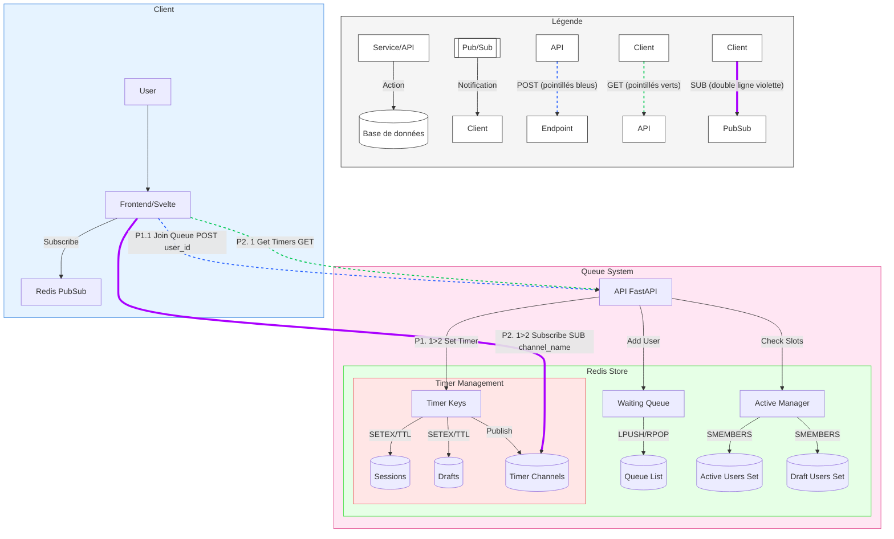

```mermaid
flowchart TD
    %% Définition des styles
    classDef clientStyle fill:#E6F3FF,stroke:#4A90E2
    classDef timerStyle fill:#FFE6E6,stroke:#E24A4A
    classDef redisStyle fill:#E6FFE6,stroke:#4AE24A
    classDef systemStyle fill:#FFE6F3,stroke:#E24A90
    classDef legendStyle fill:#F5F5F5,stroke:#333333
    classDef defaultStyle fill:#ffffff,stroke:#333333

    subgraph Legend["Légende"]
        direction TB
        L1[Service/API] --> |Action| L2[(Base de données)]
        L3[["Pub/Sub"]] --> |Notification| L4[Client]
        %% POST et GET en pointillés de couleurs différentes
        L5[API] -. "POST (pointillés bleus)" .-> L6[Endpoint]
        L7[Client] -. "GET (pointillés verts)" .-> L8[API]
        %% SUB en double ligne
        L9[Client] == "SUB (double ligne violette)" ==> L10[PubSub]
        
        style L1 fill:#ffffff,stroke:#333333
        style L2 fill:#ffffff,stroke:#333333
        style L3 fill:#ffffff,stroke:#333333
        style L4 fill:#ffffff,stroke:#333333
        style L5 fill:#ffffff,stroke:#333333
        style L6 fill:#ffffff,stroke:#333333
        style L7 fill:#ffffff,stroke:#333333
        style L8 fill:#ffffff,stroke:#333333
        style L9 fill:#ffffff,stroke:#333333
        style L10 fill:#ffffff,stroke:#333333

        %% Styles des liens de la légende
        linkStyle 0,1 stroke:#333333
        linkStyle 2 stroke:#2962FF,stroke-width:2px,stroke-dasharray: 5 5
        linkStyle 3 stroke:#00C853,stroke-width:2px,stroke-dasharray: 5 5
        linkStyle 4 stroke:#AA00FF,stroke-width:4px
    end

    subgraph Client
        U[User]
        F[Frontend/Svelte]
        R[Redis PubSub]
        U --> F
        F -->|Subscribe| R
    end

    subgraph Timer["Timer Management"]
        S[(Sessions)]
        TK[Timer Keys]
        D[(Drafts)]
        TC[(Timer Channels)]
    end

    subgraph Redis["Redis Store"]
        Q[(Queue List)]
        WQ[Waiting Queue]
        AU[(Active Users Set)]
        AM[Active Manager]
        DU[(Draft Users Set)]
        Timer
    end

    subgraph System["Queue System"]
        A[API FastAPI]
        Redis
    end

    %% Connexions principales
    A --> |Add User| WQ
    A --> |Check Slots| AM
    WQ --> |LPUSH/RPOP| Q
    AM --> |SMEMBERS| AU & DU
    TK --> |SETEX/TTL| S & D
    TK --> |Publish| TC

    %% Flux des requêtes avec styles différents pour chaque type
    %% POST en pointillés bleus
    F -. "P1.1 Join Queue POST user_id" .-> A
    %% SUB en double ligne violette
    F == "P2. 1>2 Subscribe SUB channel_name" ==> TC
    %% Normal
    A -- "P1. 1>2 Set Timer" --> TK
    %% GET en pointillés verts
    F -. "P2. 1 Get Timers GET <time, channel_name" .-> A

    %% Application des styles aux sous-graphes
    class Client clientStyle
    class Timer timerStyle
    class Redis redisStyle
    class System systemStyle
    class Legend legendStyle

    %% Styles des liens
    linkStyle default stroke:#333333
    %% Style pour les liens POST (pointillés bleus)
    linkStyle 15 stroke:#2962FF,stroke-width:2px,stroke-dasharray: 5 5
    %% Style pour les liens SUB (double ligne violette)
    linkStyle 16 stroke:#AA00FF,stroke-width:4px
    %% Style pour les liens GET (pointillés verts)
    linkStyle 18 stroke:#00C853,stroke-width:2px,stroke-dasharray: 5 5
```